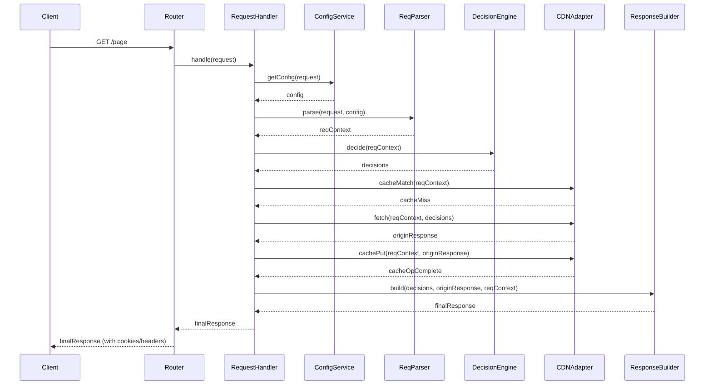
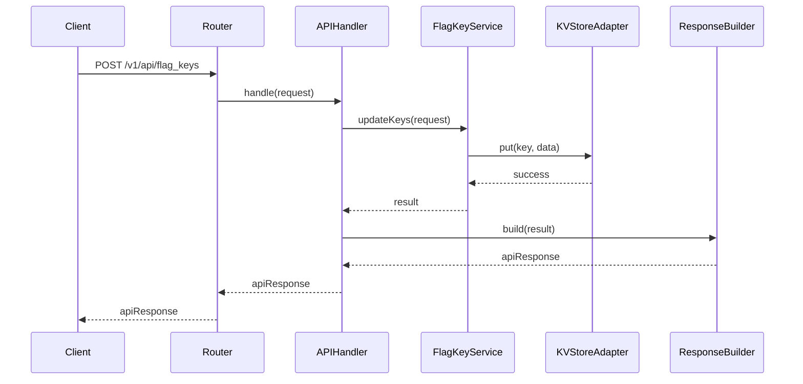

# Proposed Core Components and Interactions

**Plan ID:** `rearch-opti-edge-agent-001`

## 1. Introduction

This document details the core components proposed in the re-architecture plan (`plan.md`, section 6). It outlines the primary responsibilities of each component and illustrates their high-level interactions through sequence diagrams. This design adheres to the principles defined in `01-principles.md`.

## 2. Core Component Responsibilities

1.  **Request Router (`index.js` / dedicated router):**
    *   Analyzes incoming request path, method, and potentially headers.
    *   Determines if the request is for the API, Experimentation Pipeline, or should be passed through (e.g., static assets).
    *   Instantiates and invokes the appropriate top-level handler (`API Handler` or `Request Handler`). Minimal logic.
2.  **Request Handler (Experimentation Pipeline):**
    *   Orchestrates the step-by-step processing for non-API requests (GET/POST experimentation).
    *   Invokes `Configuration Service` to load settings.
    *   Invokes `Request Parser/Context` to build the request context.
    *   Invokes `Decision Engine` to get Optimizely decisions.
    *   Determines response strategy (fetch from CDN, forward to origin, serve directly).
    *   Invokes `CDN Adapter` for fetching or caching.
    *   Invokes `Response Builder/Modifier` to construct the final response.
3.  **API Handler:**
    *   Parses API request path and parameters.
    *   Instantiates and invokes relevant service modules (`Datafile Service`, `FlagKey Service`).
    *   Constructs API responses (success or error).
4.  **Configuration Service:**
    *   Loads static default settings (`defaultSettings.js`).
    *   Extracts dynamic configuration from the request context (headers, cookies, query params - via `RequestAdapter`).
    *   Merges configurations and provides a unified API to access settings.
    *   May cache configuration derived from request context for the duration of the request.
5.  **Request Parser/Context:**
    *   Uses `RequestAdapter` to access raw request details.
    *   Extracts/generates Visitor ID (using `CookieHelper`).
    *   Extracts SDK Key.
    *   Extracts relevant attributes (query params, headers, potentially POST body).
    *   Extracts forced decisions or flags to decide (if provided).
    *   Constructs and returns the immutable Request Context object.
6.  **Decision Engine:**
    *   Receives Request Context object and list of flags to decide/force.
    *   Uses `OptimizelyProvider` to initialize SDK and get decisions.
    *   Handles logic related to using stored decisions (from cookies via Request Context) vs. fetching fresh decisions.
    *   Returns a standardized decision result object.
7.  **Optimizely Provider:**
    *   Manages Optimizely SDK lifecycle (initialization via `createInstance`).
    *   Creates Optimizely User Context (`createUserContext`).
    *   Calls SDK `decide()` and `track()` methods.
    *   Coordinates event dispatch by invoking the `EventDispatcherAdapter`.
    *   Interacts with `UserProfileService` (if enabled/injected).
8.  **Response Builder/Modifier:**
    *   Takes decision results, fetched content (if any), and Request Context.
    *   Uses `ResponseAdapter` to create the final `Response` object.
    *   Sets appropriate headers (e.g., `Content-Type`, custom headers).
    *   Sets necessary cookies (e.g., visitor ID, serialized decisions via `CookieHelper`).
    *   Modifies responses proxied from origin or cache if needed.
9.  **CDN Adapter Interface:** (Contract Definition)
    *   Defines methods for `fetch`, `kvGet`, `kvPut`, `kvDelete`, `cacheMatch`, `cachePut`, `cacheDelete`, `dispatchEvent`.
10. **CDN Adapter Implementation (e.g., `CloudflareAdapter`):**
    *   Implements `CDN Adapter Interface` using Cloudflare native APIs (`fetch`, KV bindings, `caches`, `ctx.waitUntil`).
11. **KV Store Interface:** (Contract Definition)
    *   Defines methods for `get`, `put`, `delete`.
12. **KV Store Implementation (e.g., `CloudflareKVStore`):**
    *   Implements `KV Store Interface` using Cloudflare KV bindings.
13. **User Profile Service (Optional):**
    *   Implements logic for saving/retrieving user profiles using `KVStoreAdapter`.
14. **Helper Modules (e.g., `CookieHelper`, `OptimizelyDataHelper`):**
    *   `CookieHelper`: Handles serialization/deserialization of decision cookies, cookie parsing/setting logic.
    *   `OptimizelyDataHelper`: Parses `cdnVariationSettings` JSON, validates decision structures.

## 3. High-Level Interaction Diagrams (Mermaid)

### 3.1 GET Request - Experimentation Flow (Cache Miss)

### 3.2 POST Request - API Flow (e.g., Update Flag Keys)

*(Note: These are simplified diagrams illustrating core interactions. Detailed error handling and specific adapter interactions are omitted for clarity.)* 