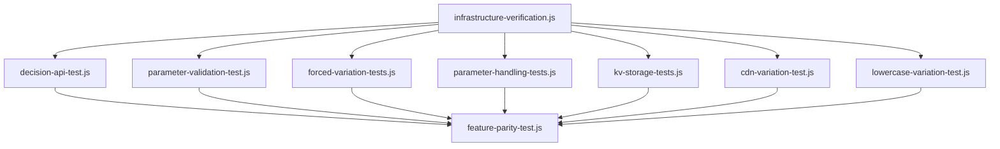

# Test Dependencies and Execution Flow

This document maps the dependencies between Edge Agent test scripts and establishes the correct execution flow for reliable testing.

## Dependency Graph

## Test Execution Order

Based on the dependency graph and the execution-plan.md, the following is the recommended execution order:

1. **infrastructure-verification.js** - Must run first to validate basic connectivity
2. **decision-api-test.js** - Tests core API endpoints
3. **parameter-validation-test.js** - Tests parameter validation logic
4. **Basic Feature Tests**:
   - **forced-variation-tests.js** - Tests forced variation functionality
   - **parameter-handling-tests.js** - Tests parameter handling across inputs
   - **kv-storage-tests.js** - Tests key-value storage functionality
   - **cdn-variation-test.js** - Tests CDN variation and content delivery
   - **lowercase-variation-test.js** - Tests lowercase variation key handling
5. **feature-parity-test.js** - Comprehensive test (depends on all previous tests)

## Detailed Dependencies

### 1. infrastructure-verification.js

- **Dependencies:** None
- **Required Before:** All other tests
- **Function:** Validates basic connectivity and environment
- **Critical Checks:**
  - Cloudflare environment verification
  - SDK key validation
  - Basic HTTP connectivity

### 2. decision-api-test.js

- **Dependencies:** infrastructure-verification.js
- **Required Before:** feature-parity-test.js
- **Function:** Tests the core decision API endpoints
- **Critical Checks:**
  - `/api/decide` endpoint functionality
  - `/api/decide-all` endpoint functionality
  - `/api/decide-for-keys` endpoint functionality

### 3. parameter-validation-test.js

- **Dependencies:** infrastructure-verification.js
- **Required Before:** feature-parity-test.js
- **Function:** Tests parameter validation logic
- **Critical Checks:**
  - Parameter format validation
  - Error handling for invalid parameters
  - Parameter type checking

### 4. forced-variation-tests.js

- **Dependencies:** infrastructure-verification.js
- **Required Before:** feature-parity-test.js
- **Function:** Tests forced variation functionality
- **Critical Checks:**
  - Header-based forced variations
  - JSON-based forced variations
  - Query parameter-based forced variations
  - Precedence rules

### 5. parameter-handling-tests.js

- **Dependencies:** infrastructure-verification.js
- **Required Before:** feature-parity-test.js
- **Function:** Tests parameter handling across sources
- **Critical Checks:**
  - Query parameter handling
  - Header option handling
  - JSON body parameter handling
  - Parameter precedence rules

### 6. kv-storage-tests.js

- **Dependencies:** infrastructure-verification.js
- **Required Before:** feature-parity-test.js
- **Function:** Tests key-value storage functionality
- **Critical Checks:**
  - KV namespace access
  - Data storage and retrieval
  - Cache management

### 7. cdn-variation-test.js

- **Dependencies:** infrastructure-verification.js
- **Required Before:** feature-parity-test.js
- **Function:** Tests CDN variation and content delivery
- **Critical Checks:**
  - URL pattern matching
  - Origin request forwarding
  - Content transformation
  - Cache behavior

### 8. lowercase-variation-test.js

- **Dependencies:** infrastructure-verification.js
- **Required Before:** feature-parity-test.js
- **Function:** Tests lowercase "on" variation key preservation
- **Critical Checks:**
  - Case sensitivity handling
  - Boolean flag variations

### 9. feature-parity-test.js

- **Dependencies:** All other tests
- **Required Before:** None (final test)
- **Function:** Comprehensive test of feature parity
- **Critical Checks:**
  - Complete feature set verification
  - Side-by-side comparison with original implementation
  - Performance and behavior validation

## Run-All-Tests.js Execution Flow

The `run-all-tests.js` script executes tests in the following order (from script analysis):

1. Infrastructure verification
2. Decision API tests
3. Parameter validation tests
4. Forced variation tests 
5. Parameter handling tests
6. KV storage tests
7. CDN variation tests
8. Lowercase variation tests
9. Feature parity tests

This order aligns with the dependency graph and is the recommended sequence for test execution.

## Parallel vs. Sequential Execution

- **Sequential Execution (Recommended)**: Run tests in the order specified above to ensure dependencies are met
- **Parallel Execution (Not Recommended)**: Most tests have dependencies on earlier tests and may produce inconsistent results if run in parallel

## Result Dependencies

Test result files maintain references to previous test executions in the following ways:

1. Timestamps in filenames for chronological ordering
2. References to previous test results in comprehensive tests
3. Test execution summaries that aggregate results

## Common Code Dependencies

Several shared components and dependencies exist across the test scripts:

1. **Environment Variable Processing**: Common pattern for loading environment variables
2. **HTTP Request Handling**: Similar fetch/request patterns
3. **Result Reporting**: Common format for JSON and Markdown result files
4. **Verification Logic**: Similar assertion patterns

These shared components ensure consistent behavior across the test suite but also mean that failures in common patterns may affect multiple tests. 