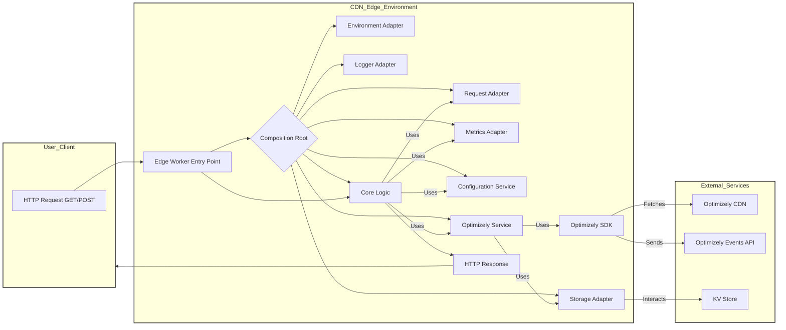
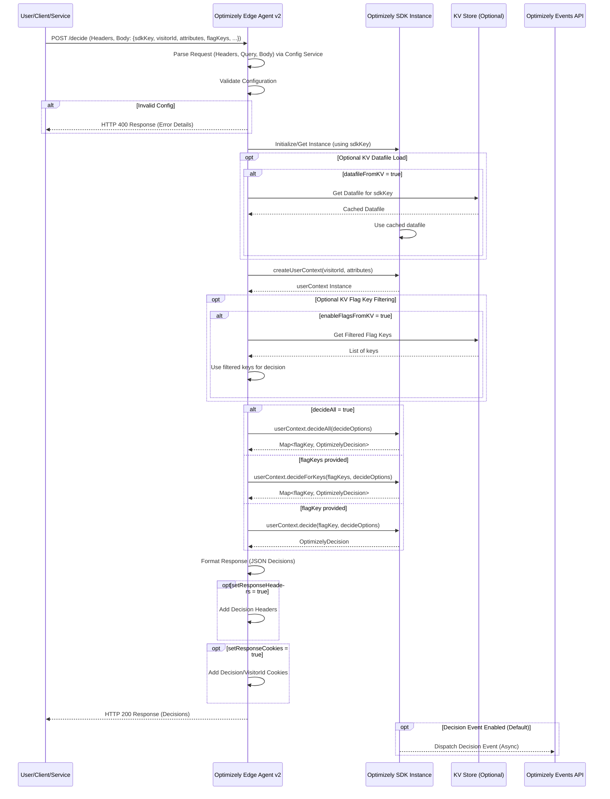
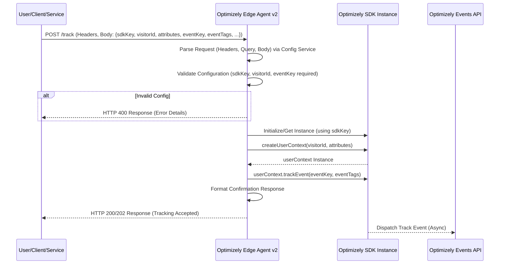
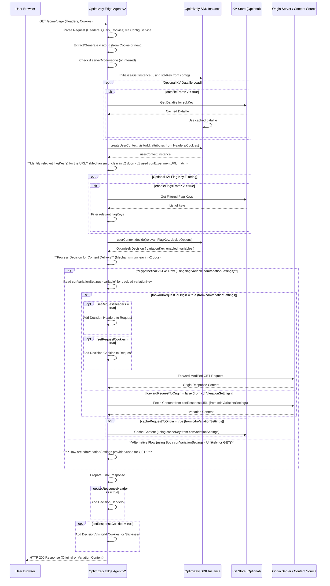

# Optimizely Edge Agent v2: Architecture & Technical Reference Guide

**Version:** Based on v2 Documentation Provided (April 2025 context)

**Purpose:** This guide provides a detailed architectural and functional overview of the Optimizely Edge Agent v2 implementation, based *solely* on the provided documentation. It aims to equip engineers and AI systems with the necessary context and technical details to understand its intended capabilities, configuration, and operation within various CDN environments.

**Navigation:**

*   [1. Introduction](#1-introduction)
*   [2. Core Concepts](#2-core-concepts)
*   [3. Architecture Overview](#3-architecture-overview)
    *   [3.1. Core Components](#31-core-components)
    *   [3.2. CDN Adapter System](#32-cdn-adapter-system)
    *   [3.3. Architectural Flow Diagram](#33-architectural-flow-diagram)
*   [4. Operating Modes (Edge vs. Agent)](#4-operating-modes-edge-vs-agent)
*   [5. Detailed Functionality](#5-detailed-functionality)
    *   [5.1. Optimizely SDK Integration](#51-optimizely-sdk-integration)
        *   [5.1.1. Initialization](#511-initialization)
        *   [5.1.2. User Context (`OptimizelyUserContext`)](#512-user-context-optimizelyusercontext)
        *   [5.1.3. Decision Methods (`decide`, `decideAll`, `decideForKeys`)](#513-decision-methods-decide-decideall-decideforkeys)
        *   [5.1.4. Event Tracking (`trackEvent`)](#514-event-tracking-trackevent)
        *   [5.1.5. Forced Decisions](#515-forced-decisions)
        *   [5.1.6. OptimizelyConfig API](#516-optimizelyconfig-api)
        *   [5.1.7. Real-Time Segments](#517-real-time-segments)
        *   [5.1.8. Resource Management (`close`)](#518-resource-management-close)
    *   [5.2. Configuration System](#52-configuration-system)
        *   [5.2.1. Configuration Sources & Priority](#521-configuration-sources--priority)
        *   [5.2.2. Detailed Configuration Options](#522-detailed-configuration-options)
        *   [5.2.3. Validation and Error Handling](#523-validation-and-error-handling)
        *   [5.2.4. Environment Variables](#524-environment-variables)
    *   [5.3. CDN Adapter Usage](#53-cdn-adapter-usage)
        *   [5.3.1. Cloudflare Workers](#531-cloudflare-workers)
        *   [5.3.2. Vercel Edge Functions](#532-vercel-edge-functions)
        *   [5.3.3. Fastly Compute@Edge](#533-fastly-computeedge)
    *   [5.4. KV Store Integration (Inferred Functionality)](#54-kv-store-integration-inferred-functionality)
    *   [5.5. Metrics System](#55-metrics-system)
        *   [5.5.1. Overview & Adapter](#551-overview--adapter)
        *   [5.5.2. Key Metrics Tracked](#552-key-metrics-tracked)
        *   [5.5.3. Usage](#553-usage)
*   [6. Sequence Diagrams](#6-sequence-diagrams)
    *   [6.1. Agent Mode - Decide Request (POST)](#61-agent-mode---decide-request-post)
    *   [6.2. Agent Mode - Track Request (POST)](#62-agent-mode---track-request-post)
    *   [6.3. Edge Mode - GET Request (Expected Flow based on v1 & Config)](#63-edge-mode---get-request-expected-flow-based-on-v1--config)
*   [7. Conclusion & Important Notes](#7-conclusion--important-notes)

---

## 1. Introduction

The Optimizely Edge Agent v2 is designed to run within Content Delivery Network (CDN) edge environments (Cloudflare Workers, Vercel Edge Functions, Fastly Compute@Edge). Its primary purpose is to leverage the Optimizely Feature Experimentation SDK to perform A/B testing, feature flagging, and event tracking decisions geographically close to the end-user, minimizing latency and offloading computation from origin servers. It provides a configurable interface accessible via HTTP requests.

---

## 2. Core Concepts

Understanding these concepts is crucial for working with the Edge Agent:

*   **Edge Computing:** Performing computations on CDN servers at the network edge, closer to users than centralized origin servers.
*   **Serverless:** Running code in an environment where the underlying infrastructure is managed by the CDN provider (e.g., Cloudflare, Vercel, Fastly).
*   **Optimizely SDK:** The core library (@optimizely/optimizely-sdk for Node.js) that handles datafile processing, user bucketing, feature flag evaluation, and event dispatching based on Optimizely project configurations.
*   **Datafile:** A JSON representation of an Optimizely project's configuration (features, experiments, audiences, attributes, events) used by the SDK to make decisions locally.
*   **User Context:** An object within the SDK representing a specific user, holding their ID and attributes, used for targeted decision-making.
*   **Decision:** The outcome of evaluating a feature flag or experiment for a given user context, indicating if a feature is enabled and which variation is assigned.
*   **Event Tracking:** Sending data points (e.g., conversions, clicks) associated with a user context back to Optimizely for results analysis.
*   **Sticky Bucketing:** Ensuring a user consistently receives the same variation of an experiment across multiple requests (implicitly supported via `userProfileService` SDK option, though not detailed in v2 docs).
*   **CDN Adapters:** Platform-specific modules that allow the core Edge Agent logic to interact consistently with different CDN environments (storage, environment variables, request/response handling).

---

## 3. Architecture Overview

The Edge Agent v2 employs a modular, adapter-based architecture designed for portability across different CDN platforms.

### 3.1. Core Components

*   **Composition Root:** (e.g., `cloudflareComposition.ts`, handlers in `compositionRoot.ts`) Initializes and wires together the necessary services and adapters based on the execution environment.
*   **Request Handler:** Processes incoming HTTP requests, parses configuration, invokes core logic, and formats responses.
*   **Optimizely Service:** Encapsulates interactions with the Optimizely SDK (`@optimizely/optimizely-sdk`), including initialization, creating user contexts, making decisions, and tracking events.
*   **Configuration Service:** Parses and validates configuration options from various sources (Headers, Query, Body) according to defined priorities.
*   **Core Logic:** (Implicit) Orchestrates the flow based on the request type and configuration – determining whether to make decisions, track events, etc.

### 3.2. CDN Adapter System

This system allows the core agent logic to remain platform-agnostic. Key adapter interfaces include:

1.  **`IEnvironmentAdapter`**: Accesses environment variables, bindings, and execution context (e.g., `waitUntil` for background tasks).
2.  **`IStorageAdapter`**: Abstracts Key-Value storage operations (e.g., for KV namespaces in Cloudflare/Vercel, Dictionaries in Fastly). Used implicitly for features like `enableFlagsFromKV` or `datafileFromKV`.
3.  **`IRequestAdapter`**: Normalizes access to HTTP request properties (method, URL, headers, body).
4.  **`ILoggerAdapter`**: Provides a consistent logging interface.
5.  **`IMetricsAdapter`**: Provides a consistent interface for tracking operational metrics ([See Metrics System](#55-metrics-system)).

Each supported CDN (Cloudflare, Vercel, Fastly) has its own implementation of these adapters and a corresponding **Adapter Factory** (`CloudflareAdapterFactory`, `VercelAdapterFactory`, `FastlyAdapterFactory`) used by the Composition Root.

### 3.3. Architectural Flow Diagram



---

## 4. Operating Modes (Edge vs. Agent)

While the v2 documentation doesn't explicitly label modes as "Edge" and "Agent" with distinct functionalities like the v1 documentation did, the configuration options and typical edge worker use cases strongly imply two primary operational patterns, configurable via the `serverMode` option:

1.  **Agent Mode (`serverMode: "agent"` or default):**
    *   **Trigger:** Typically `POST` or `PUT` requests.
    *   **Functionality:** Acts as a serverless API endpoint providing remote access to the Optimizely SDK. Applications send requests (often with user context, attributes, event data in the body) to get decisions or track events.
    *   **Configuration:** Primarily driven by Headers, Query Parameters, and the **Request Body**. Key options include `sdkKey`, `visitorId`, `attributes`, `flagKeys`/`flagKey`, `eventKey`, `eventTags`, `forcedDecisions`.
    *   **Use Case:** Backend services needing Optimizely decisions without embedding the SDK; tracking server-side conversions; mobile app backends retrieving flag configurations.

2.  **Edge Mode (`serverMode: "edge"`):**
    *   **Trigger:** Typically `GET` requests (though the v2 docs confusingly list `cdnVariationSettings` as a *Body* option).
    *   **Functionality:** Intended to act more like an edge-side SDK integrated into the content delivery path. It should make decisions based on the incoming request (URL, headers, cookies) *before* potentially fetching/modifying content or forwarding to an origin.
    *   **Configuration:** Primarily driven by Headers and Query Parameters for user context (`sdkKey`, `visitorId`, attributes derived from headers/cookies). KV storage options (`enableFlagsFromKV`, `datafileFromKV`) are relevant here.
    *   **`cdnVariationSettings` Discrepancy:** The v2 `configuration-options.md` lists `cdnVariationSettings` as configurable via the **Request Body only**. This contradicts the expected v1 behavior where `cdnVariationSettings` was a *flag variable* configured within Optimizely and used to control content fetching/caching based on the *decision* for a `GET` request. The v2 documentation **does not detail the properties** within this `cdnVariationSettings` object or how they are used, unlike the v1 documentation. This suggests either:
        *   A significant change in how Edge Mode works in v2 (perhaps configured via a POST setup?).
        *   An inaccuracy or incompleteness in the v2 `configuration-options.md`.
        *   The detailed content manipulation features from v1 (like `cdnResponseURL`, `cacheKey`, `forwardRequestToOrigin`) might not be fully implemented or documented in v2 as described.
    *   **Use Case (Intended):** A/B testing content variations directly at the edge, personalizing responses based on user segments without hitting the origin server unnecessarily. The *exact mechanism* for achieving this based purely on the v2 docs is unclear due to the `cdnVariationSettings` ambiguity.

**Conclusion on Modes:** The agent supports configuration indicating distinct modes. Agent mode seems clearly defined. Edge mode's *intent* is likely similar to v1, but the *mechanism*, particularly regarding `cdnVariationSettings` and content manipulation, is **not clearly documented** in the provided v2 materials and appears inconsistent with v1's approach.

---

## 5. Detailed Functionality

### 5.1. Optimizely SDK Integration

The agent leverages the `@optimizely/optimizely-sdk` for Node.js.

#### 5.1.1. Initialization

*   Uses `createInstance` from the SDK.
*   Requires either `sdkKey` (recommended, enables auto-updates) or a `datafile` object.
*   Supports configuration options: `eventDispatcher`, `logger`, `errorHandler`, `userProfileService`, `datafileOptions` (for `autoUpdate`, `updateInterval`, `urlTemplate`, `datafileAccessToken`), `defaultDecideOptions`, `ODPManager` (for Real-Time Segments).
*   Uses `onReady()` promise to ensure successful initialization before use.

#### 5.1.2. User Context (`OptimizelyUserContext`)

*   Created via `optimizely.createUserContext(visitorId, attributes)`.
*   Represents the end-user for decisions and tracking.
*   **Methods:**
    *   `setAttribute(key, value)`: Sets/updates user attributes.
    *   `getAttributes()`: Retrieves current attributes.
    *   `decide(flagKey, options)`: Gets decision for one flag.
    *   `decideForKeys(flagKeys, options)`: Gets decisions for multiple specific flags.
    *   `decideAll(options)`: Gets decisions for all active flags.
    *   `trackEvent(eventKey, eventTags)`: Tracks a conversion event.
    *   `setForcedDecision(context, decision)`: Forces a variation for a flag/experiment.
    *   `getForcedDecision(context)`: Retrieves a forced decision.
    *   `removeForcedDecision(context)`: Removes a specific forced decision.
    *   `removeAllForcedDecisions()`: Removes all forced decisions for the user context.
    *   `fetchQualifiedSegments(options, callback)`: Fetches Real-Time Segments.
    *   `isQualifiedFor(segment)`: Checks if user is in a specific segment.
*   **Properties:** `userId`, `attributes`, `qualifiedSegments`.

#### 5.1.3. Decision Methods (`decide`, `decideAll`, `decideForKeys`)

*   Core methods for evaluating feature flags/experiments.
*   Return an `OptimizelyDecision` object (or a map of flagKey -> OptimizelyDecision).
*   **`OptimizelyDecision` Object Properties:** `variationKey`, `enabled`, `variables`, `ruleKey`, `flagKey`, `userContext`, `reasons` (if requested).
*   **Decision Options (`OptimizelyDecideOption` enum):** Control behavior via an array passed to decide methods. Configurable via `decideOptions` parameter.
    *   `DISABLE_DECISION_EVENT`: Prevents sending impression events.
    *   `ENABLED_FLAGS_ONLY`: Returns only decisions for enabled flags (for `decideAll`/`decideForKeys`).
    *   `IGNORE_USER_PROFILE_SERVICE`: Skips user profile lookup/save (affects stickiness).
    *   `INCLUDE_REASONS`: Adds debugging reasons to the decision object.
    *   `EXCLUDE_VARIABLES`: Omits variable values from the decision object.

#### 5.1.4. Event Tracking (`trackEvent`)

*   Used to send event data to Optimizely for results analysis.
*   Triggered via requests configured with `eventKey`.
*   Supports `eventTags` (key-value pairs) for adding metadata to events.

#### 5.1.5. Forced Decisions

*   Allows overriding normal bucketing logic for specific users/requests, primarily for QA and debugging.
*   Configured via the `forcedDecisions` request body parameter.
*   Managed via `setForcedDecision`, `getForcedDecision`, `removeForcedDecision`, `removeAllForcedDecisions` on the `OptimizelyUserContext`.

#### 5.1.6. OptimizelyConfig API

*   Accessed via `optimizely.getOptimizelyConfig()`.
*   Provides access to the static configuration of the project derived from the datafile (revision, environment key, features map, experiments map, raw datafile JSON). Useful for debugging or custom logic based on project structure.

#### 5.1.7. Real-Time Segments

*   Requires SDK v5.0.0+.
*   Allows fetching audience segments the user qualifies for in real-time (if configured in Optimizely Data Platform).
*   Uses `userContext.fetchQualifiedSegments()` and `userContext.isQualifiedFor()`.

#### 5.1.8. Resource Management (`close`)

*   The `optimizely.close()` method should be called when the agent instance is no longer needed (e.g., during shutdown) to clean up resources like timers for datafile updates. The v2 docs don't specify *where* this is called in the edge worker lifecycle.

### 5.2. Configuration System

The agent offers flexible configuration sourcing.

#### 5.2.1. Configuration Sources & Priority

1.  **HTTP Headers:** Highest priority (e.g., `X-Optimizely-SDK-Key`). Case-insensitive.
2.  **Query Parameters:** Medium priority (e.g., `?sdkKey=...`). Used if Header not present.
3.  **Request Body (JSON):** Lowest priority. Applicable for `POST`/`PUT` requests. Used if Header/Query not present.
4.  **Default Values:** Predefined defaults within the agent code.

*Note:* The `OPTIMIZELY_PRIORITIZE_HEADERS` environment variable (default `true`) controls if headers strictly override query params.

#### 5.2.2. Detailed Configuration Options

(Referencing `configuration-options.md`)

| Option                   | Type     | Required | Description                                      | Sources (Header, Query, Body)                     | Notes                                                                 |
| :----------------------- | :------- | :------- | :----------------------------------------------- | :------------------------------------------------ | :-------------------------------------------------------------------- |
| `sdkKey`                 | string   | ✅       | Optimizely SDK key                               | H: `X-Optimizely-SDK-Key`, Q: `sdkKey`, B           |                                                                       |
| `visitorId`              | string   |          | Visitor ID                                       | H: `X-Optimizely-Visitor-Id`, Q: `visitorId`, B   | `userId` (H/Q/B) is deprecated alias.                                 |
| `flagKeyYou are an AI assistant working with the Rex Tracker system [rex-tracker], an MCP (Model Context Protocol) Server for structured project tracking and software implementation.

First, query the MCP service for connection status using rex_test. Then, present a simple status indicator:

# 🧰 Rex-Tracker MCP Tools Status: ✅ Connected

If the connection fails, the agent would display:

# 🧰 Rex-Tracker MCP Tools Status: ❌ Unable to Connect

After confirming connection status, continue with the next steps of checking the project state.

## FIRST STEPS:
1. Check project state: `rex_get_state_summary`
2. Check for existing plans: `rex_search_plans_with_pending_tasks`
3. For each active plan:
   a. Get detailed plan info: `rex_get_plan` with planId
   b. Identify any tasks with status="IN_PROGRESS"
4. For primary plan: `rex_get_next_task` to find next implementable task

5. For IN_PROGRESS tasks (CRITICAL STEPS):
   a. Get task details using `rex_get_task_details`
   b. Check task notes to identify progress: `rex_get_task_details`
   c. For each target file in the task, check if file exists and examine its content (`read_file`)
   d. For implementation tasks: identify which subtasks/steps were completed (via notes/file content) and which remain based on the task's **specific description**.
   e. ASSUME THE TASK IS INCOMPLETE until you verify all requirements in the description are met.
   f. Present findings to user noting what appears complete vs incomplete according to the task description.

## INITIAL RESPONSE STRUCTURE:
After checking state and plans, present findings and options in this format:

# Current Project Status

When displaying project plans and tasks, use a list-based format as follows:

1. Show the project name as a bold header ("**Current Project Status**").
2. For each plan, create a section with the plan name as a bold subheader ("**Plan: [Name]**").
3. Under each plan, list:
   - Plan ID: [ID]
   - Active Tasks: [Bullet list of Task Name (Task ID)]
   - Next Available Task: [Task Name (Task ID)] or "None" if no task is available
   - Pending Tasks: [Number] tasks
4. End with an "Available Actions" section as a numbered list, constructed as follows:
   - First, for each plan with a next available PENDING task, include an action: "Continue implementing active plan: 📝 [Plan Name] with task [Next Available Task Name] ([Task ID])".
   - Then, for each plan that has at least one next available task: "Switch to plan: 📝 [Plan Name] and implement [Next Available Task Name] ([Task ID])".
   - Then, include the following fixed actions in order:
     - Create a new 📊 PRD (Product Requirements Document)
     - Create a new 📐 TDD (Technical Design Document)
     - Generate an implementation plan from existing 📐 TDD (Technical Design Document).
5. Use bullet points and bold labels for clarity. Ensure long task names wrap naturally without breaking alignment.

Example:
# Current Project Status

**Plan: 📝 Rule Creation System**
- **Plan ID**: 🆔 rule-creation-system-250413-2226
- **Active Tasks**:
  - 🔹 Implement Cloudflare Service Detectors (M6.T1)
  - 🔹 Create Cloud Services Rules (M6.T3)
- **Next Available Task**: 🔹 Create Development Workflow Rules (M7.T3)
- **Pending Tasks**: 3 tasks

**Plan: 📝 Rule Creation System - Additional Rules**
- **Plan ID**: 🆔 rule-creation-system-add-rules-250414-1324
- **Active Tasks**:
  - 🔹 Create Remix Additional Rules (AR2.T2)
  - 🔹 Create UI Component Additional Rules (AR2.T3)
- **Next Available Task**: 🔹 Create Data Fetching Rules (AR2.T4)
- **Pending Tasks**: 28 tasks

# Available Actions
1. For each plan with a next available PENDING task, include: "Continue implementing active plan: 📝 [Plan Name] with task [Next Available Task Name] ([Task ID])"
2. For each plan that has at least one next available task: "Switch to plan: 📝 [Plan Name] and implement [Next Available Task Name] ([Task ID])"
3. **Create a new 📊 PRD** (Product Requirements Document)
4. **Create a new 📐 TDD** (Technical Design Document)
5. **Generate an implementation plan** from existing 📐 TDD (Technical Design Document)

# Recovery Actions (Investigate state and attempt to continue task completion)

If there are any tasks with "IN_PROGRESS" status, create a separate "**Recovery Actions**" section with:
1. For each IN_PROGRESS task across all plans, prefix "R" to each item numeric identifier like "R1., R2., R3." include: "Continue implementing active task: 🔹 [Task Name] ([Task ID]) from plan [Plan Name]"
2. When a user selects a recovery action:
   a. Thoroughly investigate the current task state by reviewing: Task details (`rex_get_task_details`), Target files (`read_file`), Implementation notes (`rex_get_task_details`).
   b. Determine appropriate recovery approach based on comparing current state to the *specific requirements in the task description*.
   c. Present a brief status report and recommendation before continuing.
   d. **If proceeding with implementation:** Execute the **"MANDATORY STEP: Pre-Implementation Task Decomposition"** below, focusing on generating the atomic actions needed to complete the *remaining* requirements from the task description.
   e. After user confirmation (and decomposition), proceed with implementation.

DOCUMENTATION REFERENCES:
- For implementation tasks: See docs/ai-guides/chat-agent-guide.md for implementation protocol
- See docs/ai-guides/rule-scope-agent-protocol.md for protection levels
- For document creation: See docs/ai-guides/document-creation-agent-guide.md for creating PRDs/TDDs
- Follow templates in templates/ directory

RESOURCE LOCATIONS:
• PRDs & TDDs: product-features/{feature-name}/
• Implementation plans: data/plans/{planId}/plan.json (via MCP tools only)
• Implementation files: As specified in task.targetFiles

TOOL SELECTION RULES:
• Use MCP tools for plans/tasks
• Use Cursor tools for implementation code
• Never edit plan files directly

## MCP TOOLING REFERENCE

All interactions with the MCP system MUST use these exact tool names. Do not add prefixes or modify tool names.

### State Management Tools
- `rex_get_state_summary` - Get current project state
- `rex_update_state` - Update project state properties

### Plan Management Tools
- `rex_create_plan` - Create a new implementation plan
- `rex_get_plan` - Retrieve plan details by ID/name
- `rex_search_plans_with_pending_tasks` - Find plans with pending work

### Task Management Tools
- `rex_get_next_task` - Get the next task to implement
- `rex_get_task_details` - Get details of a specific task
- `rex_update_task_status` - Update task status (PENDING/IN_PROGRESS/DONE/BLOCKED)
- `rex_add_task_note` - Add implementation notes to a task

### Rule & Scope Tools
- `rex_get_relevant_rules` - Get rules applicable to a file
- `rex_check_scope` - Check if a component is in scope
- `rex_get_protection_level` - Check component protection level

### Workflow Tools
- `rex_get_workflow_state` - Get current workflow state
- `rex_transition_workflow` - Move to next workflow state
- `rex_record_workflow_action` - Record completed action
- `rex_reset_workflow` - Reset workflow to initial state

### Technical Context Tools
- `rex_suggest_technical_context` - Suggest technical context tags based on task descriptions and file paths

### File System Tools (for implementation only)
- `read_file` - Read a file's contents
- `write_file` - Create or update a file
- `create_directory` - Create directory structure
- `list_directory` - List files in a directory
- `search_files` - Find files by pattern

## When IMPLEMENTING:

**BEFORE STARTING ANY IMPLEMENTATION STEPS (including scope/rule checks) for a newly assigned task OR resuming an IN_PROGRESS task:**

---
## MANDATORY STEP: Pre-Implementation Task Decomposition

**Objective:** To create a precise, step-by-step execution checklist based on the task's specific requirements, minimizing ambiguity and ensuring adherence to design decisions.

**Trigger:** Execute this immediately after confirming the `taskId` to work on (new or resumed) and *before* proceeding to Scope/Protection/Rule checks or file modifications.

1.  **Gather Context:**
    *   Retrieve full task details using `rex_get_task_details`. Focus intensely on the **specific requirements, libraries, configurations, patterns, and constraints detailed in the `description` field.**
    *   Identify relevant PRD/TDD using `rex_get_state_summary` (`current_feature`, `prd_path`, `tdd_path`). Use these ONLY to clarify ambiguities in the task description, not to override it. The task description is the primary source for implementation details at this stage.
    *   If resuming, meticulously analyze task notes and current file states (`read_file`) to determine exactly which requirements from the task description have been met and which remain.

2.  **Generate Atomic Action List:** Based on the gathered context, and **strictly adhering to ALL specifics detailed in the task `description`**, generate a **numbered, sequential list of atomic actions** required to complete the *entire* task (or the *remaining requirements* if resuming).

    **Action Criteria (Strictly Enforced):**
    *   **Atomicity:** Smallest logical unit (e.g., add imports for `winston`, define `logger` configuration object, call `winston.createLogger`, add one log statement).
    *   **Single Intent:** NO "and", "then", "also". Separate steps explicitly.
    *   **Sequential Order:** Precise execution order logically derived from the requirements.
    *   **Clarity:** Use precise language, file/function names consistent with context and task description.
    *   **Granularity:** Prioritize many small, verifiable steps.
    *   **Adherence:** The generated actions *must* directly implement the specific requirements, libraries, and configurations stated in the task description. **DO NOT introduce unspecified libraries, configurations, or architectural patterns.** If the description seems incomplete for implementation, state the missing information needed before proceeding.

3.  **Internal Checklist:** This numbered list is your **internal execution plan** for implementing *this specific task*.

4.  **Allowed Flexibility (Limited):** Your freedom lies *only* in:
    *   Determining the exact sequence of micro-steps *within* the task's defined constraints (e.g., order of adding imports vs. defining variables, if not specified).
    *   Adapting to the immediate code context (e.g., using existing variable naming conventions, fitting into existing class structures unless the task specifies changes).
    *   Handling low-level implementation details *not* explicitly defined in the task description (e.g., choosing loop variable names, minor formatting consistent with project style).
    *   You do **NOT** have freedom to change specified libraries, core configurations, data schemas, API contracts, or architectural patterns mandated in the task description.

5.  **Inform User (Recommended):** Briefly state you've decomposed the task: "I have broken down Task [taskId] '[Task Title]' into [N] specific atomic actions based on its requirements. I will now proceed sequentially, starting with step 1: [Description of first action]."

---

**Now, proceed with the standard implementation flow by executing the actions from your generated list sequentially:**

1.  **Select Action:** Take the next pending action from your numbered list.
2.  **Prepare for Action:**
    *   Check Scope First: `rex_check_scope` for file(s) targeted by this action.
    *   Check Protection Level Second: `rex_get_protection_level` for file(s).
    *   Get and Apply Rules Third: `rex_get_relevant_rules` for file(s). Ensure this specific action complies.
3.  **Execute Action:** Perform the single, atomic implementation step (e.g., writing code via Cursor tools, running a command).
4.  **Document Action Completion:** Add a note for the *main task ID* documenting the completion of this specific *atomic action*:
    `rex_add_task_note {"planId": "[planId]", "taskId": "[taskId]", "note": "Completed action #[action #]: [brief description of action]"}`
5.  **Repeat:** Go back to step 1 for the next action in the list until all are complete.

## TASK COMPLETION AND SUBTASK HANDLING

The "Pre-Implementation Task Decomposition" step proactively defines the subtasks (atomic actions) for the current execution context.

1.  **Track Implementation Progress**: Use `rex_add_task_note` after *each atomic action* as described above.
2.  **Verify All Actions**: Before marking the main task DONE, explicitly confirm that **all actions** in your generated list have been completed (check your notes). Verify the final result against the main task's `verificationCriteria`.
3.  **IN_PROGRESS Context Preservation**: When continuing an IN_PROGRESS task, the "Pre-Implementation Task Decomposition" step will generate the list of *remaining* atomic actions based on notes and file state analysis.
4.  **Clear Evidence**: When marking a main task DONE, provide structured evidence referencing the completion of the decomposed actions:
    `rex_update_task_status {"planId": "[planId]", "taskId": "[taskId]", "status": "DONE", "evidence": "Completed all [N] decomposed atomic actions derived from task description. Verified against criteria. Key actions included: [mention 1-2 key actions]."}`

## When using MCP tools for implementation, you MUST follow this exact protocol:

1.  **Check Scope First**:
    - Call `rex_check_scope` for every file before modification
    - NEVER modify files that are out of scope
    - If scope check fails, request explicit approval before proceeding

2.  **Check Protection Level Second**:
    - Call `rex_get_protection_level` for each in-scope file
    - Respect protection levels strictly:
      - `@LOCKED`: No modifications allowed
      - `@INTERFACE`: Only implementation changes, preserve interface
      - `@BEHAVIOR`: Preserve behavior, request approval for behavior changes
      - `@FLEXIBLE`: Standard modifications allowed

3.  **Get and Apply Rules Third**:
    - Call `rex_get_relevant_rules` for each file
    - Immediately analyze and follow ALL rules returned
    - Prioritize rule compliance over general best practices
    - Reference specific rule IDs when explaining implementation decisions
    - Verify your output against rule requirements before completion

4.  **Protection and Scope Override**:
    - Protection level and scope restrictions OVERRIDE rules if conflicts exist
    - If rules suggest modifying a protected or out-of-scope component, follow protection/scope limits
    - Request explicit approval for ANY exceptions

5.  **Documentation and Reporting**:
    - Document all scope, protection, and rule checks performed
    - Report rule conformance in task status updates
    - Flag any conflicts between rules, scope, or protection levels

This protocol is MANDATORY for all MCP-guided implementations. Always decompose the task into atomic actions first, then check scope/protection/rules before executing each action.

## FINAL REMINDER

You are an AI assistant working with the Rex Tracker system [rex-tracker], an MCP (Model Context Protocol) Server for structured project tracking and software implementation.
**DO NOT** create another assistant or explain how to build one. Instead, actively help the user by first asking what documentation they need help with, then following their directions using the protocols above.`                | string   |          | Single flag key for decide                       | H: `X-Optimizely-Flag-Key`, Q: `flagKey`, B       | Ignored if `flagKeys` is present.                                     |
| `flagKeys`               | string[] |          | Multiple flag keys for decide                    | Q: `keys` (multi-value), B                        | Body expects array, Query expects multiple `keys=` params.             |
| `attributes`             | object   |          | User attributes (JSON)                           | H: `X-Optimizely-Attributes`, Q: `attributes`, B  | Header/Query need URL-encoded JSON. Max 5 levels deep, no circular refs. |
| `forcedDecisions`        | object   |          | Forced decision overrides                        | B only                                            | Format: `{ "flagKey": { "variationKey": "var_A" } }`                  |
| `decideOptions`          | string[] |          | Options for decide calls                         | H: `X-Optimizely-Decide-Options`, Q: `decideOptions`, B | Comma-separated or JSON array. See [5.1.3](#513-decision-methods-decide-decideall-decideforkeys). |
| `decideAll`              | boolean  | `false`  | Decide all flags?                                | Q: `decideAll`, B                                 |                                                                       |
| `enabledFlagsOnly`       | boolean  | `false`  | Return only enabled flags?                       | Q: `enabledFlagsOnly`, B                          |                                                                       |
| `includeReasons`         | boolean  | `false`  | Include decision reasons?                        | Q: `includeReasons`, B                            |                                                                       |
| `excludeVariables`       | boolean  | `false`  | Exclude variables from response?                 | Q: `excludeVariables`, B                          |                                                                       |
| `disableDecisionEvent`   | boolean  | `false`  | Disable impression events?                       | Q: `disableDecisionEvent`, B                      |                                                                       |
| `ignoreUserProfileService`| boolean  | `false`  | Ignore user profile service?                     | Q: `ignoreUserProfileService`, B                  |                                                                       |
| `trimmedDecisions`       | boolean  | `true`   | Return trimmed decisions?                        | H: `X-Optimizely-Trimmed-Decisions`, Q: `trimmedDecisions`, B | Reduces response size.                                                |
| `eventKey`               | string   |          | Event key for tracking                           | H: `X-Optimizely-Event-Key`, Q: `eventKey`, B     | Required for tracking requests.                                       |
| `eventTags`              | object   |          | Tags for tracked events (JSON)                   | H: `X-Optimizely-Event-Tags`, Q: `eventTags`, B   | Header/Query need URL-encoded JSON.                                   |
| `value`                  | number   |          | Numeric value for conversion events              | Q: `value`, B                                     | Often used with revenue events.                                       |
| `setResponseHeaders`     | boolean  | `true`   | Set decision headers in response?                | H: `X-Optimizely-Set-Response-Headers`, Q: `setResponseHeaders`, B |                                                                       |
| `setResponseCookies`     | boolean  | `true`   | Set decision/visitorId cookies in response?      | H: `X-Optimizely-Set-Response-Cookies`, Q: `setResponseCookies`, B | Used for stickiness.                                                  |
| `setRequestHeaders`      | boolean  | `true`   | Set decision headers in forwarded request?       | H: `X-Optimizely-Set-Request-Headers`, Q: `setRequestHeaders`, B | Relevant for Edge Mode forwarding.                                    |
| `setRequestCookies`      | boolean  | `true`   | Set decision cookies in forwarded request?       | H: `X-Optimizely-Set-Request-Cookies`, Q: `setRequestCookies`, B | Relevant for Edge Mode forwarding.                                    |
| `overrideCache`          | boolean  | `false`  | Override internal/CDN cache?                     | H: `X-Optimizely-Override-Cache`, Q: `overrideCache`, B | For debugging.                                                        |
| `enableFlagsFromKV`      | boolean  | `false`  | Filter decisions using flag keys from KV?        | H: `X-Optimizely-Flags-KV`, Q: `enableFlagsFromKV`, B | Requires KV setup. See [5.4](#54-kv-store-integration-inferred-functionality). |
| `datafileFromKV`         | boolean  | `false`  | Load datafile from KV?                           | H: `X-Optimizely-Datafile-KV`, Q: `enableDatafileFromKV`, B | Requires KV setup. See [5.4](#54-kv-store-integration-inferred-functionality). |
| `enableResponseMetadata` | boolean  | `true`   | Include agent metadata in response?              | H: `X-Optimizely-Enable-Response-Metadata`, Q: `enableResponseMetadata`, B | Useful for debugging.                                                 |
| `datafileAccessToken`    | string   |          | Token for authenticated datafile fetch           | H: `X-Optimizely-Datafile-Access-Token`, B        |                                                                       |
| `serverMode`             | string   |          | Explicitly set mode ('edge' or 'agent')          | Q: `serverMode`, B                                | Usually inferred by method.                                           |
| `overrideVisitorId`      | boolean  | `false`  | Force new visitor ID per request?                | H: `X-Optimizely-Override-Visitor-Id`, Q: `overrideVisitorId`, B | Breaks stickiness; for testing.                                       |
| `cdnVariationSettings`   | object   |          | CDN variation settings (Edge Mode)               | B only                                            | **Mechanism unclear in v2 docs.** See [Section 4](#4-operating-modes-edge-vs-agent). |

#### 5.2.3. Validation and Error Handling

*   The agent performs type validation, checks required fields, and enforces constraints (e.g., attribute nesting depth, string length).
*   Errors result in appropriate HTTP status codes (400, 401, 404, 500).
*   Error responses include `error`, `details`, and potentially `metadata` with specific validation issues when `enableResponseMetadata` is true.

#### 5.2.4. Environment Variables

Some default behaviors can be set via environment variables:

*   `OPTIMIZELY_FLAGS_FROM_KV`: Default for `enableFlagsFromKV`.
*   `OPTIMIZELY_DATAFILE_FROM_KV`: Default for `datafileFromKV`.
*   `OPTIMIZELY_ENABLE_RESPONSE_METADATA`: Default for `enableResponseMetadata`.
*   `OPTIMIZELY_PRIORITIZE_HEADERS`: Default for header priority.
*   `OPTIMIZELY_COOKIE_EXPIRATION_DAYS`: Default cookie lifetime (e.g., 400 days).

### 5.3. CDN Adapter Usage

The agent provides entry points/handlers for different CDNs.

#### 5.3.1. Cloudflare Workers

*   **Entry Point:** Default `fetch` handler in `index.ts` (or similar) calling `handleWorkerRequest(request, env, ctx)`.
*   **Storage:** Uses Cloudflare Workers KV. Requires a binding named `OPTLY_HYBRID_AGENT_KV` in `wrangler.toml`.
*   **Context:** Uses `ctx.waitUntil` for background tasks.

#### 5.3.2. Vercel Edge Functions

*   **Entry Point:** Default export function in `vercel.ts` (or similar) calling `handleVercelEdgeRequest(request, vercelEnv, vercelContext)`.
*   **Storage:** Adapts to Vercel KV (requires setup via Vercel platform).
*   **Context:** Requires manual creation of `vercelEnv` and `vercelContext` (with `waitUntil`) within the handler.

#### 5.3.3. Fastly Compute@Edge

*   **Entry Point:** `fetch` event listener in `fastly.js` (or similar) calling `event.respondWith(handleFastlyComputeRequest(event.request, fastlyEnv, fastlyContext))`.
*   **Storage:** Adapts to Fastly storage (e.g., Dictionaries, requires setup).
*   **Context:** Requires manual creation of `fastlyEnv` and `fastlyContext` (with `waitUntil` mapped to `event.waitUntil`) within the listener.

### 5.4. KV Store Integration (Inferred Functionality)

Based on the configuration options `enableFlagsFromKV` and `datafileFromKV`, the agent integrates with the CDN's Key-Value store (via `IStorageAdapter`).

*   **Purpose (Inferred from v1 & option names):**
    *   **Datafile Caching (`datafileFromKV`):** Store the Optimizely datafile in KV to reduce latency compared to fetching from Optimizely CDN on each instantiation. Requires a sync mechanism (likely webhook + API endpoint, though not detailed in v2 docs).
    *   **Flag Key Filtering (`enableFlagsFromKV`):** Store a specific list of active `flagKeys` in KV. If enabled, the agent only evaluates these flags, optimizing performance in projects with many flags. Requires managing this list (likely via an API endpoint, not detailed in v2 docs).
    *   **User Profile Service (Implicit):** While not explicitly detailed in v2 docs, the SDK supports a `userProfileService` option during initialization. If implemented using the `IStorageAdapter`, KV could be used for persistent sticky bucketing.

*   **Note:** The v2 documentation *does not* detail the API endpoints for managing KV content (like updating the datafile or flag keys list) or the exact structure of data stored in KV.

### 5.5. Metrics System

The agent includes a system for tracking operational metrics.

#### 5.5.1. Overview & Adapter

*   Uses an `IMetricsAdapter` interface.
*   Primary implementation is `CloudflareMetricsAdapter`.
*   **Modes:**
    *   **Analytics Engine Mode:** Sends metrics to Cloudflare Analytics Engine if available/configured.
    *   **Logging Mode:** Logs metrics to the console via `ILoggerAdapter` as a fallback.
*   Metrics are prefixed (default: `optimizely_edge_`) and include name, value, and key-value tags.

#### 5.5.2. Key Metrics Tracked

(Referencing `metrics.md`)

*   **API:** `api_requests_total`, `api_request_duration_seconds`, `api_responses_total`, `api_errors_total` (tagged by method, endpoint, status, error type).
*   **Datafile:** `datafile_requests_total`, `datafile_updates_total`, `datafile_fetch_duration`, `datafile_cache_hit`/`miss`, `datafile_size_bytes`.
*   **Flag Keys (KV):** `flagkeys_requests_total`, `flagkeys_updates_total`, `flagkeys_fetch_duration`, `flagkeys_count`, `flagkeys_cache_hit`/`miss`.
*   **Cache:** `cache_clear_duration`, `cache_status`.
*   **Edge Mode:** `edge_mode_pipeline_duration`, `edge_mode_eligibility`, `url_match_found`, `content_preparation_duration`, `content_fetch_duration`, `transform_duration`, `edge_mode_errors`.

#### 5.5.3. Usage

*   The `IMetricsAdapter` is injected into services via the Composition Root.
*   Methods: `incrementCounter(name, value, tags)`, `setGauge(name, value, tags)`, `recordHistogram(name, value, tags)`, `startTimer(name, tags)` (returns stop function), `recordTimer(name, durationMs, tags)`.

---

## 6. Sequence Diagrams

### 6.1. Agent Mode - Decide Request (POST)



### 6.2. Agent Mode - Track Request (POST)



### 6.3. Edge Mode - GET Request (Expected Flow based on v1 & Config)

**Note:** This diagram reflects the *expected* flow based on v1 and the *intent* of Edge Mode. The exact mechanism, especially regarding `cdnVariationSettings`, is **unclear** from the provided v2 docs.



---

## 7. Conclusion & Important Notes

This document synthesizes the functional aspects of the Optimizely Edge Agent v2 based *strictly* on the provided documentation set. Key takeaways include:

*   **Multi-CDN Support:** The agent is architected with adapters for Cloudflare, Vercel, and Fastly.
*   **Robust SDK Integration:** Leverages core features of the Optimizely Feature Experimentation SDK, including decisions, tracking, forced decisions, and configuration access.
*   **Flexible Configuration:** Offers multiple ways to configure requests (Headers, Query, Body) with clear precedence.
*   **Metrics:** Provides built-in metrics tracking compatible with Cloudflare Analytics Engine or logging.
*   **Mode Ambiguity:** While configuration supports `serverMode: "edge"`, the specific mechanics of how Edge Mode integrates with content delivery (especially concerning `cdnVariationSettings`) are **not clearly defined** in the v2 documentation provided and appear inconsistent with typical GET request patterns and v1 precedent.

**Recommendation:** Due to the identified inconsistencies, particularly regarding the `cdnVariationSettings` mechanism in Edge Mode, **thorough testing and direct code analysis are essential** to verify the actual implemented behavior against the intended functionality and the details outlined in this guide. This guide should be used as a starting point for understanding the *documented intent*, not as a guaranteed reflection of the current implementation.
```