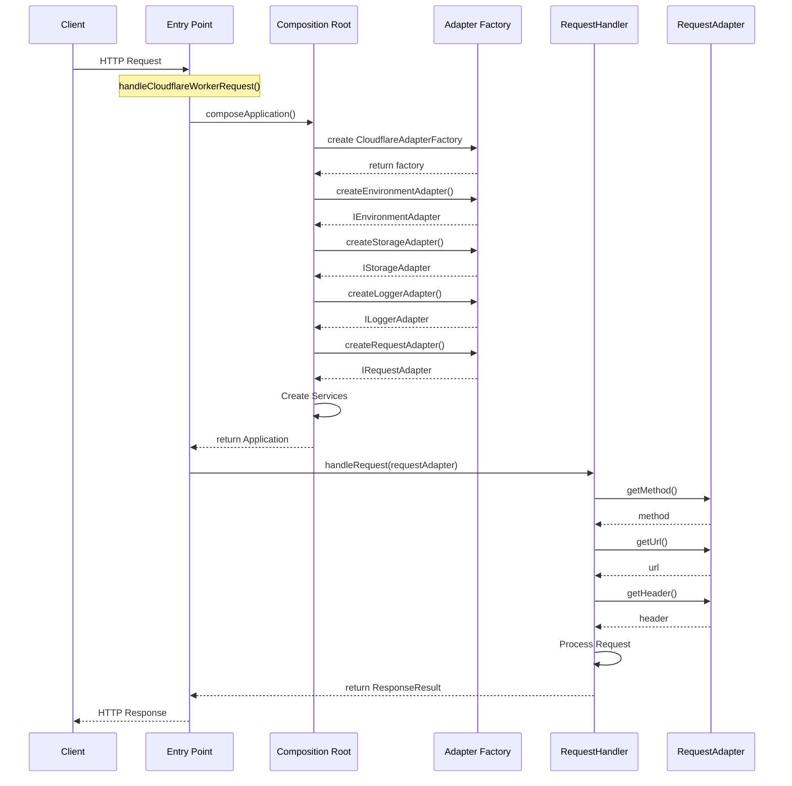
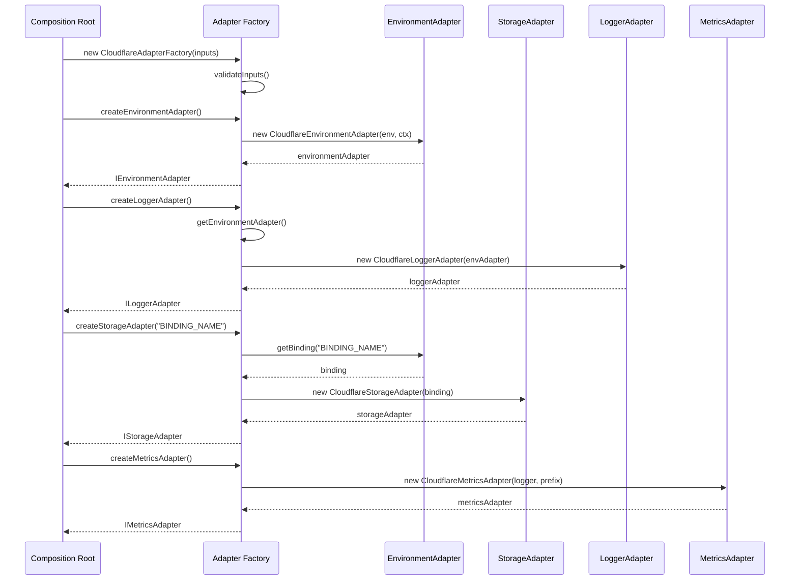

# CDN Adapter Implementation in v2

*Last Updated: 2025-04-18*

## Overview

The v2 implementation of the Optimizely Edge Agent introduces a comprehensive adapter interface system for CDN platform abstraction. This document analyzes the architecture, design patterns, and implementation details of the CDN adapter system in v2, focusing on the interface-based design, factory pattern implementation, and composition root integration.

## Table of Contents

1. [Adapter Interface System](#adapter-interface-system)
2. [Adapter Factory Pattern](#adapter-factory-pattern)
3. [Composition Root Integration](#composition-root-integration)
4. [Multi-CDN Support Capabilities](#multi-cdn-support-capabilities)
5. [Comparison with v1 Implementation](#comparison-with-v1-implementation)
6. [Sequence Diagrams](#sequence-diagrams)
7. [Code Examples](#code-examples)
8. [Summary](#summary)

## Adapter Interface System

The v2 codebase implements a comprehensive interface-based design for CDN adapters, separating concerns into specialized interfaces:

### Key Interfaces

1. **IEnvironmentAdapter**: Abstracts environment-specific configuration and context access.
   ```typescript
   export interface IEnvironmentAdapter {
     getVariable(key: string): string | undefined;
     getBinding<T>(bindingName: string): T | undefined;
     getContext<T = unknown>(): T;
     waitUntil(promise: Promise<unknown>): void;
     fetch(input: RequestInfo | URL, init?: RequestInit): Promise<Response>;
   }
   ```

2. **IStorageAdapter**: Abstracts key-value storage operations across different CDN platforms.
   ```typescript
   export interface IStorageAdapter {
     get(key: string, type: 'text'): Promise<string | null>;
     get<T>(key: string, type: 'json'): Promise<T | null>;
     get(key: string, type: 'arrayBuffer'): Promise<ArrayBuffer | null>;
     get(key: string, type: 'stream'): Promise<ReadableStream | null>;
     put(key: string, value: string | ArrayBuffer | ReadableStream, options?: StoragePutOptions): Promise<void>;
     delete(key: string): Promise<void>;
     list?(options?: StorageListOptions): Promise<StorageListResult>;
   }
   ```

3. **IRequestAdapter**: Abstracts incoming HTTP request handling across platforms.
   ```typescript
   export interface IRequestAdapter {
     getMethod(): string;
     getUrl(): URL;
     getHeader(name: string): string | null;
     getHeaders(): Headers;
     getBodyText(): Promise<string>;
     getBodyJson<T>(): Promise<T>;
     getBody(): Promise<any>;
     getNativeRequest<T = unknown>(): T;
   }
   ```

4. **IResponseAdapter**: Abstracts HTTP response generation and manipulation.
   ```typescript
   export interface IResponseAdapter {
     setHeader(name: string, value: string): void;
     getHeaders(): Headers;
     status(code: number): void;
     getStatus(): number;
     send(content: string): void;
     getBody(): string;
     json(data: any): void;
   }
   ```

5. **ILoggerAdapter**: Abstracts logging functionality across platforms.

6. **IMetricsAdapter**: Abstracts metrics collection and reporting.

### Interface Design Principles

The interface design follows several key principles:

1. **Interface Segregation**: Each interface focuses on a specific aspect of platform abstraction (requests, storage, environment, etc.).

2. **Dependency Inversion**: Services depend on interfaces rather than concrete implementations.

3. **Generic Type Parameters**: Interfaces use TypeScript generics for type-safe operations (e.g., `get<T>(key: string, type: 'json'): Promise<T | null>`).

4. **Method Overloading**: Interfaces use method overloading to provide type-safe operations with different return types (e.g., in `IStorageAdapter`).

5. **Platform Agnosticism**: Interfaces are designed to be platform-agnostic, exposing only the functionality needed by the application.

## Adapter Factory Pattern

The v2 codebase implements the Factory pattern through dedicated factory classes for each supported CDN platform:

### Factory Implementation

1. **CloudflareAdapterFactory**: Creates Cloudflare-specific adapters.
   ```typescript
   export class CloudflareAdapterFactory {
     private inputs: CloudflareAdapterFactoryInputs;
     private environmentAdapter: IEnvironmentAdapter | null = null;
     private loggerAdapter: ILoggerAdapter | null = null;

     constructor(inputs: CloudflareAdapterFactoryInputs) {
       if (!inputs || !inputs.request || !inputs.env || !inputs.ctx) {
         throw new Error("CloudflareAdapterFactory requires request, env, and ctx inputs.");
       }
       this.inputs = inputs;
     }

     createRequestAdapter(): IRequestAdapter { /* ... */ }
     createResponseAdapter(request: IRequestAdapter): IResponseAdapter { /* ... */ }
     createStorageAdapter(bindingName: string): IStorageAdapter { /* ... */ }
     createEnvironmentAdapter(): IEnvironmentAdapter { /* ... */ }
     createLoggerAdapter(): ILoggerAdapter { /* ... */ }
     createMetricsAdapter(): IMetricsAdapter { /* ... */ }
   }
   ```

2. **VercelAdapterFactory**: Creates Vercel-specific adapters.

3. **FastlyAdapterFactory**: Creates Fastly Compute@Edge-specific adapters.

### Factory Design Patterns

The factories implement several patterns:

1. **Factory Method Pattern**: Each `create*` method is a factory method that creates a specific type of adapter.

2. **Singleton Pattern**: Some adapters (like `EnvironmentAdapter` and `LoggerAdapter`) are cached as singletons within the factory instance.

3. **Dependency Injection**: The factory injects dependencies into the created adapters.

4. **Input Validation**: The factories validate constructor inputs to ensure all required dependencies are available.

## Composition Root Integration

The composition root (`compositionRoot.ts`) is responsible for creating and wiring together all adapters and services:

### Key Components

1. **CDN Type Detection**: The composition root supports multiple CDN types:
   ```typescript
   type AnyCDNAdapterFactoryInputs = 
     CloudflareAdapterFactoryInputs | 
     VercelAdapterFactoryInputs | 
     FastlyAdapterFactoryInputs;
   ```

2. **Factory Creation Logic**:
   ```typescript
   function composeApplication(factoryInputs: AnyCDNAdapterFactoryInputs, cdnType: 'cloudflare' | 'vercel' | 'fastly'): Application {
     let logger: ILoggerAdapter;
     let environmentAdapter: IEnvironmentAdapter;
     let storageAdapter: IStorageAdapter;
     let requestAdapter: IRequestAdapter;
     let eventService: IEventService;
     let metricsAdapter: IMetricsAdapter | null = null;

     // Create Adapter Factory based on CDN type
     switch (cdnType) {
       case 'cloudflare':
         const cloudflareFactory = new CloudflareAdapterFactory(factoryInputs as CloudflareAdapterFactoryInputs);
         // Create adapters...
         break;
       case 'vercel':
         const vercelFactory = new VercelAdapterFactory(factoryInputs as VercelAdapterFactoryInputs);
         // Create adapters...
         break;
       case 'fastly':
         const fastlyFactory = new FastlyAdapterFactory(factoryInputs as FastlyAdapterFactoryInputs);
         // Create adapters...
         break;
       default:
         throw new Error(`Unsupported CDN type: ${cdnType}`);
     }
     
     // Create services with the adapters...
     
     return { /* Application object with services */ };
   }
   ```

3. **Entry Point Functions**: Specific entry points for each CDN platform:
   ```typescript
   export async function handleCloudflareWorkerRequest(
     request: Request,
     env: CloudflareEnv,
     ctx: CloudflareExecutionContext
   ): Promise<Response> {
     const factoryInputs: CloudflareAdapterFactoryInputs = { request, env, ctx };
     return handleRequest(factoryInputs, 'cloudflare');
   }

   export async function handleVercelEdgeRequest(/* ... */) { /* ... */ }
   export async function handleFastlyComputeRequest(/* ... */) { /* ... */ }
   ```

### Wiring Process

1. The composition root creates appropriate factory based on CDN type.
2. The factory creates platform-specific adapters.
3. Service instances are created with these adapters.
4. The fully configured application object graph is returned.

## Multi-CDN Support Capabilities

The v2 implementation significantly enhances multi-CDN support through:

### Platform Detection and Abstraction

1. **Runtime CDN Detection**: The composition root detects the CDN platform and creates appropriate adapters.

2. **Abstract Request Processing**:
   ```typescript
   async function handleRequest(
     factoryInputs: AnyCDNAdapterFactoryInputs, 
     cdnType: 'cloudflare' | 'vercel' | 'fastly'
   ): Promise<Response> {
     // 1. Compose the application
     const app = composeApplication(factoryInputs, cdnType);

     // 2. Create the specific RequestAdapter for this request
     let requestAdapter: IRequestAdapter;
     switch (cdnType) {
       case 'cloudflare':
         requestAdapter = new CloudflareAdapterFactory(factoryInputs as CloudflareAdapterFactoryInputs).createRequestAdapter();
         break;
       // Other CDN types...
     }

     // 3. Handle the request with RequestHandler
     const result = await app.requestHandler.handleRequest(requestAdapter);

     // 4. Convert ResponseResult to standard Response object
     // ...
   }
   ```

### Supported CDN Platforms

1. **Cloudflare Workers**: Full implementation with all adapter interfaces.
2. **Vercel Edge Functions**: Implementation with platform-specific adapters.
3. **Fastly Compute@Edge**: Implementation with platform-specific adapters.

## Comparison with v1 Implementation

The v2 CDN adapter implementation represents a significant improvement over v1:

| Aspect | v1 Implementation | v2 Implementation |
|--------|------------------|------------------|
| **Design Pattern** | Monolithic adapter class with mixed concerns | Interface-based design with strict separation of concerns |
| **Abstraction Level** | Limited abstraction with platform-specific code scattered throughout | High abstraction with platform-specific code isolated to adapter implementations |
| **Multi-CDN Support** | Basic support with conditional code paths | Comprehensive support through adapter factories and interfaces |
| **Extensibility** | Requires code modifications to add new platforms | New platforms can be added by implementing adapter interfaces |
| **Type Safety** | JavaScript with limited type checks | TypeScript with strong typing and interfaces |
| **Dependency Management** | Direct dependencies between components | Dependency injection through composition root |
| **Error Handling** | Inconsistent error handling | Structured error handling with typed error responses |
| **Code Organization** | Mixed concerns in large files | Separated interfaces and implementations |

### Key Improvements

1. **Cleaner Separation of Concerns**: v2 separates environment, request, response, storage, and metrics concerns.

2. **Enhanced Testability**: Interface-based design enables easier mocking and testing.

3. **Improved Platform Support**: Well-defined extension points for supporting new CDN platforms.

4. **Type Safety**: Strong TypeScript typing throughout the adapter system.

5. **Dependency Injection**: Clear dependencies explicitly injected through composition root.

## Sequence Diagrams

### Request Processing Sequence 



### Adapter Creation Sequence



## Code Examples

### Adapter Interface Implementation (CloudflareRequestAdapter)

```typescript
export class CloudflareRequestAdapter implements IRequestAdapter {
  private request: Request;

  constructor(request: Request) {
    if (!request) {
      throw new Error("Cloudflare Request object cannot be null or undefined.");
    }
    this.request = request;
  }

  getMethod(): string {
    return this.request.method;
  }

  getUrl(): URL {
    return new URL(this.request.url);
  }

  getHeader(name: string): string | null {
    return this.request.headers.get(name);
  }

  // Other methods...
}
```

### Factory Pattern (CloudflareAdapterFactory)

```typescript
export class CloudflareAdapterFactory {
  private inputs: CloudflareAdapterFactoryInputs;
  private environmentAdapter: IEnvironmentAdapter | null = null;
  private loggerAdapter: ILoggerAdapter | null = null;

  constructor(inputs: CloudflareAdapterFactoryInputs) {
    if (!inputs || !inputs.request || !inputs.env || !inputs.ctx) {
      throw new Error("CloudflareAdapterFactory requires request, env, and ctx inputs.");
    }
    this.inputs = inputs;
  }

  createRequestAdapter(): IRequestAdapter {
    return new CloudflareRequestAdapter(this.inputs.request);
  }

  createStorageAdapter(bindingName: string): IStorageAdapter {
    const kvBinding = this.getEnvironmentAdapter().getBinding<CloudflareKV>(bindingName);
    if (!kvBinding) {
      throw new Error(`KV Namespace binding '${bindingName}' not found in environment.`);
    }
    
    return new CloudflareStorageAdapter(kvBinding);
  }

  // Other factory methods...
}
```

### Composition Root Implementation

```typescript
function composeApplication(factoryInputs: AnyCDNAdapterFactoryInputs, cdnType: 'cloudflare' | 'vercel' | 'fastly'): Application {
  let logger: ILoggerAdapter;
  let environmentAdapter: IEnvironmentAdapter;
  let storageAdapter: IStorageAdapter;
  let requestAdapter: IRequestAdapter;
  let eventService: IEventService;
  let metricsAdapter: IMetricsAdapter | null = null;

  // 1. Create Adapter Factory based on CDN type
  switch (cdnType) {
    case 'cloudflare':
      const cloudflareFactory = new CloudflareAdapterFactory(factoryInputs as CloudflareAdapterFactoryInputs);
      logger = cloudflareFactory.createLoggerAdapter();
      environmentAdapter = cloudflareFactory.createEnvironmentAdapter();
      storageAdapter = cloudflareFactory.createStorageAdapter(CONFIG_KV_BINDING_NAME);
      requestAdapter = cloudflareFactory.createRequestAdapter();
      // Create Cloudflare-specific event service
      eventService = new CloudflareEventService(storageAdapter, environmentAdapter, logger);
      break;
    
    // Other CDN types...
  }

  // 3. Create Services (inject dependencies)
  const cacheService = new CacheService(storageAdapter, logger);
  const datafileService = new DatafileService(
    storageAdapter, 
    environmentAdapter, 
    logger, 
    metricsAdapter || undefined,
    flagStorageService
  );
  // More services...

  // 4. Return the composed application graph
  return {
    requestHandler,
    cacheService,
    datafileService,
    // Other services...
  };
}
```

## Summary

The v2 CDN adapter implementation represents a significant architectural improvement over v1:

1. **Interface-Based Design**: Clearly defines contracts for different aspects of platform integration.

2. **Factory Pattern**: Isolates platform-specific adapter creation.

3. **Composition Root**: Centralizes dependency wiring and adapter selection.

4. **Enhanced Multi-CDN Support**: Provides a structured way to support multiple CDN platforms.

5. **Improved Abstraction**: Isolates platform-specific code from business logic.

6. **Type Safety**: Uses TypeScript interfaces for strong typing.

The implementation demonstrates several design patterns, including:

- Adapter Pattern
- Factory Pattern 
- Dependency Injection
- Interface Segregation
- Composition Root Pattern

These improvements provide better testability, maintainability, and extensibility compared to the v1 implementation, while maintaining functional parity across different CDN platforms.