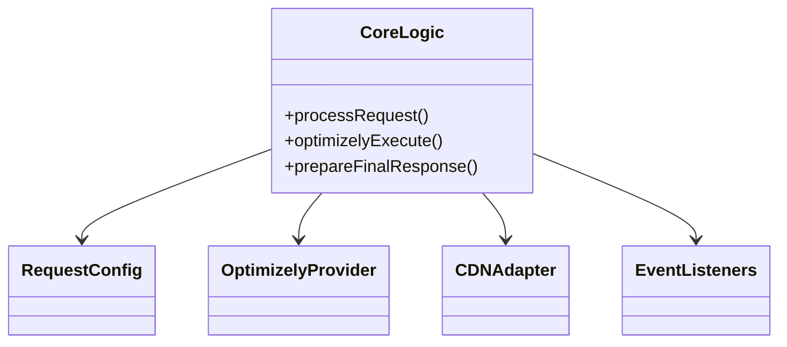
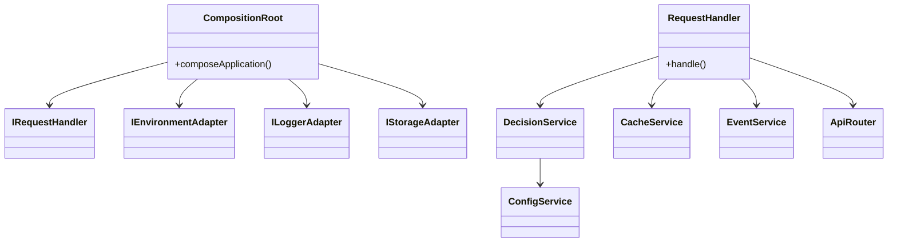

# Component Relationship Diagrams

_Last Updated: 2025-04-18_

## v1 – Monolithic Structure

## v2 – Service‑Oriented Structure

### Observations

1. **v1** collapses all dependencies into `CoreLogic`, resulting in a dense cluster with many outgoing arrows.
2. **v2** delegates responsibilities to small services, each arrow representing a bounded contract (interface).
3. CompositionRoot clearly defines adapter boundaries, enabling CDN‑specific injection at startup.
