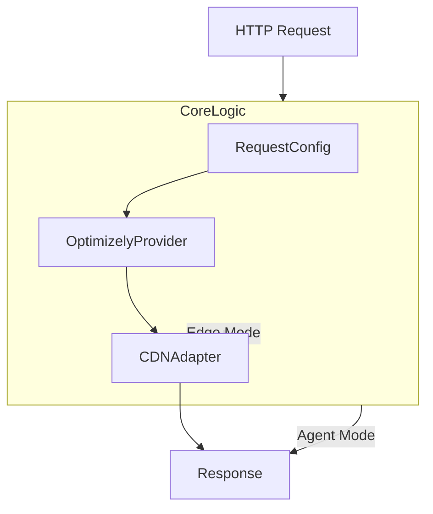

# v1 Architecture – JavaScript Implementation

_Last Updated: 2025-04-18_

## High‑Level Overview

v1 is built around a **monolithic core module**: `src/coreLogic.js`. All request handling, Optimizely SDK orchestration, Edge‑mode logic, Agent‑mode logic, caching, and CDN adapter interactions live inside this single class.

### Key Modules

| Component | Responsibility |
|-----------|---------------|
| **CoreLogic** | Central orchestrator – inspects request, fetches datafile, executes Optimizely SDK, applies Edge‑mode settings, forwards or returns content |
| **RequestConfig** | Parses headers, query, body; merges with defaults; exposes **mode** (Edge vs Agent) and other flags |
| **OptimizelyProvider** | Thin wrapper around Optimizely JS SDK client |
| **CDN Adapter (Cloudflare)** | Implements platform‑specific APIs (cache, KV, response creation) |
| **Helpers / EventListeners** | Misc utilities for Optimizely and custom hooks |

### Control Flow (simplified)



### Notable Characteristics

1. **Single Class Responsibility Overload** – `CoreLogic` contains >1K LOC covering multiple concerns.
2. **Runtime Configuration via Feature Variables** – Edge‑mode behaviour is driven by `cdnVariationSettings` feature variable inside flag variations.
3. **Ad‑hoc Dependency Management** – Dependencies are instantiated manually in constructor parameters; no formal DI container.
4. **Adapter Pattern (Partial)** – CDN abstractions exist but are still called directly by CoreLogic.

### Strengths
- Minimal upfront complexity, easy to trace synchronous flow.
- Works on multiple CDNs with adapter injection.

### Weaknesses
- **Tight Coupling** between concerns (request parsing, SDK usage, caching, forwarding).
- **Limited Testability** – Hard to isolate units due to monolith.
- **Scalability Issues** – Adding new service (e.g., metrics) would bloat CoreLogic further.

```text
File References
- src/coreLogic.js (Lines 1‑1197)
- src/_config_/requestConfig.js – config parser
- src/cdn‑adapters/cloudflare/cloudflareAdapter.js – example adapter
```
