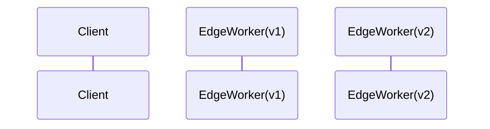

# Architecture Comparison – v1 vs v2

_Last Updated: 2025-04-18_

## Overview

This document captures the high‑level architectural patterns of Optimizely Edge Agent v1 (JavaScript) and v2 (TypeScript).

*(Diagrams and detailed sections will be populated as analysis proceeds.)*
