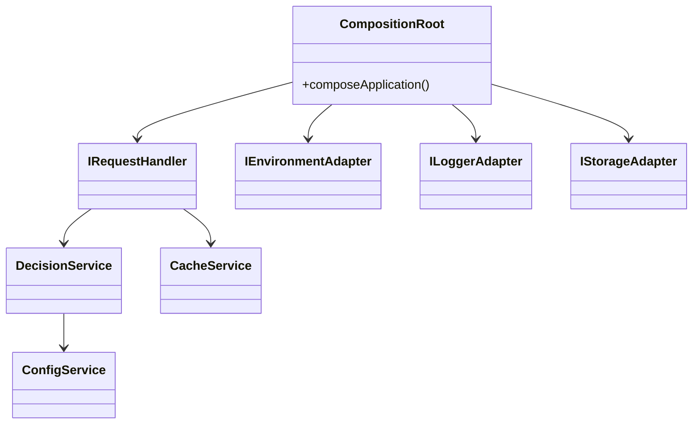

# v2 Architecture – TypeScript Implementation

_Last Updated: 2025-04-18_

## High‑Level Overview

v2 embraces **service‑oriented design** with clear interfaces and DI through a **composition root** (`src-v2/compositionRoot.ts`). Responsibilities are decomposed into small services.

### Core Layers / Services

| Layer | Example Classes | Responsibility |
|-------|-----------------|---------------|
| **Composition Root** | `compositionRoot.ts` | Instantiates adapters & services; selects CDN factory (Cloudflare, Vercel, Fastly) |
| **Environment / Adapter Layer** | `IEnvironmentAdapter`, `IRequestAdapter`, `ILoggerAdapter` | Abstracts platform APIs (KV, fetch, logging) |
| **Domain Services** | `DecisionService`, `ConfigService`, `CacheService`, `EventService` | Encapsulate business logic with pure interfaces |
| **Application Service** | `RequestHandler` implements `IRequestHandler` | Orchestrates request processing pipeline via injected services |

### Dependency Graph (simplified)



### Notable Characteristics

1. **Explicit DI** – All dependencies wired in one place; easier swapping/mocking.
2. **Interface‑First Design** – Clear contracts (`IRequestHandler`, `ICacheService`, etc.).
3. **Extensible Adapters** – Factories create CDN‑specific implementations; adding new CDN is isolated.
4. **Metrics & Logging** – Optional adapters injected if supported (Cloudflare metrics).

### Strengths over v1
- **Separation of Concerns** – Each service has single responsibility.
- **Type Safety** with strict TypeScript.
- **Testability** – Small units, mockable interfaces.
- **Extensibility** – New platform support via adapter factories.

### Potential Trade‑offs
- Increased initialization complexity.
- Slight runtime overhead from indirection layers.

```text
File References
- src-v2/compositionRoot.ts (Lines 1‑357)
- src-v2/services/interfaces/* – service contracts
- src-v2/adapters/interfaces/* – adapter contracts
```
