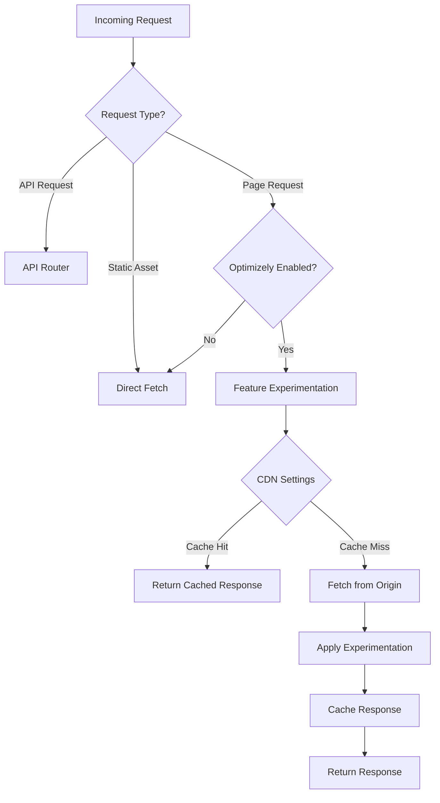

# Cloudflare CDN Adapter Analysis

*Last Updated: April 18, 2025*

## Overview

This document provides an analysis of the Cloudflare adapter implementation in the Optimizely Edge Agent. The Cloudflare adapter serves as the integration layer between Cloudflare Workers and the Optimizely Feature Experimentation engine.

## Key Files

- `src/cdn-adapters/cloudflare/index.entry.js`: Main entry point for the Cloudflare Worker
- `src/cdn-adapters/cloudflare/cloudflareAdapter.js`: Core adapter implementation
- `src/cdn-adapters/cloudflare/cloudflareKVInterface.js`: Interface for Cloudflare KV storage

## Architecture

The Cloudflare adapter follows a modular architecture that separates concerns between:
1. Request handling
2. Feature experimentation
3. Caching
4. Origin communication
5. Event management

### Request Flow



## Core Functionality

### 1. Request Processing

The adapter intercepts all incoming requests through the `fetch` handler in `index.entry.js`, which then delegates to various components based on request type:

```javascript
export default {
  async fetch(request, env, ctx) {
    // Initialize logger and abstraction helper
    // Determine request type
    if (workerOperation || requestIsForAsset) {
      // Handle assets directly
    } else if (matchedRouteForAPI) {
      // Route to API handlers
    } else if (optimizelyEnabled && sdkKey) {
      // Initialize feature experimentation
      this.initializeCoreLogic(sdkKey, _abstractRequest, _env, _ctx, abstractionHelper);
      return cdnAdapter._fetch(_request, _env, _ctx, abstractionHelper);
    } else {
      // Default handling
    }
  }
}
```

### 2. CloudflareAdapter Class

The core adapter class (`cloudflareAdapter.js`) implements several key methods:

#### fetchHandler

This is the main method for processing requests through the feature experimentation pipeline:

```javascript
async fetchHandler(request, env, ctx) {
  // Initialize state
  // Determine origin URL
  // Process request through core logic
  // Handle caching based on CDN settings
  // Apply experimentation results
  // Return processed response
}
```

#### fetchAndProcessRequest

Handles the actual fetching and processing based on experimentation settings:

```javascript
async fetchAndProcessRequest(originalRequest, originUrl, cdnSettings, ctx) {
  // Clone request with new URL
  // Apply headers and cookies
  // Handle caching if needed
  // Apply response settings
  // Return processed response
}
```

### 3. Caching Strategy

The adapter implements intelligent caching based on feature flag variations:

```javascript
generateCacheKey(cdnSettings, originUrl) {
  // Generate cache key based on variation
  let cacheKeyUrl = new URL(originUrl);
  if (cdnSettings.cacheKey === 'VARIATION_KEY') {
    cacheKeyUrl.searchParams.set('flagKey', cdnSettings.flagKey);
    cacheKeyUrl.searchParams.set('variationKey', cdnSettings.variationKey);
  } else {
    cacheKeyUrl.searchParams.set('cacheKey', cdnSettings.cacheKey);
  }
  return cacheKeyUrl.href;
}
```

This allows for efficient caching while ensuring different variations are properly served.

### 4. Event Management

The adapter includes mechanisms for tracking and dispatching analytics events:

```javascript
async dispatchConsolidatedEvents(ctx, defaultSettings) {
  // Consolidate events by visitor
  // Batch events for efficiency
  // Send to Optimizely analytics endpoints
}
```

## Key Design Patterns

1. **Adapter Pattern**: The CloudflareAdapter acts as an interface between Cloudflare Workers and the Optimizely core logic.

2. **Event Listener Pattern**: The adapter uses an event system to allow extension at various points in the request lifecycle:
   ```javascript
   this.eventListenersResult = await this.eventListeners.trigger(
     'beforeProcessingRequest',
     request,
     this.coreLogic.requestConfig
   );
   ```

3. **Factory Pattern**: The adapter creates and configures various components (KV store, loggers, etc.) based on runtime configuration.

## Integration Points

1. **Cloudflare Workers**: Integration with the Cloudflare Workers runtime environment.
2. **Cloudflare KV**: For persistent storage of datafiles, flags, and user profiles.
3. **Optimizely SDK**: For feature flag evaluation and event tracking.
4. **Origin Servers**: For fetching content when needed.

## Performance Considerations

The adapter implements several optimizations:
1. Intelligent caching based on variations
2. Event batching and consolidation
3. Minimal processing for static assets
4. Efficient request cloning

## Conclusion

The Cloudflare adapter provides a robust integration between Cloudflare Workers and Optimizely Feature Experimentation. It handles the complexities of request interception, feature evaluation, content fetching, and response processing while maintaining good performance through intelligent caching strategies.

This architecture enables edge-based feature experimentation, moving the decision logic closer to users for improved performance and experience.