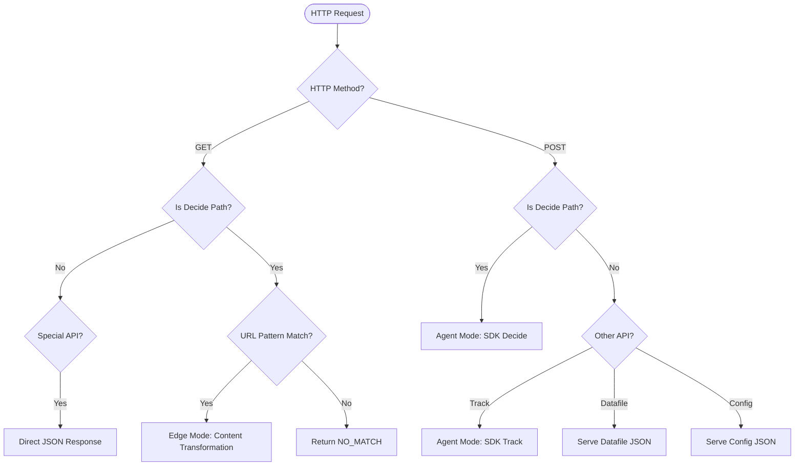

# Edge vs Agent Mode Determination Logic

_Last Updated: 2025-04-18_

## Overview

The Optimizely Edge Agent has two primary operating modes:

1. **Edge Mode**: When handling GET requests that match URL patterns, returns transformed or origin content
2. **Agent Mode**: When handling POST requests for SDK operations like decide/track

The determination of which mode to use depends on several overlapping factors.

## Request Classification

The v1 implementation uses multiple indicators to classify requests:

### 1. HTTP Method Classification

```javascript
this.httpMethod = request.method;
this.isPostMethod = this.httpMethod === 'POST';
this.isGetMethod = this.httpMethod === 'GET';
```

### 2. Path-Based Operation Type

```javascript
getIsDecideOperation(pathName) {
  if (this.isDecideOperation !== undefined) return this.isDecideOperation;
  const result = !['/v1/config', '/v1/datafile', '/v1/track', '/v1/batch'].includes(pathName);
  this.isDecideOperation = result;
  return result;
}
```

This effectively classifies all paths except specific API endpoints as "decide operations."

### 3. Special API Operation Flags

```javascript
this.datafileOperation = this.pathName === '/v1/datafile';
this.configOperation = this.pathName === '/v1/config';
```

## Mode Selection Logic

The combination of these factors determines the execution path:

```javascript
// Simplified decision tree
if (this.shouldReturnJsonResponse(this) && !isDecideOperation) {
  // Datafile or config API operations - direct JSON response
  reqResponse = await this.cdnAdapter.getNewResponseObject(optlyResponse, 'application/json', true);
} else if (this.isPostMethod && !isDecideOperation) {
  // Other POST operations - direct JSON response
  reqResponse = await this.cdnAdapter.getNewResponseObject(optlyResponse, 'application/json', true);
} else if (this.isDecideOperation) {
  // Decision operations (Edge or Agent mode)
  if (isDecideOperation) this.updateMetadata(...);
  
  // Edge Mode path - GET requests with URL matching
  if (this.isGetMethod && isDecideOperation) {
    this.cdnExperimentSettings = await this.findMatchingConfig(...);
  }

  if (this.isGetMethod && isDecideOperation && !this.cdnExperimentSettings) {
    reqResponse = 'NO_MATCH';
  } else {
    // Prepare decisions and final response
    this.serializedDecisions = await this.prepareDecisions(...);
    reqResponse = await this.prepareFinalResponse(...);
  }
}
```

## Edge Mode Activation

Edge Mode is activated when:
1. Request is a GET
2. Path is a decide operation (not a special API endpoint)
3. URL matches a pattern in cdnVariationSettings
4. `findMatchingConfig()` returns valid cdnExperimentSettings

```javascript
// From processRequest
if (this.isGetMethod && isDecideOperation) {
  this.cdnExperimentSettings = await this.findMatchingConfig(
    request.url,
    optlyResponse,
    defaultSettings.urlIgnoreQueryParameters
  );
}
```

The `findMatchingConfig` method searches `cdnVariationSettings` for URL patterns:

```javascript
async findMatchingConfig(requestURL, decisions, ignoreQueryParameters = true) {
  // Extracts cdnSettings from decisions
  const cdnSettings = this.extractCdnSettings(decisions);
  
  // Iterates through each setting looking for URL pattern matches
  for (const config of cdnSettings) {
    if (config.urlPattern) {
      // Compares URL with pattern (exact, prefix, or regex)
      if (this.compareUrlWithPattern(requestURL, config.urlPattern, ignoreQueryParameters)) {
        return config;
      }
    }
  }
  
  // No matching configuration found
  return null;
}
```

## Agent Mode Activation

Agent Mode is activated when:
1. Request is a POST to a decide operation endpoint
2. Request is to a special API endpoint (/v1/track, etc.)

```javascript
// In optimizelyExecute
async optimizelyExecute(flagsToDecide, flagsToForce, requestConfig) {
  if (this.httpMethod === 'POST' || this.datafileOperation || this.configOperation) {
    // POST operations (Agent Mode)
    return await this.handlePostOperations(flagsToDecide, flagsToForce, requestConfig);
  } else {
    // GET operations (Edge Mode if URL matches)
    return await this.optimizelyProvider.decide(flagsToDecide, flagsToForce);
  }
}
```

## Decision Control Flow Diagram



## Summary

The Edge vs Agent mode determination is a multi-factor decision process that depends on:
1. HTTP method (GET vs POST)
2. Path classification (decide operation vs special API)
3. URL pattern matching against cdnVariationSettings

This creates a flexible system where some requests are handled in Edge Mode (content transformation) while others are processed in Agent Mode (SDK operations).