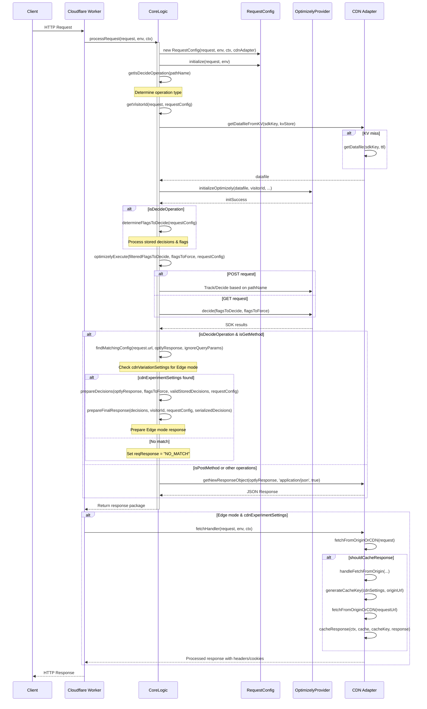

# v1 Request Handling Sequence Diagram

_Last Updated: 2025-04-18_

The following sequence diagram illustrates the key interactions between components during a typical request in the v1 architecture.



## Key Decision Points

1. **Operation Type Classification**
   ```javascript
   const isDecideOperation = !['/v1/config', '/v1/datafile', '/v1/track', '/v1/batch'].includes(pathName);
   ```

2. **Response Path Selection**
   ```javascript
   if (this.shouldReturnJsonResponse(this) && !isDecideOperation) {
     // Datafile or config operation path
   } else if (this.isPostMethod && !isDecideOperation) {
     // POST method without decide operation path
   } else if (this.isDecideOperation) {
     // Decide operation path (Edge or Agent mode)
   }
   ```

3. **Edge Mode Determination**
   ```javascript
   if (this.isGetMethod && isDecideOperation) {
     this.cdnExperimentSettings = await this.findMatchingConfig(
       request.url,
       optlyResponse,
       defaultSettings.urlIgnoreQueryParameters
     );
   }
   ```

## Error Flow

The entire request flow is wrapped in a try/catch block with error handling in the catch:

```javascript
catch (error) {
  this.logger.error('Error processing request:', error.message);
  return {
    reqResponse: await this.cdnAdapter.getNewResponseObject(
      `Internal Server Error: ${error.message}`,
      'text/html',
      false,
      500
    ),
    cdnExperimentSettings: undefined,
    reqResponseObjectType: 'response',
    forwardRequestToOrigin: this.forwardRequestToOrigin,
    errorMessage: error.message,
    isError: true,
  };
}
```

This error handling ensures that failures anywhere in the process will return a properly formatted 500 response to the client.