# V2 Request Flow Sequence Diagram

_Last Updated: 2025-04-18_

This diagram illustrates the detailed request handling flow in the v2 implementation, highlighting the service interactions, decision points, and error handling paths.

```mermaid
sequenceDiagram
    participant Client
    participant RequestHandler
    participant DecisionService
    participant EventService
    participant EdgeModeIntegration
    participant CacheService
    participant ApiRouter
    participant ConfigurationService
    participant CookieService
    participant FlagStorageService
    participant MetricsAdapter
    participant LoggerAdapter

    Client->>+RequestHandler: HTTP Request
    RequestHandler->>MetricsAdapter: startTimer('request_duration')
    RequestHandler->>MetricsAdapter: incrementCounter('requests_total')
    RequestHandler->>LoggerAdapter: info('Handling request')
    
    Note over RequestHandler: Request classification
    
    alt path.endsWith('/track.gif')
        RequestHandler->>ConfigurationService: getRequestConfig()
        ConfigurationService-->>RequestHandler: config
        RequestHandler->>RequestHandler: getVisitorId()
        RequestHandler->>EventService: trackEvent()
        RequestHandler-->>Client: Transparent GIF response
        
    else path.startsWith('/api/')
        RequestHandler->>LoggerAdapter: info('Detected API request')
        
        alt path === '/api/sdk'
            RequestHandler-->>Client: SDK info response
            
        else has ApiRouter
            RequestHandler->>ApiRouter: routeApiRequest()
            
            alt API request succeeds
                ApiRouter-->>RequestHandler: result
                RequestHandler-->>Client: API Response
                
            else API request fails
                ApiRouter-->>RequestHandler: error
                RequestHandler->>LoggerAdapter: error('API request error')
                RequestHandler->>MetricsAdapter: incrementCounter('api_errors_total')
                RequestHandler-->>Client: Error response (500)
            end
            
        else no ApiRouter
            RequestHandler->>LoggerAdapter: warn('ApiRouter not available')
            RequestHandler-->>Client: Error response (501)
        end
        
    else normal request processing
        RequestHandler->>RequestHandler: getVisitorId()
        RequestHandler->>RequestHandler: extractAttributes()
        
        alt method === 'POST' (Agent Mode)
            RequestHandler->>RequestHandler: handleAgentModeRequest()
            RequestHandler->>ConfigurationService: getRequestConfig()
            ConfigurationService-->>RequestHandler: config
            RequestHandler->>CookieService: getDecisionsFromCookies()
            CookieService-->>RequestHandler: cookieDecisions
            
            alt path === '/decide'
                RequestHandler->>DecisionService: getDecision/decide()
                DecisionService-->>RequestHandler: decision
                RequestHandler-->>Client: Decision JSON response
                
            else path === '/decide-all' or '/decide-for-keys'
                RequestHandler->>DecisionService: decideAll()
                DecisionService-->>RequestHandler: decisions
                RequestHandler-->>Client: Decisions JSON response
                
            else path === '/track'
                RequestHandler->>EventService: trackEvent()
                RequestHandler-->>Client: Success JSON response
                
            else unknown path
                RequestHandler-->>Client: Error response (404)
            end
            
            RequestHandler->>MetricsAdapter: incrementCounter('agent_mode_requests')
            
        else method === 'GET' (Edge Mode)
            RequestHandler->>RequestHandler: handleEdgeModeRequest()
            RequestHandler->>MetricsAdapter: startTimer('edge_mode_duration')
            
            alt Has EdgeModeIntegration
                RequestHandler->>EdgeModeIntegration: processEdgeModeRequest()
                
                alt Integration succeeds
                    EdgeModeIntegration-->>RequestHandler: response
                    RequestHandler-->>Client: Edge Mode response
                    
                else Integration fails
                    EdgeModeIntegration-->>RequestHandler: error
                    Note over RequestHandler: Fall back to legacy implementation
                end
                
            else Legacy Edge Mode implementation
                RequestHandler->>DecisionService: decideAll()
                DecisionService-->>RequestHandler: allDecisions
                RequestHandler->>RequestHandler: findMatchingConfig()
                
                alt Matching config found
                    RequestHandler->>DecisionService: decide()
                    DecisionService-->>RequestHandler: decision
                    RequestHandler->>EventService: trackEvent() (impression)
                    
                    alt forwardRequestToOrigin
                        RequestHandler->>RequestHandler: createForwardResponse()
                        
                        alt cacheKey exists
                            RequestHandler->>CacheService: get()
                            CacheService-->>RequestHandler: cachedResponse
                            
                            alt Cache hit
                                RequestHandler-->>Client: Cached response
                                
                            else Cache miss
                                RequestHandler->>EdgeModeIntegration: fetchContent()
                                EdgeModeIntegration-->>RequestHandler: response
                                RequestHandler->>CacheService: set()
                                RequestHandler-->>Client: Fresh response
                            end
                            
                        else No cacheKey
                            RequestHandler->>EdgeModeIntegration: fetchContent()
                            EdgeModeIntegration-->>RequestHandler: response
                            RequestHandler-->>Client: Response
                        end
                        
                    else Direct content
                        RequestHandler->>RequestHandler: createContentResponse()
                        
                        alt cacheKey exists
                            RequestHandler->>CacheService: get()
                            CacheService-->>RequestHandler: cachedContent
                            
                            alt Cache hit
                                RequestHandler-->>Client: Cached content
                                
                            else Cache miss
                                RequestHandler->>EdgeModeIntegration: fetchContent()
                                EdgeModeIntegration-->>RequestHandler: content
                                
                                alt Content transformation
                                    RequestHandler->>RequestHandler: transformContent()
                                end
                                
                                RequestHandler->>CacheService: set()
                                RequestHandler-->>Client: Fresh content
                            end
                            
                        else No cacheKey
                            RequestHandler->>EdgeModeIntegration: fetchContent()
                            EdgeModeIntegration-->>RequestHandler: content
                            RequestHandler-->>Client: Content
                        end
                    end
                    
                else No matching config
                    RequestHandler->>RequestHandler: createForwardResponse()
                    RequestHandler-->>Client: Forwarded response
                end
                
            end
            
            RequestHandler->>MetricsAdapter: incrementCounter('edge_mode_requests')
            
        else Unsupported method
            RequestHandler->>RequestHandler: createErrorResponse(405)
            RequestHandler->>MetricsAdapter: incrementCounter('unsupported_method_requests')
            RequestHandler-->>Client: Method Not Allowed (405)
        end
    end
    
    RequestHandler->>MetricsAdapter: incrementCounter('response_status')
    RequestHandler->>FlagStorageService: triggerCleanupIfNeeded()
    RequestHandler->>MetricsAdapter: stopTimer('request_duration')
    RequestHandler-->>-Client: Final Response
    
    Note over RequestHandler: Global error handling
    
    alt Any error during processing
        RequestHandler->>LoggerAdapter: error('Error handling request')
        RequestHandler->>MetricsAdapter: incrementCounter('request_errors')
        RequestHandler->>MetricsAdapter: stopTimer('request_duration')
        RequestHandler-->>Client: Error response (500)
    end
```

## Key Flow Decision Points

### 1. Request Classification
- **Pixel Tracking Path**: Detected by endpoint `/track.gif` and handles both GET and POST methods
- **API Request Path**: Detected by prefix `/api/` and delegates to ApiRouter if available
- **Agent Mode Path**: Handles POST requests for decision/tracking SDK operations
- **Edge Mode Path**: Handles GET requests for content serving based on experiments

### 2. Agent Mode (POST) Decision Points
- Different endpoints (`/decide`, `/decide-all`, `/decide-for-keys`, `/track`) determine service interactions
- Sticky bucketing from cookies may override fresh decisions
- Options and attributes are passed to decision service

### 3. Edge Mode (GET) Decision Points
- Modern EdgeModeIntegration attempted first with fallback to legacy implementation
- URL matching against experiment configs determines content delivery approach
- Content delivery strategies depend on settings:
  - `forwardRequestToOrigin`: Controls if request goes to origin vs direct serving
  - `cacheKey` and `cacheTTL`: Controls caching behavior
  - `transformContent`: Optional content transformation
  
### 4. Caching Decision Points
- Cache lookup performed based on cache key configuration
- TTL-based expiration controls cache freshness
- Cache hit/miss metrics tracked for optimization

### 5. Error Handling
- Structured error responses with consistent formatting
- Error metrics collection for monitoring
- Fallback mechanisms at multiple decision points

## Service Interaction Patterns

1. **Initialization Dependency Injection**: Services injected in constructor
2. **Request-Response Pattern**: Services return results that flow through handler
3. **Cascading Fallbacks**: Primary service failures trigger fallback implementations
4. **Metrics Instrumentation**: Timer start/stop surrounds critical operations
5. **Context Propagation**: UserContext and RequestId passed through service chain

The v2 implementation leverages a clear service-oriented approach with well-defined interfaces, comprehensive metrics, and robust error handling throughout the request flow.