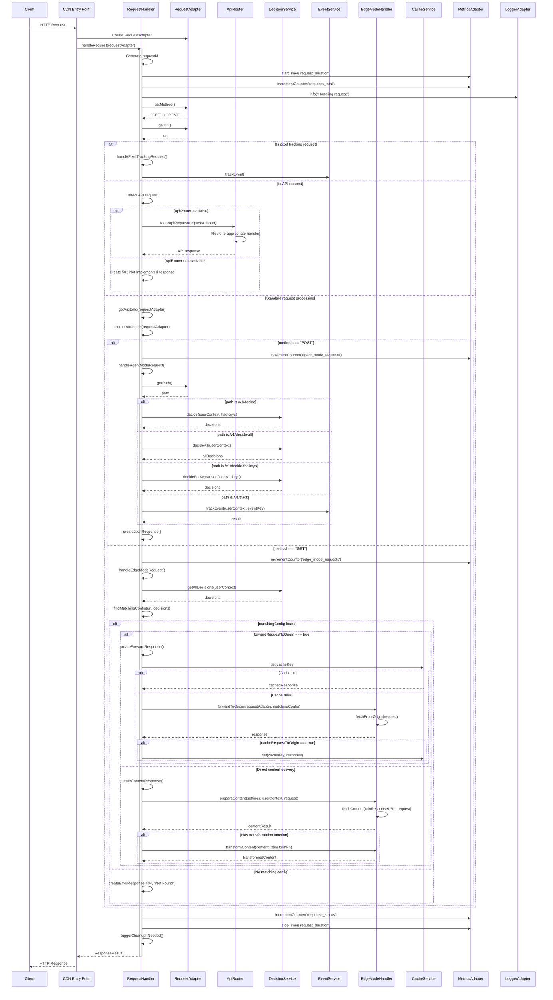

# v2 Request Handling Sequence Diagram

_Last Updated: 2025-04-18_

The following sequence diagram illustrates the service interactions during request handling in the v2 architecture.



## Decision Points

The v2 architecture introduces a clear set of decision points:

1. **Initial Request Classification**
   ```typescript
   if (path.endsWith('/track.gif')) {
     // Handle pixel tracking
   } else if (path.startsWith('/api/')) {
     // Route through ApiRouter
   } else {
     // Standard request processing
   }
   ```

2. **Mode Selection**
   ```typescript
   if (method === 'POST') {
     // Agent Mode (SDK operations)
     result = await this.handleAgentModeRequest(requestAdapter, requestId, userContext);
   } else if (method === 'GET') {
     // Edge Mode (content delivery)
     result = await this.handleEdgeModeRequest(requestAdapter, requestId, userContext);
   } else {
     // Unsupported methods
     result = this.createErrorResponse(requestId, 405, 'Method Not Allowed');
   }
   ```

3. **Agent Mode Operation Routing**
   ```typescript
   switch (path) {
     case '/v1/decide':
       // Handle decide
       break;
     case '/v1/decide-all':
       // Handle decideAll
       break;
     case '/v1/decide-for-keys':
       // Handle decideForKeys
       break;
     case '/v1/track':
       // Handle track
       break;
     // ...other operations
   }
   ```

4. **Edge Mode Content Delivery**
   ```typescript
   const matchingConfig = await this.findMatchingConfig(url.toString(), decisions);
   
   if (matchingConfig) {
     if (matchingConfig.forwardRequestToOrigin) {
       // Forward to origin
       return this.createForwardResponse(requestAdapter, requestId, userContext, matchingConfig);
     } else {
       // Direct content delivery
       return this.createContentResponse(requestAdapter, requestId, userContext, matchingConfig);
     }
   } else {
     // No matching configuration
     return this.createErrorResponse(requestId, 404, 'Not Found');
   }
   ```

This layered decision-making structure enables clear separation of concerns and makes the request flow more maintainable.

## Key Benefits of v2 Sequence

1. **Clear Service Boundaries** - Each service is responsible for a specific part of the request processing
2. **Injectable Services** - Any service can be replaced with a mock for testing
3. **Comprehensive Metrics** - Metrics are collected at key points in the request lifecycle
4. **Structured Logging** - Each component logs with its own prefix and structured data
5. **Consistent Error Handling** - Errors are caught at the handler level and processed uniformly