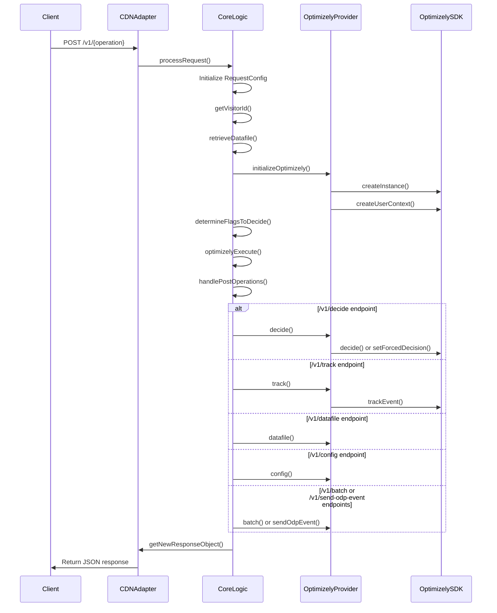

# Agent Mode Implementation Analysis - v1

*Last Updated: April 18, 2025*

## Table of Contents

- [Overview](#overview)
- [Request Handling Flow](#request-handling-flow)
- [SDK Operation Execution](#sdk-operation-execution)
- [Parameter Validation](#parameter-validation)
- [SDK Initialization Strategy](#sdk-initialization-strategy)
- [Decision Making and Forced Decisions](#decision-making-and-forced-decisions)
- [Event Tracking Implementation](#event-tracking-implementation)
- [EventTags Handling](#eventtags-handling)
- [Response Formatting](#response-formatting)
- [Key Components](#key-components)
- [v1-v2 Comparison](#v1-v2-comparison)
- [Integration Examples](#integration-examples)
- [Key Findings](#key-findings)

## Overview

Agent Mode in the Optimizely Edge Agent v1 allows for running Optimizely SDK operations directly at the edge, serving as a backend service for clients. This document analyzes how the v1 implementation processes POST requests, parses parameters, interacts with the Optimizely SDK, and returns structured responses.

Primary files analyzed:
- `src/coreLogic.js`
- `src/_optimizely_/optimizelyProvider.js`

## Request Handling Flow

The Agent Mode implementation in v1 is primarily focused on handling POST requests that call specific API endpoints for Optimizely operations. The core flow is as follows:



The entry point for Agent Mode is the `processRequest` method in `CoreLogic.js` (line 315), but the key Agent Mode-specific logic is in the `handlePostOperations` method (lines 536-609) which handles different POST endpoints:

```javascript
async handlePostOperations(flagsToDecide, flagsToForce, requestConfig) {
    switch (this.pathName) {
        case '/v1/decide':
            this.eventListenersResult = await this.eventListeners.trigger(
                'beforeDecide',
                this.request,
                requestConfig,
                flagsToDecide,
                flagsToForce
            );
            this.logger.debug('POST operation [/v1/decide]: Decide');
            let result = await this.optimizelyProvider.decide(flagsToDecide, flagsToForce, requestConfig.forcedDecisions);
            this.eventListenersResult = await this.eventListeners.trigger(
                'afterDecide',
                this.request,
                requestConfig,
                result
            );
            return result;
        case '/v1/track':
            this.logger.debug('POST operation [/v1/track]: Track');
            this.trackOperation = true;
            if (requestConfig.eventKey && typeof requestConfig.eventKey === 'string') {
                let result = await this.optimizelyProvider.track(
                    requestConfig.eventKey,
                    requestConfig.attributes,
                    requestConfig.eventTags
                );
                // Return success or error message based on result
            } else {
                return await this.cdnAdapter.getNewResponseObject(
                    'Invalid or missing event key. An event key is required for tracking conversions.',
                    'text/html',
                    false,
                    400
                );
            }
        case '/v1/datafile':
            // Fetch and return datafile
        case '/v1/config':
            // Fetch and return config
        case '/v1/batch':
            // Handle batch operations
        case '/v1/send-odp-event':
            // Handle ODP events
        default:
            throw new Error(`URL Endpoint Not Found: ${this.pathName}`);
    }
}
```

This method acts as a router, delegating each API endpoint to the appropriate function in the OptimizelyProvider, then formatting the response for the client.

## SDK Operation Execution

The `OptimizelyProvider` class (in `src/_optimizely_/optimizelyProvider.js`) serves as the bridge between CoreLogic and the Optimizely SDK. It handles SDK initialization, user context creation, and execution of SDK operations.

### SDK Initialization

SDK initialization occurs in the `initializeOptimizely` method (lines 146-198 in OptimizelyProvider.js):

```javascript
async initializeOptimizely(
    datafile,
    visitorId,
    defaultDecideOptions = [],
    attributes = {},
    eventTags = {},
    datafileAccessToken = '',
    userAgent = '',
    sdkKey = '',
) {
    this.visitorId = visitorId;

    try {
        this.validateParameters(attributes, eventTags, defaultDecideOptions, userAgent, datafileAccessToken);

        // Use global client if SDK key hasn't changed, otherwise create new client
        if (globalSdkKey !== sdkKey) {
            globalKVStoreUserProfile = this.kvStoreUserProfileEnabled
                ? globalKVStoreUserProfile || new UserProfileService(this.kvStoreUserProfile, sdkKey)
                : null;
                
            const params = this.buildInitParameters(
                datafile,
                datafileAccessToken,
                defaultDecideOptions,
                visitorId,
                globalKVStoreUserProfile,
            );
            globalOptimizelyClient = createInstance(params);
            globalSdkKey = sdkKey;
        }

        // Prefetch user profiles if enabled
        // Create user context with attributes
        this.optimizelyClient = globalOptimizelyClient;
        attributes = await this.getAttributes(attributes, userAgent);
        this.optimizelyUserContext = this.optimizelyClient.createUserContext(visitorId, attributes);

        return true;
    } catch (error) {
        logger().error('Error initializing Optimizely:', error);
        throw error;
    }
}
```

Key aspects of SDK initialization:
1. Global caching of the Optimizely client based on SDK key for efficiency
2. Optional User Profile Service for consistent bucketing across requests
3. Event dispatcher configuration for sending decision events to Optimizely
4. User context creation with visitor ID and attributes

### Operation Execution

The main operations exposed through Agent Mode:

1. **decide** (lines 260-302): Makes decisions for feature flags
   ```javascript
   async decide(flagKeys, flagsToForce, forcedDecisionKeys = []) {
       const decisions = [];
       let forcedDecisions = [];
       
       // Determine forced decisions from different sources
       if (isFlagsToForceValid && isForcedDecisionKeysValid) {
           forcedDecisions = [...flagsToForce, ...forcedDecisionKeys];
       } else if (isFlagsToForceValid) {
           forcedDecisions = flagsToForce;
       } else if (isForcedDecisionKeysValid) {
           forcedDecisions = forcedDecisionKeys;
       }
       
       // Process non-forced decisions
       for (const flagKey of flagKeys) {
           if (!this.isForcedDecision(flagKey, forcedDecisions)) {
               const decision = this.optimizelyUserContext.decide(flagKey);
               if (decision) {
                   decisions.push(decision);
               }
           }
       }
       
       // Process forced decisions
       for (const forcedDecision of forcedDecisions) {
           const decision = await this.getDecisionForFlag(forcedDecision, true);
           if (decision) {
               decisions.push(decision);
           }
       }
       
       // Save user profile if enabled
       if (this.kvStoreUserProfileEnabled && this.kvStoreUserProfile) {
           // Save profile to KV storage
       }
       
       return decisions;
   }
   ```

2. **track** (lines 356-365): Tracks conversion events
   ```javascript
   async track(eventKey, attributes = {}, eventTags = {}) {
       const result = this.optimizelyUserContext.trackEvent(eventKey, attributes, eventTags);
       return result;
   }
   ```

3. **datafile** (lines 370-373): Returns the current datafile
   ```javascript
   async datafile() {
       return optlyHelper.safelyParseJSON(this.optimizelyClient.getOptimizelyConfig().getDatafile());
   }
   ```

4. **config** (lines 378-381): Returns the Optimizely configuration
   ```javascript
   async config() {
       return this.optimizelyClient.getOptimizelyConfig();
   }
   ```

5. **batch** and **sendOdpEvent**: Stub implementations for batch processing and ODP events

## Parameter Validation

The v1 implementation has basic parameter validation primarily in the `validateParameters` method of the OptimizelyProvider class:

```javascript
validateParameters(attributes, eventTags, defaultDecideOptions, userAgent, datafileAccessToken) {
    // Ensure attributes are an object
    if (attributes && typeof attributes !== 'object') {
        logger().warn('Optimizely attributes must be an object. Defaulting to empty object.');
        attributes = {};
    }

    // Ensure eventTags are an object
    if (eventTags && typeof eventTags !== 'object') {
        logger().warn('Optimizely eventTags must be an object. Defaulting to empty object.');
        eventTags = {};
    }

    // Ensure defaultDecideOptions is an array
    if (defaultDecideOptions && !Array.isArray(defaultDecideOptions)) {
        logger().warn('defaultDecideOptions must be an array. Defaulting to empty array.');
        defaultDecideOptions = [];
    }

    // Validate datafileAccessToken
    if (datafileAccessToken && typeof datafileAccessToken !== 'string') {
        logger().warn('datafileAccessToken must be a string. Defaulting to empty string.');
        datafileAccessToken = '';
    }

    // Only basic type checking, no deep validation
    return { attributes, eventTags, defaultDecideOptions, userAgent, datafileAccessToken };
}
```

Parameter validation in v1 has several key limitations:

1. **Surface-Level Validation**: Only checks basic types but doesn't validate the structure or content of objects.

2. **Inconsistent Validation**: Some parameters like `sdkKey` and `eventKey` have basic validation in different places but not consistently applied.

3. **Silent Defaults**: Often defaults to empty objects/arrays on invalid input without clear errors to clients.

4. **Limited Validation for Critical Fields**: Key parameters like `flagKey` and `visitorId` have minimal validation.

5. **API-Specific Validation**: Different validation for different endpoints, with varying levels of strictness:

   * **`/v1/decide` Endpoint**:
     ```javascript
     // Only validates that flagKeys is an array-like object
     const flagKeys = Array.isArray(requestConfig.flagKeys) 
         ? requestConfig.flagKeys 
         : [requestConfig.flagKey];
     
     // Basic type checking for forcedDecisions
     const forcedDecisions = typeof requestConfig.forcedDecisions === 'object' 
         ? requestConfig.forcedDecisions 
         : {};
     ```

   * **`/v1/track` Endpoint**:
     ```javascript
     // Only validates that eventKey is defined and is a string
     if (requestConfig.eventKey && typeof requestConfig.eventKey === 'string') {
         // proceed with tracking
     } else {
         return await this.cdnAdapter.getNewResponseObject(
             'Invalid or missing event key. An event key is required for tracking conversions.',
             'text/html',
             false,
             400
         );
     }
     ```

6. **Missing Schema Validation**: No formal schema validation for request parameters, relying instead on ad-hoc checks.

The validation approach leaves the system vulnerable to unexpected inputs and provides inconsistent feedback to API consumers.

## SDK Initialization Strategy

The SDK initialization strategy in v1 implements several important patterns:

### 1. Global Client Caching

```javascript
// Global caching using module-level variables
let globalOptimizelyClient;
let globalSdkKey;
let globalKVStoreUserProfile;

// Inside initializeOptimizely
if (globalSdkKey !== sdkKey) {
    globalKVStoreUserProfile = this.kvStoreUserProfileEnabled
        ? globalKVStoreUserProfile || new UserProfileService(this.kvStoreUserProfile, sdkKey)
        : null;
        
    const params = this.buildInitParameters(/* ... */);
    globalOptimizelyClient = createInstance(params);
    globalSdkKey = sdkKey;
}
```

This approach provides:
- Performance benefits by reusing the same client instance
- Memory efficiency for handling multiple requests
- Challenges in multi-tenant environments where different clients might use the same SDK key

### 2. Datafile Management

```javascript
// In CoreLogic.js
async retrieveDatafile() {
    // Check if cached in memory
    if (this.optimizelyDatafileJSON) {
        return this.optimizelyDatafileJSON;
    }

    // Try to get from CDN KV store
    const kvStore = await this.cdnAdapter.getOptimizelyKVStore();
    if (kvStore) {
        const datafile = await kvStore.get(`datafile:${this.sdkKey}`);
        if (datafile) {
            return datafile;
        }
    }

    // Fetch from network as last resort
    try {
        const datafileJson = await fetch(`https://cdn.optimizely.com/datafiles/${this.sdkKey}.json`);
        const datafile = await datafileJson.json();
        
        // Cache for future use
        if (kvStore) {
            await kvStore.put(`datafile:${this.sdkKey}`, datafile);
        }
        
        this.optimizelyDatafileJSON = datafile;
        return datafile;
    } catch (error) {
        this.logger.error('Error fetching datafile:', error);
        throw error;
    }
}
```

The datafile management strategy:
- Implements a multi-level caching approach
- Uses in-memory caching for the shortest response times
- Falls back to KV store for persistence across edge function executions
- Uses network fetching as a last resort
- Lacks sophisticated versioning or invalidation strategies

### 3. User Profile Management

```javascript
// Conditional initialization of User Profile Service
globalKVStoreUserProfile = this.kvStoreUserProfileEnabled
    ? globalKVStoreUserProfile || new UserProfileService(this.kvStoreUserProfile, sdkKey)
    : null;

// Include in SDK initialization if enabled
const params = {
    datafile,
    eventDispatcher: this.eventDispatcherEnabled ? defaultEventDispatcher : null,
    logger,
    userProfileService: globalKVStoreUserProfile,
    // ...other parameters
};
```

The user profile strategy:
- Conditionally enables user profile storage based on configuration
- Leverages KV storage for persistent profiles
- Provides consistent bucketing across requests
- Has limited cleanup or TTL management

### 4. SDK Configuration

```javascript
buildInitParameters(
    datafile,
    datafileAccessToken,
    defaultDecideOptions,
    visitorId,
    userProfileService,
) {
    return {
        datafile,
        eventDispatcher: this.eventDispatcherEnabled ? defaultEventDispatcher : null,
        logger,
        userProfileService,
        defaultDecideOptions: defaultDecideOptions || [],
        logLevel: this.logLevel,
        clientName: 'edge-agent',
        clientVersion: this.VERSION
    };
}
```

The SDK configuration approach:
- Sets appropriate client name and version for tracking
- Configures event dispatching based on settings
- Enables logging at the appropriate level
- Sets default decide options
- Lacks advanced configuration options available in v2

## Decision Making and Forced Decisions

The Agent Mode implementation supports three types of decision inputs:

1. **Standard Decisions**: Regular feature flag decisions based on user context
2. **Forced Decisions from Request**: Decisions specified in the request body
3. **Stored Decisions from Cookies**: Decisions retrieved from cookies (primarily used in Edge Mode, but accessible in Agent Mode)

### Forced Decisions Handling

Forced decisions are handled through `setForcedDecision` in the Optimizely SDK:

```javascript
async getDecisionForFlag(flagObj, doForceDecision = false) {
    if (doForceDecision) {
        this.optimizelyUserContext.setForcedDecision(
            { flagKey: flagObj.flagKey, ruleKey: flagObj.ruleKey },
            { variationKey: flagObj.variationKey },
        );
    }
    
    return await this.optimizelyUserContext.decide(flagObj.flagKey);
}
```

This allows clients to override the default bucketing logic and force specific variation assignments, which is useful for testing and debugging.

### Flag Selection Logic

The CoreLogic class determines which flags to evaluate through the `determineFlagsToDecide` method (lines 840-862), which:

1. Retrieves flag keys from the request, KV storage, or active flags
2. Processes stored decisions from cookies for GET requests (not applicable to Agent Mode's POST requests)
3. Calculates which flags need decisions vs. which can be forced from stored decisions

## Event Tracking Implementation

Conversion event tracking is implemented in the `track` method of OptimizelyProvider:

```javascript
async track(eventKey, attributes = {}, eventTags = {}) {
    logger().debug(
        'Tracking an event [track]:',
        'Event Key:',
        eventKey,
        'Attributes:',
        attributes,
        'Event Tags:',
        eventTags,
    );
    const result = this.optimizelyUserContext.trackEvent(eventKey, attributes, eventTags);
    return result;
}
```

In CoreLogic's `handlePostOperations`, the tracking flow is:

1. Validate that `eventKey` is provided and is a string
2. Call `optimizelyProvider.track` with the eventKey, attributes, and eventTags
3. Format a success or error response based on the result

The v1 implementation provides basic tracking functionality but lacks comprehensive error handling and event validation.

## EventTags Handling

EventTags are a critical part of the tracking implementation in v1, primarily used to:
1. Pass additional metadata about events
2. Set revenue or value for conversion events
3. Provide custom dimensions for analytics

The handling of eventTags in v1 has several key aspects:

### 1. EventTags Parameter Processing

```javascript
// In handlePostOperations
case '/v1/track':
    this.logger.debug('POST operation [/v1/track]: Track');
    this.trackOperation = true;
    if (requestConfig.eventKey && typeof requestConfig.eventKey === 'string') {
        let result = await this.optimizelyProvider.track(
            requestConfig.eventKey,
            requestConfig.attributes,
            requestConfig.eventTags
        );
        // Response handling
    }
```

The eventTags parameter is:
- Passed directly from requestConfig without additional processing
- Not validated beyond basic type-checking in the validateParameters method
- Passed unchanged to the SDK's trackEvent method

### 2. EventTags Validation

```javascript
// In validateParameters
if (eventTags && typeof eventTags !== 'object') {
    logger().warn('Optimizely eventTags must be an object. Defaulting to empty object.');
    eventTags = {};
}
```

Validation is minimal, only checking:
- That eventTags is either undefined or an object
- No validation of the object structure, property types, or special fields
- No handling of reserved key names like 'revenue' or 'value'

### 3. Special EventTag Fields

The v1 implementation doesn't provide special handling for important eventTag fields:

- **Revenue Events**: No specific validation for 'revenue' tag which should be a number
- **Value Events**: No validation for 'value' tag which should be a number 
- **Custom Tags**: No limits on number or size of custom tags

### 4. EventTags Format Example

When a client sends an event tracking request, the eventTags structure looks like:

```json
{
  "eventKey": "purchase_complete",
  "attributes": {
    "user_type": "returning",
    "browser": "chrome"
  },
  "eventTags": {
    "revenue": 42.50,
    "product_id": "SKU-123",
    "category": "electronics",
    "custom_dimension_1": "value1"
  }
}
```

The v1 implementation simply passes this structure to the SDK without processing or standardizing it.

## Response Formatting

The v1 implementation handles response formatting primarily through the `getNewResponseObject` method in the CDN adapter:

```javascript
async getNewResponseObject(body, contentType, base64Encode = false, status) {
    if (typeof body === 'object') {
        body = JSON.stringify(body);
        contentType = contentType || 'application/json';
    }

    contentType = contentType || 'text/html';
    let responseObject = {
        body,
        headers: {
            'content-type': [contentType],
            'cache-control': ['no-store'],
        },
    };

    if (status) {
        responseObject.status = status;
    }

    if (this.visitorId) {
        responseObject.headers['set-cookie'] = [
            `optly_edge_visitor_id=${this.visitorId}; path=/; max-age=${COOKIE_MAX_AGE}; secure; samesite=none`,
        ];
    }

    return responseObject;
}
```

Key aspects of response formatting in v1:

### 1. Response Structure

The standard response structure includes:
- **Body**: The response content, automatically stringified if an object
- **Headers**: Content-type and cache-control headers
- **Status**: HTTP status code (if provided)
- **Cookies**: Visitor ID cookie (if available)

### 2. Response Examples

**Successful Decision Response**:
```json
{
  "body": "[{\"flagKey\":\"my_flag\",\"enabled\":true,\"variationKey\":\"variation_1\",\"ruleKey\":\"rule_1\",\"variables\":{},\"reasons\":[\"random bucketing\"],\"userContext\":{\"userId\":\"user123\",\"attributes\":{}}}]",
  "headers": {
    "content-type": ["application/json"],
    "cache-control": ["no-store"],
    "set-cookie": ["optly_edge_visitor_id=user123; path=/; max-age=31536000; secure; samesite=none"]
  },
  "status": 200
}
```

**Error Response**:
```json
{
  "body": "Invalid or missing event key. An event key is required for tracking conversions.",
  "headers": {
    "content-type": ["text/html"],
    "cache-control": ["no-store"],
    "set-cookie": ["optly_edge_visitor_id=user123; path=/; max-age=31536000; secure; samesite=none"]
  },
  "status": 400
}
```

### 3. Response Headers

Standard headers include:
- **Content-Type**: 'application/json' for API responses, 'text/html' for errors
- **Cache-Control**: Always set to 'no-store' to prevent caching of decisions
- **Set-Cookie**: Sets visitor ID cookie when available
- Missing headers that v2 includes:
  - No request ID or correlation ID
  - No SDK version information
  - No implementation version

### 4. Response Limitations

The v1 response formatting has several limitations:
- Inconsistent error message formatting
- Limited metadata in response
- No structured error responses
- No standardization of decision response formats
- Limited customization options for response headers

## Key Components

### OptimizelyProvider

The `OptimizelyProvider` class (in `src/_optimizely_/optimizelyProvider.js`) is the central component for Agent Mode, providing:

1. SDK initialization and management
2. User context creation and handling
3. Methods for each SDK operation (decide, track, etc.)
4. Optional user profile service integration for consistent bucketing

### CoreLogic

The `CoreLogic` class (in `src/coreLogic.js`) acts as the coordinator:

1. Processes incoming requests
2. Routes API endpoints to appropriate handlers
3. Manages datafile retrieval and caching
4. Handles visitor ID generation and tracking
5. Formats responses for clients

### UserProfileService

The `UserProfileService` class (referenced in OptimizelyProvider) provides:

1. Persistent storage of user bucketing decisions
2. KV storage integration for distributed environments
3. Prefetching of user profiles for performance optimization

## v1-v2 Comparison

| Feature | v1 Implementation | v2 Implementation |
|---------|-------------------|-------------------|
| **Architecture** | Monolithic design with CoreLogic handling most functionality | Service-oriented with specialized interfaces and implementations |
| **Language** | JavaScript | TypeScript with strict type checking |
| **Code Organization** | Limited separation of concerns | Clear separation with interface-based design |
| **Parameter Validation** | Basic type checking, inconsistent | Comprehensive validation with proper error handling |
| **Error Handling** | Basic try/catch, limited standardization | Structured error responses with consistent formatting |
| **Dependency Management** | Direct dependencies, limited abstraction | Dependency injection via constructor parameters |
| **Decision Making** | Basic implementation with limited options | Enhanced with multiple endpoints and options |
| **Event Tracking** | Basic implementation | Enhanced with batching and configuration options |
| **Response Formatting** | Basic response objects | Standardized response objects with metadata |
| **Forced Decisions** | Basic support | Enhanced support with multiple mechanisms |
| **Performance Optimization** | Basic caching | Comprehensive caching with metrics |
| **Testability** | Limited due to tight coupling | Enhanced with interface-based design |
| **Metrics Collection** | None | Comprehensive metrics with custom adapters |
| **Multi-CDN Support** | Limited | Enhanced with adapter factories |

## Integration Examples

### Basic Flag Decision

```javascript
// Client code for getting a feature flag decision in v1
fetch('https://your-edge-worker.example.com/v1/decide', {
  method: 'POST',
  headers: {
    'Content-Type': 'application/json',
    'X-Optimizely-SDK-Key': 'your-sdk-key'
  },
  body: JSON.stringify({
    flagKey: 'my_feature_flag',
    userId: 'user123',
    attributes: {
      device: 'mobile',
      country: 'us'
    }
  })
})
.then(response => response.json())
.then(decisions => {
  // Process decisions
  console.log('Feature enabled:', decisions[0].enabled);
  console.log('Variation:', decisions[0].variationKey);
})
.catch(error => console.error('Error:', error));
```

### Event Tracking with EventTags

```javascript
// Client code for tracking an event with eventTags in v1
fetch('https://your-edge-worker.example.com/v1/track', {
  method: 'POST',
  headers: {
    'Content-Type': 'application/json',
    'X-Optimizely-SDK-Key': 'your-sdk-key'
  },
  body: JSON.stringify({
    eventKey: 'purchase',
    userId: 'user123',
    attributes: {
      device: 'mobile',
      country: 'us'
    },
    eventTags: {
      revenue: 42.50,
      product_id: 'SKU-123',
      category: 'electronics'
    }
  })
})
.then(response => response.json())
.then(result => console.log('Tracking result:', result))
.catch(error => console.error('Error:', error));
```

### Forced Decision Example

```javascript
// Client code for forcing a specific variation in v1
fetch('https://your-edge-worker.example.com/v1/decide', {
  method: 'POST',
  headers: {
    'Content-Type': 'application/json',
    'X-Optimizely-SDK-Key': 'your-sdk-key'
  },
  body: JSON.stringify({
    flagKey: 'my_feature_flag',
    userId: 'user123',
    attributes: {
      device: 'mobile',
      country: 'us'
    },
    forcedDecisions: {
      'my_feature_flag': {
        variationKey: 'variation_1'
      }
    }
  })
})
.then(response => response.json())
.then(decisions => console.log('Forced decision:', decisions[0]))
.catch(error => console.error('Error:', error));
```

## Key Findings

1. **Monolithic Structure**: Agent Mode functionality is embedded within the CoreLogic class rather than separated into a dedicated class, making the code harder to maintain and extend.

2. **Limited Error Handling**: Error handling is basic, primarily focused on catching and logging errors rather than providing detailed error responses to clients.

3. **Global State Management**: The implementation uses global variables for SDK client and KV storage, which provides performance benefits but may cause issues in multi-tenant environments.

4. **Limited Validation**: Input validation is minimal, potentially allowing invalid inputs to propagate to the SDK.

5. **Forced Decision Support**: The implementation properly supports forced decisions, allowing clients to override the default bucketing logic for testing and debugging.

6. **Optimizely SDK Integration**: The implementation correctly integrates with the Optimizely SDK, using the recommended UserContext pattern for decision making.

7. **Event Handling**: Event tracking is implemented but lacks comprehensive validation and error handling.

8. **Caching Strategy**: The implementation includes caching strategies for datafiles and user profiles, improving performance for repeated requests.

9. **Limited Metrics**: The implementation lacks detailed metrics and telemetry, making it difficult to monitor performance and usage.

10. **Limited Documentation**: Code comments provide basic information but lack detailed explanations of design decisions and implementation details.

The Agent Mode implementation in v1 provides core functionality for SDK operations but would benefit from improved structure, error handling, validation, and telemetry to enhance reliability and maintainability.