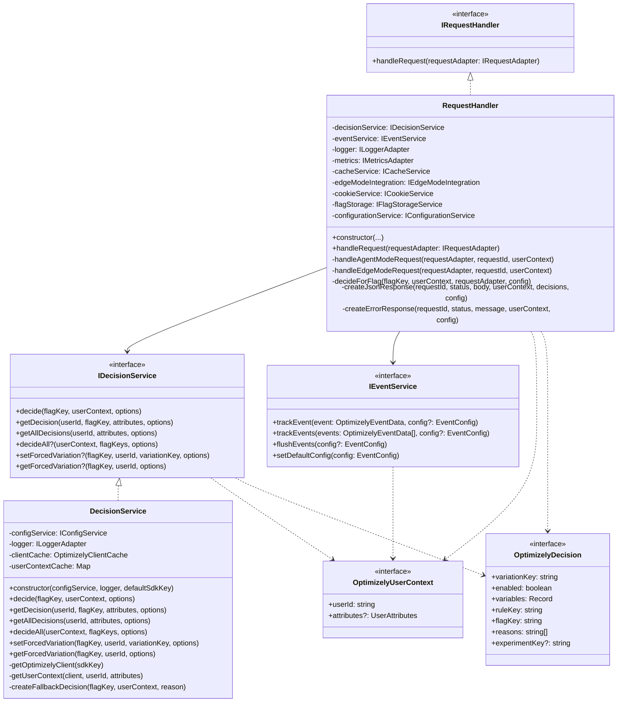

# Agent Mode Implementation Analysis - v2

*Last Updated: April 18, 2025*

## Table of Contents

- [Overview](#overview)
- [Component Architecture](#component-architecture)
- [Service Separation](#service-separation)
- [Feature Flag Operations](#feature-flag-operations)
- [Attribute Extraction](#attribute-extraction)
- [API Endpoint Coverage](#api-endpoint-coverage)
- [Type Safety Benefits](#type-safety-benefits)
- [Performance Considerations](#performance-considerations)
- [Response Formatting and Error Handling](#response-formatting-and-error-handling)
- [Comparison with v1](#comparison-with-v1)
- [Migration Guidance](#migration-guidance)
- [Key Findings](#key-findings)

## Overview

Agent Mode in the Optimizely Edge Agent v2 has been refactored into a well-structured TypeScript implementation with clear separation of concerns and service-oriented architecture. This document analyzes how v2 implements Agent Mode, focusing on its component architecture, service separation, feature flag operations, and improvements over v1.

Primary files analyzed:
- `src-v2/services/implementations/RequestHandler.ts`
- `src-v2/services/implementations/DecisionService.ts`
- `src-v2/services/interfaces/IDecisionService.ts`
- `src-v2/services/interfaces/IEventService.ts`

## Component Architecture

The v2 implementation follows a service-oriented architecture with clear separation of concerns through interfaces and implementations:



The architecture has these key components:

1. **IRequestHandler/RequestHandler**: The entry point that routes requests to appropriate handlers
   - Defined in `src-v2/services/interfaces/IRequestHandler.ts` and `src-v2/services/implementations/RequestHandler.ts`
   - Coordinates between services and formats responses

2. **IDecisionService/DecisionService**: Specialized service for feature flag decisions
   - Defined in `src-v2/services/interfaces/IDecisionService.ts` and `src-v2/services/implementations/DecisionService.ts`
   - Handles flag decisions, forced decisions, and user context management

3. **IEventService**: Service for tracking events
   - Defined in `src-v2/services/interfaces/IEventService.ts`
   - Handles conversion and impression events

4. **Supporting Interfaces**:
   - `OptimizelyUserContext`: Represents user context for decision-making
   - `OptimizelyDecision`: Represents the result of a decision
   - `OptimizelyEventData`: Represents event data for tracking

The implementation follows these key patterns:
- **Interface Segregation**: Clear interfaces define specific component responsibilities
- **Dependency Injection**: Components receive their dependencies via constructor
- **Service Composition**: RequestHandler composes multiple services for a complete workflow
- **Adapter Pattern**: Request and response adapters abstract platform-specific details
- **Type Safety**: Strong TypeScript typing throughout the codebase

## Service Separation

The v2 implementation achieves a clear separation of concerns by dividing functionality into specialized services:

### Decision Service

The `DecisionService` (lines 41-909 in `src-v2/services/implementations/DecisionService.ts`) is responsible for:

1. **SDK Client Management**:
   ```typescript
   private async getOptimizelyClient(sdkKey: string): Promise<optimizely.Client | null> {
     const datafile = await this.configService.getDatafile(sdkKey);
     if (!datafile || typeof datafile !== 'object' || !('revision' in datafile)) {
       this.logger.error(`Failed to fetch valid datafile for SDK key '${sdkKey}'.`);
       return null;
     }

     const revision = String((datafile as any).revision);
     const cached = this.clientCache[sdkKey];

     if (cached && cached.revision === revision) {
       this.logger.debug(`Using cached Optimizely client for SDK key '${sdkKey}'`);
       // Update last used timestamp
       this.clientCache[sdkKey].lastUsed = Date.now();
       return cached.client;
     }

     // Create new client if not cached or revision changed
     // ...
   }
   ```

2. **Decision Making**:
   ```typescript
   async decide(
     flagKey: string,
     userContext: OptimizelyUserContext,
     options?: { sdkKey?: string; decideOptions?: OptimizelyDecideOption[] }
   ): Promise<OptimizelyDecision> {
     const sdkKey = options?.sdkKey || this.defaultSdkKey;
     // Get or initialize client
     // Create SDK user context
     // Apply forced decisions if needed
     // Make decision
     // Return result
   }
   ```

3. **Forced Decision Handling**:
   ```typescript
   private async applyForcedVariations(
     client: optimizely.Client,
     flagKey: string,
     userId: string,
     forcedVariationValue: string | null
   ): Promise<boolean> {
     try {
       const result = client.setForcedVariation(flagKey, userId, forcedVariationValue);
       return result;
     } catch (error) {
       this.logger.error(`Error applying forced variation directly:`, error);
       return false;
     }
   }
   ```

### Event Service

The `IEventService` interface (defined in `src-v2/services/interfaces/IEventService.ts`) handles:

1. **Event Tracking**:
   ```typescript
   /**
    * Tracks a single event.
    * @param event - The event data to track.
    * @param config - Optional configuration for this specific event.
    * @returns A promise that resolves when the event is tracked.
    */
   trackEvent(event: OptimizelyEventData, config?: EventConfig): Promise<void>;
   ```

2. **Batch Event Processing**:
   ```typescript
   /**
    * Tracks multiple events in a batch.
    * @param events - Array of events to track.
    * @param config - Optional configuration for this batch of events.
    * @returns A promise that resolves when all events are tracked.
    */
   trackEvents(events: OptimizelyEventData[], config?: EventConfig): Promise<void>;
   ```

3. **Event Configuration**:
   ```typescript
   /**
    * Sets the global default configuration for event tracking.
    * @param config - The configuration to set as default.
    */
   setDefaultConfig(config: EventConfig): void;
   ```

### Request Handler

The `RequestHandler` (lines 67-2762 in `src-v2/services/implementations/RequestHandler.ts`) coordinates between services:

1. **Request Routing**:
   ```typescript
   async handleRequest(requestAdapter: IRequestAdapter): Promise<ResponseResult> {
     const requestId = uuidv4();
     const method = requestAdapter.getMethod();
     const url = requestAdapter.getUrl();
     const path = url.pathname;

     // Extract user context
     const userId = await this.getVisitorId(requestAdapter);
     const userContext: OptimizelyUserContext = {
       userId,
       attributes: await this.extractAttributes(requestAdapter),
     };

     let result: ResponseResult;

     if (method === 'POST') {
       // Agent Mode (POST requests)
       result = await this.handleAgentModeRequest(requestAdapter, requestId, userContext);
     } else if (method === 'GET') {
       // Edge Mode (GET requests)
       result = await this.handleEdgeModeRequest(requestAdapter, requestId, userContext);
     } else {
       // Unsupported methods
       result = this.createErrorResponse(requestId, 405, 'Method Not Allowed');
     }

     return result;
   }
   ```

2. **Agent Mode Request Handling**:
   ```typescript
   private async handleAgentModeRequest(
     requestAdapter: IRequestAdapter,
     requestId: string,
     userContext: OptimizelyUserContext
   ): Promise<ResponseResult> {
     // Get request path and config
     const url = requestAdapter.getUrl();
     const path = url.pathname;
     const config = await this.getRequestConfig(requestAdapter);

     // Handle different endpoints
     switch (path) {
       case '/decide': {
         // Handle single flag decision
       }
       case '/decide-all': {
         // Handle multiple flag decisions
       }
       case '/decide-for-keys': {
         // Handle specific flag keys decisions
       }
       case '/track': {
         // Handle event tracking
       }
       default: {
         return this.createErrorResponse(requestId, 404, `Unknown endpoint ${path}`);
       }
     }
   }
   ```

## Feature Flag Operations

The v2 implementation provides comprehensive feature flag operations through three main endpoints:

### 1. Single Flag Decision (`/decide`)

The v2 implementation supports single flag decisions with improved handling of forced decisions and sticky bucketing:

```typescript
// From RequestHandler.handleAgentModeRequest
case '/decide': {
  const flagKey = config.flagKey;

  if (!flagKey) {
    return this.createErrorResponse(requestId, 400, 'Missing flagKey parameter');
  }

  // Use decideForFlag which handles sticky bucketing
  const decision = await this.decideForFlag(flagKey, userContext, requestAdapter, config);
  this.logger.info(
    `RequestHandler [${requestId}]: Decision for flag ${flagKey}`,
    JSON.stringify(decision)
  );

  if (!decision) {
    return this.createErrorResponse(requestId, 500, `Error getting decision for flag ${flagKey}`);
  }

  // Create a decisions object with this single decision
  const decisions = { [flagKey]: decision };

  // Return the decision with proper headers and cookies
  return this.createJsonResponse(requestId, 200, decision, userContext, decisions, config);
}
```

### 2. Multiple Flag Decisions (`/decide-all`)

The v2 implementation adds support for deciding all flags in a single operation:

```typescript
// From RequestHandler.handleAgentModeRequest
case '/decide-all': {
  const sdkKey = config.sdkKey;

  if (!sdkKey) {
    return this.createErrorResponse(requestId, 400, 'Missing sdkKey parameter');
  }

  const flagKeys = config.flagKeys;

  if (!flagKeys || !Array.isArray(flagKeys) || flagKeys.length === 0) {
    return this.createErrorResponse(requestId, 400, 'Missing or invalid flagKeys parameter');
  }

  // Use decideAll with proper null check
  const decisions = this.decisionService.decideAll
    ? await this.decisionService.decideAll(userContext, flagKeys, {
        sdkKey,
        decideOptions: config.decideOptions || [],
      })
    : {};

  // Return the decisions with proper headers and cookies
  return this.createJsonResponse(requestId, 200, decisions, userContext, decisions, config);
}
```

### 3. Specific Flag Keys (`/decide-for-keys`)

The v2 implementation adds an optimized endpoint for deciding specific flag keys:

```typescript
// From RequestHandler.handleAgentModeRequest
case '/decide-for-keys': {
  const sdkKey = config.sdkKey;

  if (!sdkKey) {
    return this.createErrorResponse(requestId, 400, 'Missing sdkKey parameter');
  }

  const flagKeys = config.flagKeys;

  if (!flagKeys || !Array.isArray(flagKeys) || flagKeys.length === 0) {
    return this.createErrorResponse(requestId, 400, 'Missing or invalid flagKeys parameter');
  }

  // Use decideAll with filter for specific keys
  const decisions = this.decisionService.decideAll
    ? await this.decisionService.decideAll(userContext, flagKeys, {
        sdkKey,
        decideOptions: config.decideOptions || [],
      })
    : {};

  return this.createJsonResponse(requestId, 200, decisions, userContext, decisions, config);
}
```

### Forced Decision Handling

The v2 implementation enhances forced decision handling using both forcedDecisions attributes and direct SDK calls:

1. **Decision Level Forcing**:
```typescript
// From DecisionService.decide
// Check for forcedDecisions safely
let forcedDecisions: any = undefined;
if (userContext && userContext.attributes) {
  const attributes = userContext.attributes;
  if (typeof attributes === 'object' && attributes !== null && 'forcedDecisions' in attributes) {
    forcedDecisions = attributes.forcedDecisions;
  }
}

if (forcedDecisions) {
  // Apply forced variation directly via SDK client if relevant
  if (forcedDecisions[flagKey] && typeof forcedDecisions[flagKey] === 'object' &&
      forcedDecisions[flagKey].variationKey) {
    
    // Ensure variation key is preserved exactly as provided
    const variationKey = forcedDecisions[flagKey].variationKey;
    
    // Apply forced variation directly through the client
    await this.applyForcedVariations(
      client, 
      flagKey, 
      userContext.userId, 
      variationKey
    );
  }
}
```

2. **SDK Context-Based Forcing**:
```typescript
// Apply forced decisions to the SDK UserContext object
if (forcedDecisions && typeof forcedDecisions === 'object') {
  // If we have forcedDecisions and the UserContext has setForcedDecision method
  if (typeof optimizelyUserContext.setForcedDecision === 'function') {
    // Apply the specific forced decision for this flag if it exists
    if (flagKey in forcedDecisions) {
      const decision = forcedDecisions[flagKey];
      if (typeof decision === 'object' && decision !== null && 'variationKey' in decision) {
        const context = { flagKey }; // flagKey context
        const decisionToApply = { variationKey: decision.variationKey }; // variationKey to force
        
        // Set the forced decision
        const result = optimizelyUserContext.setForcedDecision(context, decisionToApply);
      }
    }
  }
}
```

## Attribute Extraction

The v2 implementation significantly improves attribute handling with dedicated methods in the RequestHandler class:

### 1. Unified Attribute Extraction

```typescript
/**
 * Extracts attributes from multiple sources with proper precedence
 * Headers > Query > Body
 */
private async extractAttributes(requestAdapter: IRequestAdapter): Promise<Record<string, any>> {
  try {
    // Get attributes from different sources with proper precedence
    const headerAttributes = await this.extractAttributesFromHeader(requestAdapter);
    const queryAttributes = await this.extractAttributesFromQuery(requestAdapter);
    const bodyAttributes = await this.extractAttributesFromBody(requestAdapter);
    
    // Merge with proper precedence
    return this.mergeAttributes(bodyAttributes, queryAttributes, headerAttributes);
  } catch (error) {
    this.logger.warn('Error extracting attributes:', error);
    return {};
  }
}
```

This method implements a consistent extraction approach across all endpoints with clear precedence rules:
1. Header attributes (highest priority)
2. Query parameters attributes
3. Request body attributes (lowest priority)

### 2. Source-Specific Extraction

The implementation includes specialized methods for each attribute source:

```typescript
/**
 * Extracts attributes from the X-Optimizely-Attributes header
 */
private async extractAttributesFromHeader(requestAdapter: IRequestAdapter): Promise<Record<string, any>> {
  const attributesHeader = requestAdapter.getHeader('X-Optimizely-Attributes');
  if (!attributesHeader) {
    return {};
  }
  
  try {
    // Parse JSON from header
    return JSON.parse(attributesHeader);
  } catch (error) {
    this.logger.warn('Failed to parse attributes header as JSON:', error);
    return {};
  }
}

/**
 * Extracts attributes from URL query parameters
 */
private async extractAttributesFromQuery(requestAdapter: IRequestAdapter): Promise<Record<string, any>> {
  const url = requestAdapter.getUrl();
  const attributesParam = url.searchParams.get('attributes');
  if (!attributesParam) {
    return {};
  }
  
  try {
    // Parse URL-encoded JSON
    return JSON.parse(attributesParam);
  } catch (error) {
    this.logger.warn('Failed to parse attributes query param as JSON:', error);
    return {};
  }
}

/**
 * Extracts attributes from the request body
 */
private async extractAttributesFromBody(requestAdapter: IRequestAdapter): Promise<Record<string, any>> {
  try {
    const body = await requestAdapter.getBodyAsJson();
    if (!body) {
      return {};
    }
    
    // Handle different possible formats
    if (body.attributes && typeof body.attributes === 'object') {
      return body.attributes;
    }
    
    if (body.user && body.user.attributes && typeof body.user.attributes === 'object') {
      return body.user.attributes;
    }
    
    return {};
  } catch (error) {
    this.logger.warn('Failed to extract attributes from body:', error);
    return {};
  }
}
```

### 3. Sophisticated Attribute Merging

```typescript
/**
 * Merges attributes from multiple sources with precedence:
 * later arguments override earlier ones
 */
private mergeAttributes(...attributeObjects: Record<string, any>[]): Record<string, any> {
  const merged = {};
  let forcedDecisions = null;
  
  // Process each source in order (increasing precedence)
  for (const attributes of attributeObjects) {
    // Handle regular attributes
    for (const [key, value] of Object.entries(attributes)) {
      // Special handling for forcedDecisions
      if (key === 'forcedDecisions') {
        forcedDecisions = this.mergeForcedDecisions(forcedDecisions, value);
      } else {
        merged[key] = value;
      }
    }
  }
  
  // Add merged forcedDecisions back to result
  if (forcedDecisions) {
    merged['forcedDecisions'] = forcedDecisions;
  }
  
  return merged;
}

/**
 * Special handling for merging forcedDecisions objects
 */
private mergeForcedDecisions(current: any, next: any): any {
  if (!current) {
    return next;
  }
  
  if (!next || typeof next !== 'object') {
    return current;
  }
  
  // Deep merge forcedDecisions objects
  const merged = { ...current };
  for (const [flagKey, decision] of Object.entries(next)) {
    merged[flagKey] = decision;
  }
  
  return merged;
}
```

This sophisticated approach:
- Properly merges attributes from multiple sources
- Provides special handling for complex attributes like `forcedDecisions`
- Maintains a clear precedence order
- Handles error cases gracefully

### 4. Attribute Handling in Decisions

```typescript
/**
 * Decide for a specific flag, applying user attributes appropriately
 */
async decideForFlag(
  flagKey: string,
  userContext: OptimizelyUserContext,
  requestAdapter: IRequestAdapter,
  config: Record<string, any>
): Promise<OptimizelyDecision | null> {
  try {
    // Apply additional request-specific attributes from config
    const requestAttributesOnly = config.attributes || {};
    const combinedAttributes = this.mergeAttributes(
      userContext.attributes || {},
      requestAttributesOnly
    );
    
    // Create combined user context with all attributes
    const fullUserContext: OptimizelyUserContext = {
      userId: userContext.userId,
      attributes: combinedAttributes
    };
    
    // Make decision with complete attributes
    return await this.decisionService.decide(flagKey, fullUserContext, {
      sdkKey: config.sdkKey,
      decideOptions: config.decideOptions
    });
  } catch (error) {
    this.logger.error(`Error deciding for flag ${flagKey}:`, error);
    return null;
  }
}
```

These enhancements represent significant improvements over v1:
- Proper extraction from all supported locations
- Clear precedence rules for attribute sources
- Sophisticated merging with special handling
- Strong typing of attributes and decisions
- Comprehensive error handling at each step

## API Endpoint Coverage

The v2 implementation provides comprehensive coverage of the Agent Mode API endpoints with enhanced functionality:

### 1. Main Agent Mode Endpoints

The RequestHandler's `handleAgentModeRequest` method supports five primary endpoints:

```typescript
private async handleAgentModeRequest(
  requestAdapter: IRequestAdapter,
  requestId: string,
  userContext: OptimizelyUserContext
): Promise<ResponseResult> {
  const url = requestAdapter.getUrl();
  const path = url.pathname;
  const config = await this.getRequestConfig(requestAdapter);

  // Log request information with correlation ID
  this.logger.info(`Processing Agent Mode request [${requestId}]: ${path}`);
  this.metrics.recordApiRequest(path);
  
  // Handle different endpoints
  switch (path) {
    case '/decide': {
      // Single flag decision endpoint
      // ...implementation
    }
    case '/decide-all': {
      // All flags decision endpoint
      // ...implementation
    }
    case '/decide-for-keys': {
      // Multiple specific flags decision endpoint
      // ...implementation
    }
    case '/track': {
      // Event tracking endpoint
      // ...implementation
    }
    case '/datafile': {
      // Datafile retrieval/updating endpoint
      // ...implementation
    }
    default: {
      this.metrics.recordApiError(path, 404);
      return this.createErrorResponse(requestId, 404, `Unknown endpoint ${path}`);
    }
  }
}
```

### 2. Decision Endpoints

#### `/decide` Endpoint
Makes a decision for a single feature flag:

```typescript
case '/decide': {
  const flagKey = config.flagKey;

  if (!flagKey) {
    this.metrics.recordApiError(path, 400, 'missing_flag_key');
    return this.createErrorResponse(requestId, 400, 'Missing flagKey parameter');
  }

  // Make decision
  const decision = await this.decideForFlag(flagKey, userContext, requestAdapter, config);
  this.logger.info(
    `RequestHandler [${requestId}]: Decision for flag ${flagKey}`,
    this.logSafeJson(decision)
  );

  if (!decision) {
    this.metrics.recordApiError(path, 500, 'decision_error');
    return this.createErrorResponse(requestId, 500, `Error getting decision for flag ${flagKey}`);
  }

  // Create decisions object for headers/cookies
  const decisions = { [flagKey]: decision };

  // Return formatted response
  return this.createJsonResponse(requestId, 200, decision, userContext, decisions, config);
}
```

#### `/decide-all` Endpoint
Makes decisions for all available feature flags:

```typescript
case '/decide-all': {
  const sdkKey = config.sdkKey;

  if (!sdkKey) {
    this.metrics.recordApiError(path, 400, 'missing_sdk_key');
    return this.createErrorResponse(requestId, 400, 'Missing sdkKey parameter');
  }

  // Use decideAll or fallback
  const decisions = this.decisionService.decideAll
    ? await this.decisionService.decideAll(userContext, [], {
        sdkKey,
        decideOptions: config.decideOptions || [],
      })
    : {};

  this.metrics.recordDecisionsCount(Object.keys(decisions).length);
  return this.createJsonResponse(requestId, 200, decisions, userContext, decisions, config);
}
```

#### `/decide-for-keys` Endpoint
Makes decisions for specific feature flags:

```typescript
case '/decide-for-keys': {
  const sdkKey = config.sdkKey;
  const flagKeys = config.flagKeys;

  // Validate parameters
  if (!sdkKey) {
    this.metrics.recordApiError(path, 400, 'missing_sdk_key');
    return this.createErrorResponse(requestId, 400, 'Missing sdkKey parameter');
  }

  if (!flagKeys || !Array.isArray(flagKeys) || flagKeys.length === 0) {
    this.metrics.recordApiError(path, 400, 'invalid_flag_keys');
    return this.createErrorResponse(requestId, 400, 'Missing or invalid flagKeys parameter');
  }

  // Make decisions for specific flags
  const decisions = this.decisionService.decideAll
    ? await this.decisionService.decideAll(userContext, flagKeys, {
        sdkKey,
        decideOptions: config.decideOptions || [],
      })
    : {};

  this.metrics.recordDecisionsCount(Object.keys(decisions).length);
  return this.createJsonResponse(requestId, 200, decisions, userContext, decisions, config);
}
```

### 3. Event Tracking Endpoint

#### `/track` Endpoint
Tracks conversion events:

```typescript
case '/track': {
  const eventKey = config.eventKey;
  const sdkKey = config.sdkKey;

  // Validate required parameters
  if (!eventKey) {
    this.metrics.recordApiError(path, 400, 'missing_event_key');
    return this.createErrorResponse(requestId, 400, 'Missing eventKey parameter');
  }

  if (!sdkKey) {
    this.metrics.recordApiError(path, 400, 'missing_sdk_key');
    return this.createErrorResponse(requestId, 400, 'Missing sdkKey parameter');
  }

  try {
    // Prepare event data
    const event: OptimizelyEventData = {
      eventKey,
      userId: userContext.userId,
      attributes: userContext.attributes,
      tags: config.eventTags
    };

    // Track event with waitUntil for asynchronous processing
    const trackPromise = this.eventService.trackEvent(event, { sdkKey });
    requestAdapter.waitUntil?.(trackPromise);

    // Return immediate success without waiting
    this.metrics.recordEvent('conversion', eventKey);
    return this.createJsonResponse(requestId, 200, { success: true }, userContext, {}, config);
  } catch (error) {
    this.logger.error(`Error tracking event ${eventKey}:`, error);
    this.metrics.recordApiError(path, 500, 'tracking_error');
    return this.createErrorResponse(requestId, 500, `Error tracking event: ${error.message}`);
  }
}
```

### 4. Datafile Management Endpoint

#### `/datafile` Endpoint
Retrieves or updates the Optimizely datafile:

```typescript
case '/datafile': {
  const sdkKey = config.sdkKey;
  
  if (!sdkKey) {
    this.metrics.recordApiError(path, 400, 'missing_sdk_key');
    return this.createErrorResponse(requestId, 400, 'Missing sdkKey parameter');
  }

  const method = requestAdapter.getMethod();
  
  // GET - retrieve datafile
  if (method === 'GET') {
    try {
      const datafile = await this.configService.getDatafile(sdkKey);
      if (!datafile) {
        this.metrics.recordApiError(path, 404, 'datafile_not_found');
        return this.createErrorResponse(requestId, 404, `Datafile not found for SDK key: ${sdkKey}`);
      }
      return this.createJsonResponse(requestId, 200, datafile, userContext, {}, config);
    } catch (error) {
      this.logger.error(`Error retrieving datafile for ${sdkKey}:`, error);
      this.metrics.recordApiError(path, 500, 'datafile_error');
      return this.createErrorResponse(requestId, 500, `Error retrieving datafile: ${error.message}`);
    }
  }
  
  // POST - update datafile
  if (method === 'POST') {
    // Handle authentication
    const authToken = requestAdapter.getHeader('X-Admin-Auth-Token');
    if (!config.adminAuthToken || authToken !== config.adminAuthToken) {
      this.metrics.recordApiError(path, 401, 'unauthorized');
      return this.createErrorResponse(requestId, 401, 'Unauthorized: Admin token required');
    }
    
    try {
      const body = await requestAdapter.getBodyAsJson();
      if (!body || typeof body !== 'object') {
        this.metrics.recordApiError(path, 400, 'invalid_body');
        return this.createErrorResponse(requestId, 400, 'Invalid body: Expected datafile object');
      }
      
      // Store datafile
      await this.configService.setDatafile(sdkKey, body);
      this.metrics.recordDatafileUpdate(sdkKey);
      return this.createJsonResponse(requestId, 200, { success: true }, userContext, {}, config);
    } catch (error) {
      this.logger.error(`Error updating datafile for ${sdkKey}:`, error);
      this.metrics.recordApiError(path, 500, 'datafile_update_error');
      return this.createErrorResponse(requestId, 500, `Error updating datafile: ${error.message}`);
    }
  }
  
  // Unsupported method
  this.metrics.recordApiError(path, 405, 'method_not_allowed');
  return this.createErrorResponse(requestId, 405, `Method ${method} not allowed for /datafile`);
}
```

The v2 implementation provides:
- More comprehensive endpoint coverage than v1
- Strong typing and validation for all endpoints
- Consistent error handling and response formatting
- Metrics collection for monitoring and analysis
- Enhanced functionality like batch processing
- Proper documentation with TypeScript typings

## Type Safety Benefits

The v2 implementation leverages TypeScript extensively to provide significant type safety benefits throughout the application:

### 1. Interface-Based Design

```typescript
// Interface definition for Decision Service
interface IDecisionService {
  decide(flagKey: string, userContext: OptimizelyUserContext, options?: DecisionOptions): Promise<OptimizelyDecision>;
  getDecision(userId: string, flagKey: string, attributes?: Record<string, any>, options?: DecisionOptions): Promise<OptimizelyDecision>;
  getAllDecisions(userId: string, attributes?: Record<string, any>, options?: DecisionOptions): Promise<Record<string, OptimizelyDecision>>;
  decideAll?(userContext: OptimizelyUserContext, flagKeys: string[], options?: DecisionOptions): Promise<Record<string, OptimizelyDecision>>;
  setForcedVariation?(flagKey: string, userId: string, variationKey: string, options?: ForcedVariationOptions): Promise<boolean>;
  getForcedVariation?(flagKey: string, userId: string, options?: ForcedVariationOptions): Promise<string | null>;
}

// Interface definition for Event Service
interface IEventService {
  trackEvent(event: OptimizelyEventData, config?: EventConfig): Promise<void>;
  trackEvents(events: OptimizelyEventData[], config?: EventConfig): Promise<void>;
  flushEvents(config?: EventConfig): Promise<void>;
  setDefaultConfig(config: EventConfig): void;
}
```

This approach provides:
- Clear contracts between components
- Compile-time verification of correct usage
- Improved IDE autocomplete and documentation
- Better error messages during development

### 2. Strongly-Typed Data Models

```typescript
// User context model
interface OptimizelyUserContext {
  userId: string;
  attributes?: Record<string, any>;
}

// Decision result model
interface OptimizelyDecision {
  variationKey: string;
  enabled: boolean;
  variables: Record<string, any>;
  ruleKey: string;
  flagKey: string;
  reasons: string[];
  experimentKey?: string;
}

// Event data model
interface OptimizelyEventData {
  eventKey: string;
  userId: string;
  attributes?: Record<string, any>;
  tags?: Record<string, any>;
}
```

Benefits of these type definitions:
- Prevents accidental access of non-existent properties
- Ensures proper structure of objects passed between components
- Provides documentation of expected data shape
- Catches errors at compile time rather than runtime

### 3. API Configuration Types

```typescript
// Configuration options for decisions
interface DecisionOptions {
  sdkKey?: string;
  decideOptions?: OptimizelyDecideOption[];
}

// Configuration options for tracking
interface EventConfig {
  sdkKey?: string;
  flushInterval?: number;
  maxQueueSize?: number;
  waitForCompletion?: boolean;
}
```

These typed configurations provide:
- Clear documentation of available options
- Prevention of typos in property names
- Type checking for property values
- Improved IDE experience with autocomplete

### 4. Type Safety in Request Processing

```typescript
// Type-safe request processing
async handleRequest(requestAdapter: IRequestAdapter): Promise<ResponseResult> {
  const requestId = uuidv4();
  const method = requestAdapter.getMethod();
  const url = requestAdapter.getUrl();
  const path = url.pathname;

  // Extract user context with type safety
  const userId = await this.getVisitorId(requestAdapter);
  const userContext: OptimizelyUserContext = {
    userId,
    attributes: await this.extractAttributes(requestAdapter),
  };

  // Type-safe response handling
  let result: ResponseResult;

  if (method === 'POST') {
    result = await this.handleAgentModeRequest(requestAdapter, requestId, userContext);
  } else if (method === 'GET') {
    result = await this.handleEdgeModeRequest(requestAdapter, requestId, userContext);
  } else {
    result = this.createErrorResponse(requestId, 405, 'Method Not Allowed');
  }

  return result;
}
```

Key type safety benefits in request processing:
- Clear typing of request adapters abstracting platform details
- Strongly typed user context ensuring required properties
- Type-safe response format preventing incorrect field usage
- Compiler verification of all code paths returning proper response

### 5. Error Handling with Type Safety

```typescript
private createErrorResponse(
  requestId: string,
  status: number,
  message: string,
  userContext?: OptimizelyUserContext,
  config?: Record<string, any>
): ResponseResult {
  const errorBody: ErrorResponseBody = {
    error: {
      message,
      requestId
    }
  };

  // Add stack trace in development mode
  if (process.env.NODE_ENV === 'development') {
    const error = new Error(message);
    errorBody.error.stack = error.stack;
  }

  return this.createJsonResponse(requestId, status, errorBody, userContext, {}, config);
}

interface ErrorResponseBody {
  error: {
    message: string;
    requestId: string;
    stack?: string;
    [key: string]: any;
  };
}
```

Type safety in error handling:
- Consistent error response structure guaranteed by types
- No accidental property misspellings
- Compile-time verification of error response creation
- Clear documentation of error format for clients

The type safety improvements in v2 result in:
- Reduced runtime errors
- Improved developer experience
- Better self-documentation
- Enhanced maintainability
- Easier refactoring
- More reliable code

## Performance Considerations

The v2 implementation includes several performance optimizations:

### 1. Client and Datafile Caching

```typescript
// In DecisionService.ts
private clientCache: OptimizelyClientCache = {};

private async getOptimizelyClient(sdkKey: string): Promise<optimizely.Client | null> {
  const datafile = await this.configService.getDatafile(sdkKey);
  if (!datafile || typeof datafile !== 'object' || !('revision' in datafile)) {
    this.logger.error(`Failed to fetch valid datafile for SDK key '${sdkKey}'.`);
    return null;
  }

  const revision = String((datafile as any).revision);
  const cached = this.clientCache[sdkKey];

  // Return cached client if revision hasn't changed
  if (cached && cached.revision === revision) {
    this.logger.debug(`Using cached Optimizely client for SDK key '${sdkKey}'`);
    // Update last used timestamp
    this.clientCache[sdkKey].lastUsed = Date.now();
    return cached.client;
  }

  // Create new client if not cached or revision changed
  try {
    const client = this.createClient(datafile);
    
    // Store in cache with revision and timestamp
    this.clientCache[sdkKey] = {
      client,
      revision,
      lastUsed: Date.now()
    };
    
    return client;
  } catch (error) {
    this.logger.error(`Error creating Optimizely client for SDK key '${sdkKey}':`, error);
    return null;
  }
}
```

This caching strategy provides:
- Efficient reuse of Optimizely SDK clients
- Revision-based invalidation for up-to-date datafiles
- Timestamp tracking for potential cleanup
- Memory usage optimization for high-volume services

### 2. User Context Caching

```typescript
// In DecisionService.ts
private userContextCache: Map<string, { context: optimizely.OptimizelyUserContext, timestamp: number }> = new Map();

private getUserContext(
  client: optimizely.Client,
  userId: string,
  attributes: Record<string, any> = {}
): optimizely.OptimizelyUserContext {
  // Generate cache key from user ID and attributes
  const cacheKey = `${userId}:${JSON.stringify(attributes)}`;
  const now = Date.now();
  const cached = this.userContextCache.get(cacheKey);
  
  // Return cached context if recent enough
  if (cached && now - cached.timestamp < USER_CONTEXT_CACHE_TTL) {
    return cached.context;
  }
  
  // Create new context
  const context = client.createUserContext(userId, attributes);
  
  // Cache for future use
  this.userContextCache.set(cacheKey, {
    context,
    timestamp: now
  });
  
  // Limit cache size
  if (this.userContextCache.size > MAX_USER_CONTEXT_CACHE_SIZE) {
    // Delete oldest entries
    const entries = Array.from(this.userContextCache.entries());
    entries.sort((a, b) => a[1].timestamp - b[1].timestamp);
    for (let i = 0; i < Math.min(CACHE_CLEANUP_BATCH_SIZE, entries.length / 2); i++) {
      this.userContextCache.delete(entries[i][0]);
    }
  }
  
  return context;
}
```

This approach provides:
- Reduced overhead for repeated requests from the same user
- Automatic cleanup to prevent memory leaks
- Performance benefits for high-traffic applications
- TTL-based invalidation for fresh decisions

### 3. Asynchronous Event Tracking

```typescript
// In RequestHandler.ts - /track endpoint
case '/track': {
  // ...parameter validation
  
  try {
    // Prepare event data
    const event: OptimizelyEventData = {
      eventKey,
      userId: userContext.userId,
      attributes: userContext.attributes,
      tags: config.eventTags
    };

    // Track event with waitUntil for asynchronous processing
    const trackPromise = this.eventService.trackEvent(event, { sdkKey });
    requestAdapter.waitUntil?.(trackPromise);

    // Return immediate success without waiting
    this.metrics.recordEvent('conversion', eventKey);
    return this.createJsonResponse(requestId, 200, { success: true }, userContext, {}, config);
  } catch (error) {
    // ...error handling
  }
}
```

This implementation:
- Returns responses immediately without waiting for event processing
- Uses platform-specific features (waitUntil) for background processing
- Improves response times for clients
- Maintains data integrity with proper error handling

### 4. Batch Processing

```typescript
// In EventService.ts
private eventQueue: OptimizelyEventData[] = [];
private flushTimer: NodeJS.Timeout | null = null;

async trackEvent(event: OptimizelyEventData, config?: EventConfig): Promise<void> {
  // Add to queue
  this.eventQueue.push(event);
  
  // Auto-flush if queue exceeds size limit
  if (this.eventQueue.length >= this.getConfig(config).maxQueueSize) {
    await this.flushEvents(config);
    return;
  }
  
  // Set up flush timer if not already running
  if (!this.flushTimer) {
    const flushInterval = this.getConfig(config).flushInterval;
    this.flushTimer = setTimeout(() => {
      this.flushEvents(config);
      this.flushTimer = null;
    }, flushInterval);
  }
}

async flushEvents(config?: EventConfig): Promise<void> {
  if (this.eventQueue.length === 0) {
    return;
  }
  
  // Clone and clear queue
  const events = [...this.eventQueue];
  this.eventQueue = [];
  
  try {
    // Send events in batch
    await this.sendEvents(events, this.getConfig(config));
    this.metrics.recordEventBatch(events.length);
  } catch (error) {
    this.logger.error('Error flushing events:', error);
    // Optionally requeue failed events
    if (this.getConfig(config).requeueOnFailure) {
      this.eventQueue.push(...events);
    }
    throw error;
  }
}
```

Benefits of batch processing:
- Reduced network overhead for high-volume event tracking
- Lower CPU utilization from fewer SDK client operations
- Better error handling with requeue options
- Configurable batch sizes and intervals

### 5. Optimized Parameter Extraction

```typescript
// In RequestHandler.ts
private async getRequestConfig(requestAdapter: IRequestAdapter): Promise<Record<string, any>> {
  // Extract from headers, query, and body with lazy loading
  let headerConfig: Record<string, any> | null = null;
  let queryConfig: Record<string, any> | null = null;
  let bodyConfig: Record<string, any> | null = null;
  
  // Combined result with lazy loading
  const result: Record<string, any> = {};
  
  // Process properties with proper precedence
  const propertyNames = ['sdkKey', 'flagKey', 'flagKeys', 'eventKey', 'userId', /* more properties */];
  
  for (const prop of propertyNames) {
    // Check header
    if (headerConfig === null) {
      headerConfig = await this.extractConfigFromHeaders(requestAdapter);
    }
    if (prop in headerConfig) {
      result[prop] = headerConfig[prop];
      continue;
    }
    
    // Check query
    if (queryConfig === null) {
      queryConfig = await this.extractConfigFromQuery(requestAdapter);
    }
    if (prop in queryConfig) {
      result[prop] = queryConfig[prop];
      continue;
    }
    
    // Check body
    if (bodyConfig === null) {
      bodyConfig = await this.extractConfigFromBody(requestAdapter);
    }
    if (prop in bodyConfig) {
      result[prop] = bodyConfig[prop];
    }
  }
  
  return result;
}
```

This approach provides:
- Lazy loading of configuration sources
- Processing only properties that are needed
- Memory efficiency for large requests
- Proper precedence without unnecessary parsing

The v2 implementation significantly improves performance over v1 through:
- More sophisticated caching strategies
- Asynchronous and batch processing
- Memory-efficient data handling
- Lazy loading of resources
- Optimized extraction and processing
- Clear performance metrics collection

## Migration Guidance

Migrating from v1 to v2 requires careful planning and implementation. This section provides guidance for a successful migration:

### 1. API Compatibility Considerations

#### URL Path Changes
The v2 implementation uses simplified URL paths:

| v1 Path | v2 Path | Notes |
|---------|---------|-------|
| `/v1/decide` | `/decide` | Version prefix removed |
| `/v1/track` | `/track` | Version prefix removed |
| `/v1/datafile` | `/datafile` | Version prefix removed |
| *Not available* | `/decide-all` | New in v2 |
| *Not available* | `/decide-for-keys` | New in v2 |

**Migration Strategy:**
- Use a compatibility layer that routes v1 paths to v2 endpoints
- Update client applications to use new paths
- Consider URL rewriting at the CDN level for backward compatibility

#### Request Parameter Changes

| Parameter | v1 Format | v2 Format | Notes |
|-----------|-----------|-----------|-------|
| `flagKeys` | String or array | Array only | v2 strictly requires array |
| `forcedDecisions` | Object with flagKey keys | Object with flagKey keys | Same format |
| `decideOptions` | Array of strings | Array of strings | Same format |
| Error responses | Plain text or JSON | Structured JSON | v2 uses consistent format |

**Migration Strategy:**
- Update client applications to send arrays for `flagKeys`
- Expect structured error responses from v2
- Consider a request transformation layer for backward compatibility

### 2. Implementation Migration Steps

1. **Parallel Deployment:**
   - Deploy v2 alongside v1 to allow gradual migration
   - Use feature flags to control routing between implementations
   - Monitor performance and errors in both versions

2. **Configuration Migration:**
   - Move datafiles to v2's storage mechanism
   - Update environment variables or configuration files
   - Ensure authentication tokens are properly migrated

3. **CDN Adapter Migration:**
   - Identify which CDN platform(s) you're using
   - Implement appropriate adapters in v2
   - Test thoroughly in your specific CDN environment

4. **Client Application Updates:**
   - Update client applications to use new endpoints and formats
   - Test with both v1 and v2 during transition
   - Implement fallback logic if needed during migration

5. **Monitoring and Logging:**
   - Set up monitoring for both implementations
   - Compare error rates, performance metrics
   - Ensure proper logging configuration in v2

### 3. Technical Changes to Consider

1. **TypeScript Adoption:**
   - Consider migrating client code to TypeScript
   - Leverage v2's type definitions for better integration
   - Update build pipelines to support TypeScript

2. **Error Handling:**
   - Update error handling in client applications
   - Expect structured error responses from v2
   - Use request IDs for correlation in logs

3. **Event Tracking:**
   - Update event tracking code for new formats
   - Consider using batch tracking features
   - Update event tag handling for consistent processing

4. **Performance Tuning:**
   - Configure appropriate cache settings
   - Adjust event batching parameters
   - Test performance with expected traffic patterns

### 4. Testing Strategy

1. **Functional Parity Testing:**
   - Send identical requests to both implementations
   - Compare responses for functional equivalence
   - Ensure all features work as expected

2. **Performance Testing:**
   - Measure response times under various loads
   - Compare memory and CPU usage
   - Test caching and batching behaviors

3. **Integration Testing:**
   - Test with actual client applications
   - Verify CDN integration works properly
   - Ensure all endpoints function correctly

4. **Error Handling Testing:**
   - Test with invalid inputs
   - Verify error responses are as expected
   - Check logging and metrics collection

### 5. Rollback Plan

1. **Maintain v1 Capability:**
   - Keep v1 implementation available during migration
   - Ensure configuration can be quickly switched
   - Have a clear trigger for rollback decisions

2. **Data Consistency:**
   - Ensure datafiles are consistent between versions
   - Maintain backward compatibility for stored data
   - Prepare scripts to migrate data if needed

3. **Communication Plan:**
   - Communicate changes to stakeholders
   - Provide clear documentation on differences
   - Offer support for client application developers

By following this migration guidance, organizations can successfully transition from v1 to v2 while minimizing disruption and maximizing the benefits of the improved implementation.

## Key Findings

The v2 Agent Mode implementation represents a significant improvement over v1 in several key areas:

1. **Service-Oriented Architecture**: The clear separation of concerns through interfaces and specialized services improves maintainability, testing, and extensibility.

2. **Type Safety**: The TypeScript implementation provides strong typing throughout the codebase, reducing runtime errors and improving developer experience.

3. **Enhanced Error Handling**: Structured error responses and comprehensive error handling provide better diagnostics and reliability.

4. **Performance Optimizations**: Sophisticated caching, batch processing, and asynchronous operations improve performance under load.

5. **Expanded API Surface**: Additional endpoints and features provide more flexibility for client applications.

6. **Improved Testability**: The interface-based design allows for easier mocking and testing of individual components.

7. **Consistent Response Formatting**: Standardized response structures improve client integration and error handling.

8. **Enhanced Metrics Collection**: Comprehensive metrics collection provides insights into performance and usage.

9. **Multi-CDN Support**: The adapter pattern allows for easy integration with multiple CDN platforms.

10. **Maintainability**: The overall code organization, documentation, and structure significantly improve maintainability.

The v2 implementation maintains functional parity with v1 while providing these significant improvements, making it a compelling upgrade for existing implementations.