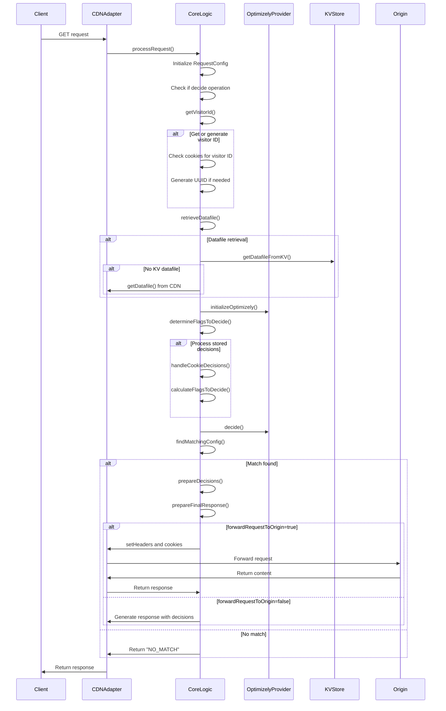

# Edge Mode Implementation Analysis - v1

*Last Updated: April 18, 2025*

## Table of Contents

- [Overview](#overview)
- [Request Flow](#request-flow)
- [URL Matching and Configuration](#url-matching-and-configuration)
- [Content Fetching and Transformation](#content-fetching-and-transformation)
- [Caching Strategy](#caching-strategy)
- [Cookie and Header Management](#cookie-and-header-management)
- [Key Findings](#key-findings)

## Overview

Edge Mode in the Optimizely Edge Agent v1 allows for content experimentation at the CDN level. This document analyzes how the v1 implementation processes GET requests, matches URLs, applies configurations from Optimizely feature variables, and manages content delivery and caching.

Primary files analyzed:
- `src/coreLogic.js`
- `src/_helpers_/optimizelyHelper.js`

## Request Flow

The Edge Mode request handling flow in v1 is triggered when the Edge Agent receives a GET request. The core flow is as follows:



The key decision flow starts in `processRequest()` (line 271 in coreLogic.js) where the request is analyzed to determine if it's a decide operation (GET request). For Edge Mode, the core processing involves:

1. Retrieving the visitor ID from cookies or generating a new one 
2. Retrieving the Optimizely datafile (from KV store or CDN)
3. Initializing the Optimizely SDK
4. Determining flags to decide
5. Executing Optimizely logic and obtaining decisions
6. Finding a matching configuration in `cdnVariationSettings`
7. Preparing the response based on the matching configuration

## URL Matching and Configuration

The URL matching logic is central to Edge Mode implementation and is primarily handled by the `findMatchingConfig()` method (line 193 in coreLogic.js). The method matches the incoming request URL against the `cdnExperimentURL` values defined in the `cdnVariationSettings` of each feature flag.

### cdnVariationSettings Structure

The `cdnVariationSettings` is a JSON structure stored as a feature variable for each flag in the Optimizely datafile:

```javascript
cdnVariationSettings: {
    // URL to match against incoming requests
    cdnExperimentURL: 'https://www.example.com/page/1',
    
    // URL from which to fetch variation content
    cdnResponseURL: 'https://www.example.com/page/2',
    
    // Specifies cache key strategy
    cacheKey: 'VARIATION_KEY', // or custom string
    
    // Whether to forward requests to origin
    forwardRequestToOrigin: 'true',
    
    // Whether to cache forwarded requests
    cacheRequestToOrigin: 'true',
    
    // Indicates if this is the control variation
    isControlVariation: 'false'
}
```

### Extraction of cdnVariationSettings

The extraction process occurs in the `extractCdnSettings()` method (line 98), which maps decision objects to a new structure that isolates the CDN settings:

```javascript
extractCdnSettings(decisions) {
    const result = decisions.map((decision) => {
        const { flagKey, variationKey, variables } = decision;
        const settings = variables.cdnVariationSettings || {};
        const result = {
            [flagKey]: {
                [variationKey]: {
                    cdnExperimentURL: settings.cdnExperimentURL || undefined,
                    cdnResponseURL: settings.cdnResponseURL || undefined,
                    cacheKey: settings.cacheKey || undefined,
                    forwardRequestToOrigin: 
                        (settings.forwardRequestToOrigin && 
                         settings.forwardRequestToOrigin === 'true') || false,
                    cacheRequestToOrigin: 
                        (settings.cacheRequestToOrigin && 
                         settings.cacheRequestToOrigin === 'true') || false,
                    isControlVariation: 
                        (settings.isControlVariation && 
                         settings.isControlVariation === 'true') || false,
                },
            },
        };
        return result;
    });
    return result;
}
```

### URL Matching Algorithm

The URL matching logic follows these steps:

1. Process decisions to extract CDN settings (line 195)
2. Parse the incoming request URL and normalize it (lines 196-201)
3. Remove query parameters if configured to ignore them (line 206)
4. Normalize the pathname by removing trailing slashes (line 209)
5. Iterate through each flag and variation to find a matching configuration (lines 215-245)
6. For each potential match:
   - Parse and normalize the `cdnExperimentURL` 
   - Compare the normalized requested URL with the normalized `cdnExperimentURL`
   - If matched, store the configuration and return it

The algorithm includes special handling for test flags and trailing slashes to ensure consistent matching.

## Content Fetching and Transformation

When a URL match is found, the content handling and delivery depends on the `forwardRequestToOrigin` setting.

### Origin Forwarding

If `forwardRequestToOrigin` is `true`, the Edge Agent will forward the request to the origin server with additional headers and cookies containing Optimizely decision information:

```javascript
async handleOriginForwarding(visitorId, serializedDecisions, requestConfig) {
    // Set request headers with visitor ID and decisions
    if (requestConfig.setRequestHeaders) {
        const headers = {};
        if (visitorId) {
            headers[requestConfig.settings.visitorIdsHeaderName] = visitorId;
        }
        if (serializedDecisions) {
            headers[requestConfig.settings.decisionsHeaderName] = serializedDecisions;
        }
        clonedRequest = this.cdnAdapter.setMultipleRequestHeaders(this.request, headers);
    }

    // Set request cookies with visitor ID and decisions
    if (requestConfig.setRequestCookies) {
        // Create and set cookies
    }

    // Forward the request to the origin
    let fetchResponse = await fetch(clonedRequest || this.request);

    // Set response cookies
    if (requestConfig.setResponseCookies) {
        fetchResponse = await this.setResponseCookies(fetchResponse, visitorId, serializedDecisions, requestConfig);
    }

    return fetchResponse;
}
```

The forwarded request includes:
- Original request data
- Optimizely decision information in headers/cookies
- Visitor ID for user identification

### Direct Content Serving

If `forwardRequestToOrigin` is `false`, the Edge Agent will:
1. Create a JSON response with decision information
2. Set appropriate headers and cookies
3. Return the response directly

```javascript
async prepareLocalResponse(responseDecisions, visitorId, serializedDecisions, requestConfig) {
    const jsonBody = {
        [requestConfig.settings.responseJsonKeyName]: requestConfig.trimmedDecisions
            ? this.allDecisions
            : responseDecisions,
        ...(requestConfig.enableResponseMetadata && { configMetadata: requestConfig.configMetadata }),
    };

    let fetchResponse = await this.cdnAdapter.getNewResponseObject(jsonBody, 'application/json', true);

    // Set headers and cookies
    
    return fetchResponse;
}
```

## Caching Strategy

The caching implementation in Edge Mode is controlled by the `cacheKey` and `cacheRequestToOrigin` settings.

### Cache Key Generation

The `cacheKey` setting can be:
- `"VARIATION_KEY"`: Generates a key based on the flagKey and variationKey combination
- Custom string: Uses the provided string directly as the cache key

This is used to create a unique identifier for storing and retrieving cached content.

### Origin Request Caching

The `cacheRequestToOrigin` setting determines whether responses fetched from the origin should be cached:

- When `true`: Responses from the origin server are cached using the generated cache key
- When `false`: Every request is forwarded to the origin without caching

The actual caching implementation is delegated to the CDN adapter, which leverages the CDN's native caching capabilities (e.g., Cloudflare KV store).

## Cookie and Header Management

The Edge Mode implementation extensively uses cookies and headers for consistent user experience and decision propagation.

### Visitor ID Management

Visitor IDs are managed by the `getVisitorId()` method (line 566):

1. Check for visitor ID in request configuration
2. If not found, check cookies for visitor ID (`optly_edge_visitor_id`)
3. If still not found, generate a UUID
4. Store visitor ID in response cookies for subsequent requests

```javascript
async getVisitorId(request, requestConfig) {
    let visitorId = requestConfig.visitorId;
    let visitorIdSource = 'request-visitor'; // Default source

    if (!visitorId) {
        [visitorId, visitorIdSource] = await this.retrieveOrGenerateVisitorId(request, requestConfig);
    }

    // Store metadata
    return visitorId;
}
```

### Decision Propagation

Decisions are propagated through:

1. Response headers: `X-Optimizely-Decisions` containing serialized decisions
2. Response cookies: `optly_edge_decisions` containing serialized decisions
3. Request forwarding: Adding decision headers to forwarded requests

The serialization/deserialization logic in `optimizelyHelper.js` converts decision objects to compact strings:

```javascript
export function serializeDecisions(decisions) {
    if (!arrayIsValid(decisions)) {
        return undefined;
    }
    return decisions
        .map((d) => `${d.flagKey}${FLAG_VAR_DELIMITER}${d.variationKey}${FLAG_VAR_DELIMITER}${d.ruleKey}`)
        .join(DELIMITER);
}
```

This allows passing decision information within HTTP request/response headers and cookies.

## Key Findings

1. **Flexible URL Matching**: The Edge Mode implementation provides flexible URL matching with normalization for trailing slashes and optional query parameter handling.

2. **Dual Content Delivery Modes**: Content can be delivered either by forwarding requests to origin or directly from the Edge, based on configuration.

3. **Stateful Decision Propagation**: Decisions are consistently propagated through cookies and headers, ensuring coherent user experiences across requests.

4. **Configurable Caching**: Caching is configurable at both the cache key generation level and the origin request level.

5. **Visitor Identification**: A robust visitor identification system ensures consistent bucketing and experimentation over time.

6. **String-Based Configuration**: All boolean configuration values are stored as strings (`'true'`/`'false'`) requiring explicit comparison checks.

7. **Decision Flow**: The decision flow follows a linear pattern of:
   - Visitor identification
   - Feature flag decision making
   - URL matching
   - Content serving
   
8. **Centralized Processing**: All Edge Mode processing is centralized in the CoreLogic class, making the implementation straightforward but potentially less modular than an interface-based approach.

The Edge Mode implementation in v1 provides a comprehensive solution for edge-based content experimentation, with flexibility in URL matching, content delivery, and caching strategies. The string-based configuration and centralized processing suggest opportunities for enhanced type safety and modularity in future versions.