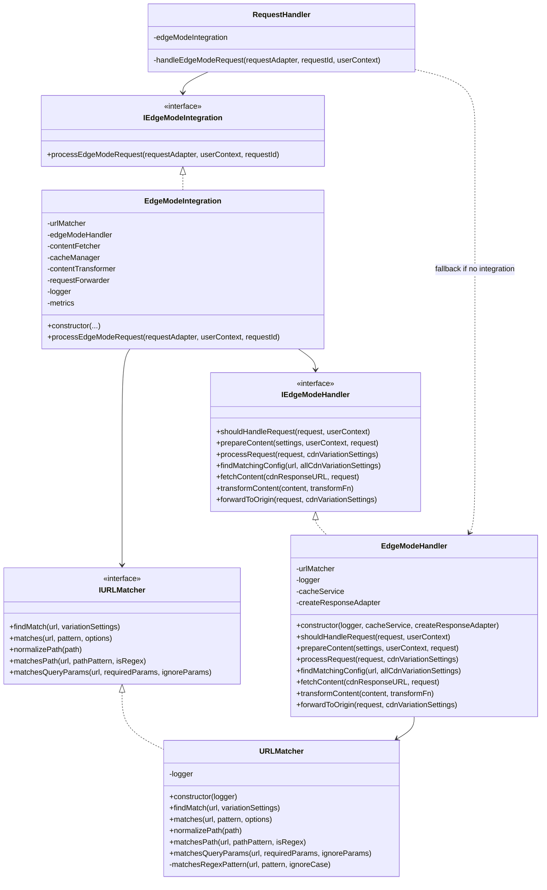

# Edge Mode Implementation Analysis - v2

*Last Updated: April 18, 2025*

## Table of Contents

- [Overview](#overview)
- [Component Architecture](#component-architecture)
- [URL Matching and Pattern Recognition](#url-matching-and-pattern-recognition)
- [Content Preparation and Transformation](#content-preparation-and-transformation)
- [CDN Variation Settings Handling](#cdn-variation-settings-handling)
- [Adapter Pattern Implementation](#adapter-pattern-implementation)
- [Key Differences from v1](#key-differences-from-v1)
- [Key Findings](#key-findings)

## Overview

Edge Mode in the Optimizely Edge Agent v2 has been refactored into a well-structured TypeScript implementation with clear separation of concerns. This document analyzes the v2 implementation, which uses interfaces, dedicated services, and improved URL matching to handle Edge Mode functionality.

Primary files analyzed:
- `src-v2/services/interfaces/IEdgeModeHandler.ts`
- `src-v2/services/implementations/EdgeModeHandler.ts`
- `src-v2/services/interfaces/IURLMatcher.ts`
- `src-v2/services/implementations/URLMatcher.ts`
- `src-v2/services/implementations/RequestHandler.ts`
- `src-v2/services/implementations/EdgeModeIntegration.ts`

## Component Architecture

The v2 Edge Mode implementation follows a service-oriented architecture with clear separation of concerns through interfaces and implementations:



The architecture has these key components:

1. **IEdgeModeHandler/EdgeModeHandler**: Core interface and implementation for Edge Mode functionality
   - Defined in `src-v2/services/interfaces/IEdgeModeHandler.ts` and `src-v2/services/implementations/EdgeModeHandler.ts`
   - Responsible for determining if a request should be handled, preparing content, and processing requests

2. **IURLMatcher/URLMatcher**: Dedicated services for URL matching
   - Defined in `src-v2/services/interfaces/IURLMatcher.ts` and `src-v2/services/implementations/URLMatcher.ts`
   - Handles pattern matching with support for exact path, regex, and query parameter matching

3. **EdgeModeIntegration**: Integration layer that composes various services
   - Defined in `src-v2/services/implementations/EdgeModeIntegration.ts`
   - Acts as a facade that coordinates other services (URLMatcher, EdgeModeHandler, ContentFetcher, etc.)

4. **RequestHandler**: Main coordinator for handling all requests
   - Uses EdgeModeIntegration for Edge Mode requests or falls back to internal EdgeModeHandler

The implementation follows these key patterns:
- **Interface Segregation**: Clear interfaces define specific component responsibilities
- **Dependency Injection**: Components receive their dependencies via constructor
- **Factory Pattern**: ResponseAdapter factory for creating appropriate responses
- **Service Composition**: EdgeModeIntegration composes multiple services into a cohesive pipeline

## URL Matching and Pattern Recognition

The URL matching system in v2 has been significantly improved from v1, with the creation of a dedicated `URLMatcher` service:

### URLMatcher Implementation

The `URLMatcher` class (lines 8-233 in `src-v2/services/implementations/URLMatcher.ts`) provides sophisticated URL matching with:

```typescript
// Primary match finding method
public async findMatch(url: string, variationSettings: CDNVariationSettings[]): Promise<URLMatchResult> {
  // Loop through variation settings to find a match
  for (const settings of variationSettings) {
    const isRegex = !!settings.pathRegex;
    const pattern = isRegex ? settings.pathRegex : settings.cdnExperimentURL;
    
    // Check if URL matches the pattern with given options
    const matches = this.matches(url, pattern, {
      isRegex,
      requiredQueryParams: settings.requiredQueryParams,
      ignoreQueryParams: settings.ignoreQueryParams
    });
    
    if (matches) {
      return {
        matched: true,
        settings
      };
    }
  }
  
  return { matched: false, settings: {} as CDNVariationSettings };
}
```

Improvements over v1:
1. **Multiple Matching Strategies**:
   - **Exact Path Matching**: Simple URL path comparison after normalization (lines 130-160)
   - **Regex Pattern Matching**: Using patterns defined in `pathRegex` (lines 170-180)
   - **Query Parameter Matching**: Support for required and ignored parameters (lines 190-230)

2. **Path Normalization**:
   - Handles trailing slashes and edge cases consistently (lines 130-147)
   - Ensures consistent matching regardless of URL format

3. **Flexible Options**:
   - The `URLMatchOptions` interface provides configuration options:
   ```typescript
   export interface URLMatchOptions {
     isRegex?: boolean;
     requiredQueryParams?: string[];
     ignoreQueryParams?: string[];
     ignoreCase?: boolean;
   }
   ```

4. **Strong Typing**:
   - Clear interfaces for match results and options
   - Type-safe throughout the implementation

## Content Preparation and Transformation

The v2 implementation introduces a structured approach to content preparation and transformation:

### Content Preparation

The `prepareContent` method in `EdgeModeHandler` (lines 171-205) focuses on determining how content should be delivered:

```typescript
public async prepareContent(
  settings: CDNVariationSettings,
  userContext: OptimizelyUserContext,
  request: IRequestAdapter
): Promise<ContentPreparationResult> {
  // Extract configuration
  const safeSettings = settings || {};
  
  // Extract content delivery settings
  const useCache = isTrue(safeSettings.cacheRequestToOrigin); 
  const forwardToOrigin = isTrue(safeSettings.forwardRequestToOrigin);
  
  // Return content preparation result
  return {
    useCache,
    forwardToOrigin
  };
}
```

The result is a structured `ContentPreparationResult` object:

```typescript
export interface ContentPreparationResult {
  forwardToOrigin: boolean;
  useCache: boolean;
  content?: string;
  headers?: Record<string, string>;
  status?: number;
}
```

### Content Fetching and Transformation

The v2 implementation provides clear mechanisms for content fetching and transformation:

1. **Content Fetching**: The `fetchContent` method fetches content from CDN URLs
   - Handles HTTP requests with proper error handling
   - Sets appropriate headers and response status

2. **Content Transformation**: The `transformContent` method (lines 492-529) transforms content using provided functions
   - Safely evaluates transformation functions
   - Provides proper error handling

3. **Request Forwarding**: The `forwardToOrigin` method (lines 545-691) handles forwarding requests to origin servers
   - Maintains original request headers and cookies
   - Handles response caching when configured

## CDN Variation Settings Handling

The v2 implementation provides a strongly-typed interface for CDN variation settings:

```typescript
export interface CDNVariationSettings {
  /** URL pattern to match for this variation */
  cdnExperimentURL: string;
  
  /** URL to fetch content from for this variation */
  cdnResponseURL: string;
  
  /** Optional regex pattern for path matching */
  pathRegex?: string;
  
  /** Flag indicating if this is the control variation */
  isControlVariation?: boolean;
  
  /** Key to use for caching (e.g., VARIATION_KEY) */
  cacheKey?: string;
  
  /** Whether to forward the request to origin */
  forwardRequestToOrigin?: boolean;
  
  /** Whether to cache the request to origin */
  cacheRequestToOrigin?: boolean;
  
  /** Time-to-live for cache in seconds */
  cacheTTL?: number;
  
  /** Query parameters to ignore when matching URLs */
  ignoreQueryParams?: string[];
  
  /** Query parameters required to be present when matching URLs */
  requiredQueryParams?: string[];
  
  /** Headers to add to the response */
  responseHeaders?: Record<string, string>;
  
  /** Function to transform content (encoded as string) */
  transformContent?: string;
}
```

Key improvements over v1:

1. **Strong Type Definitions**:
   - Proper typing for all properties instead of treating everything as strings
   - Native boolean values for flag settings (`forwardRequestToOrigin`, `cacheRequestToOrigin`)
   - Explicit function definition for content transformation

2. **Extended Capabilities**:
   - Support for regex patterns in addition to exact URL matching
   - Granular query parameter handling (required and ignored)
   - Response header customization
   - Cache TTL configuration

3. **Integration with URL Matcher**:
   - Settings directly consumable by the URLMatcher service
   - Clean separation between settings and matching logic

The `EdgeModeHandler` uses the `isTrue` helper function to safely convert string or boolean values to booleans:

```typescript
function isTrue(value: string | boolean | undefined): boolean {
  if (typeof value === 'boolean') return value;
  if (typeof value === 'string') return value.toLowerCase() === 'true';
  return false;
}
```

This ensures backward compatibility while enabling native boolean type support.

## Adapter Pattern Implementation

The v2 implementation makes extensive use of the adapter pattern to abstract away platform-specific details:

### Request and Response Adapters

The Edge Mode implementation uses `IRequestAdapter` and `IResponseAdapter` interfaces:

```typescript
// Used in IEdgeModeHandler method signatures
shouldHandleRequest(
  request: IRequestAdapter,
  userContext: OptimizelyUserContext
): Promise<ShouldHandleResult>;

fetchContent(
  cdnResponseURL: string,
  request: IRequestAdapter
): Promise<IResponseAdapter>;
```

This enables:
1. **Platform Independence**: Implementation works with any CDN/platform that provides adapters
2. **Testability**: Easy mocking for tests
3. **Extensibility**: New platforms can be supported by implementing adapters

### ResponseAdapterFactory

The `EdgeModeHandler` uses a factory function to create response adapters:

```typescript
type ResponseAdapterFactory = (request: IRequestAdapter) => IResponseAdapter;

// Used in the constructor
constructor(
  logger: ILoggerAdapter, 
  cacheService: ICacheService,
  createResponseAdapter: ResponseAdapterFactory
) {
  // ...
}
```

This allows the handler to create appropriate response objects without knowing their specific implementation details.

### Integration with CDN Adapters

The `EdgeModeIntegration` class orchestrates multiple adapters and services:

```typescript
constructor(
  urlMatcher: IURLMatcher,
  edgeModeHandler: IEdgeModeHandler,
  contentFetcher: IContentFetcher,
  cacheManager: ICacheManager,
  contentTransformer: IContentTransformer,
  requestForwarder: IRequestForwarder,
  logger: ILoggerAdapter,
  metrics?: IMetricsAdapter
) {
  // ...
}
```

This composition enables:
- Flexible CDN-specific implementations
- Easy substitution of components
- Separation of concerns for each aspect of Edge Mode functionality

## Key Differences from v1

The v2 Edge Mode implementation differs from v1 in several fundamental ways:

### 1. Architecture and Design

| v1 (JavaScript) | v2 (TypeScript) |
|-----------------|-----------------|
| Monolithic `CoreLogic` class handling all operations | Separated concerns with dedicated interfaces and implementations |
| Direct inclusion of URL matching in CoreLogic | Dedicated `URLMatcher` service |
| Logic intertwined with implementation details | Clear separation between interfaces and implementations |
| Manual type checking and validations | Strong TypeScript typing |
| No clear distinction between components | Interface-based design with dependency injection |

### 2. URL Matching

| v1 (JavaScript) | v2 (TypeScript) |
|-----------------|-----------------|
| `findMatchingConfig` method in CoreLogic | Dedicated `URLMatcher` class implementing `IURLMatcher` |
| Limited to exact URL matching with basic normalization | Multiple matching strategies (exact, regex, query params) |
| String-based settings parsing | Strongly-typed settings with native booleans |
| No dedicated normalization utilities | Comprehensive path normalization |
| No consideration for query parameters beyond ignoring them | Granular query parameter handling with required and ignored parameters |

### 3. CDN Variation Settings

| v1 (JavaScript) | v2 (TypeScript) |
|-----------------|-----------------|
| JavaScript object with string values | TypeScript interface with proper typing |
| `'true'`/`'false'` string values for booleans | Native boolean types with string fallback |
| Limited configuration options | Extended capabilities (regex, headers, query params) |
| Extracted from decision objects | Direct consumption as typed objects |
| No formal interface definition | Clear interface with documented properties |

### 4. Request Processing

| v1 (JavaScript) | v2 (TypeScript) |
|-----------------|-----------------|
| Direct request handling in CoreLogic | Separation into preparation, matching, and processing phases |
| Platform-specific implementation | Adapter pattern for platform independence |
| Tightly coupled with CDN adapters | Loose coupling through interfaces |
| Limited error handling | Comprehensive error handling and logging |
| No metrics or observability | Built-in metrics support |

## Key Findings

1. **Modular Architecture**: v2 implements a highly modular architecture with clear separation of concerns, making the codebase more maintainable, testable, and extensible.

2. **Interface-Based Design**: The use of interfaces like `IEdgeModeHandler` and `IURLMatcher` provides a clear contract for implementations and enables easier testing.

3. **Enhanced URL Matching**: The dedicated `URLMatcher` service provides sophisticated URL matching with support for exact paths, regex patterns, and query parameter validation.

4. **Type Safety**: Strong TypeScript typing throughout the codebase improves reliability and developer experience, with proper interfaces for all components.

5. **Adapter Pattern**: The consistent use of adapters enables platform independence and seamless integration with different CDN providers.

6. **Extended Functionality**: v2 adds several new capabilities including regex pattern matching, query parameter validation, and content transformation.

7. **Observability**: Built-in logging and metrics throughout the implementation improve observability and debugging.

8. **Integration Layer**: The `EdgeModeIntegration` class provides a clean composition layer that orchestrates all Edge Mode components.

9. **Backward Compatibility**: Despite the architectural changes, backward compatibility is maintained through helper functions like `isTrue` for converting string booleans.

10. **Clearer Request Flow**: The request flow is broken down into distinct phases (should handle, prepare content, process request) for better separation of concerns.

These improvements make the v2 implementation significantly more maintainable, extensible, and robust than v1, while maintaining functional compatibility.