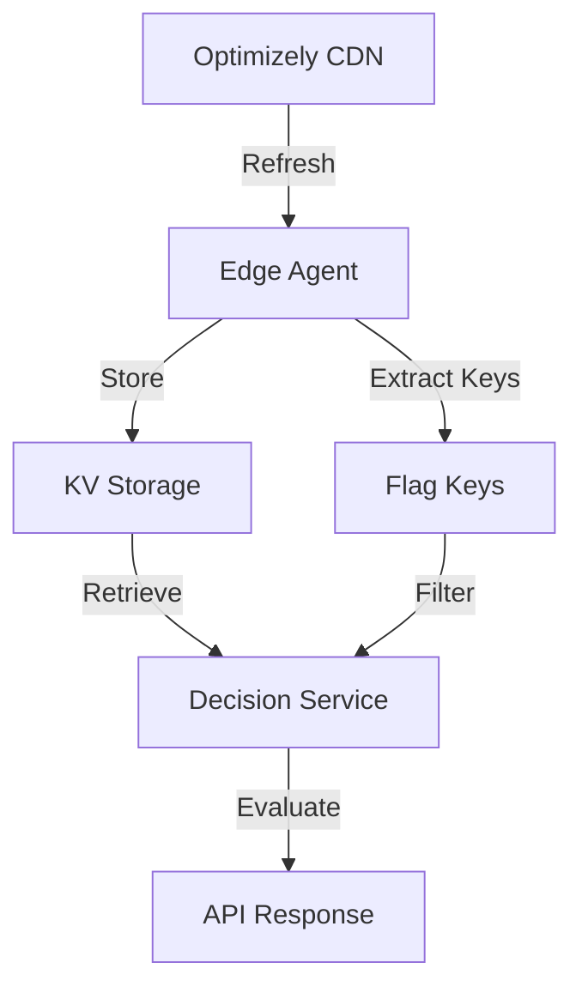

# Data Management API Endpoints

Manage Optimizely datafiles, flag keys, and Edge Agent information.

## Overview

Data management endpoints provide:
- **Datafile operations** - Fetch, update, and refresh from CDN
- **Flag key management** - Control available feature flags
- **Configuration access** - Query OptimizelyConfig dynamically
- **SDK information** - Edge Agent metadata and version
- **KV storage control** - Manage persistent storage

## Available Endpoints

| Endpoint | Methods | Description | Auth Required |
|----------|---------|-------------|---------------|
| [`/api/datafile`](./datafile.md) | GET/PUT/POST | Datafile operations | Admin for PUT/POST |
| [`/api/flagkeys`](./flagkeys.md) | GET/PUT/POST | Flag key management | Admin for PUT/POST |
| [`/api/config`](./config.md) | GET | OptimizelyConfig with queries | Admin Token |
| [`/api/sdk`](./sdk-info.md) | GET | Edge Agent information | None |

## Key Concepts

### Datafile Management

The datafile contains your Optimizely project configuration:
- Feature flags and experiments
- Targeting rules and audiences
- Variation configurations
- Variable definitions

### Flag Key Extraction

Flag keys can be managed in two ways:

1. **Automatic Extraction** (default)
   - Keys extracted from datafile updates
   - Controlled by `OPTIMIZELY_DISABLE_AUTO_FLAG_EXTRACTION`
   - Keeps flags synchronized with datafile

2. **Manual Management**
   - Disable auto-extraction for curated lists
   - Use `/api/flagkeys` endpoint
   - Allows environment-specific flag exposure

### Storage Options

Data can be stored in:
- **KV Storage** - Persistent, distributed storage
- **CDN Cache** - Temporary, edge-cached data
- **Memory** - Runtime cache (limited persistence)

## Common Workflows

### 1. Initial Setup
```bash
# 1. Upload or refresh datafile
curl -X PUT "https://your-deployment/api/datafile?operation=refresh" \
  -H "X-Optimizely-Enable-FEX: true" \
  -H "X-Optimizely-SDK-Key: your-sdk-key" \
  -H "X-Optimizely-Admin-Token: admin-token"

# 2. Verify datafile loaded
curl -X GET "https://your-deployment/api/datafile" \
  -H "X-Optimizely-Enable-FEX: true" \
  -H "X-Optimizely-SDK-Key: your-sdk-key"

# 3. Check extracted flag keys
curl -X GET "https://your-deployment/api/flagkeys" \
  -H "X-Optimizely-Enable-FEX: true" \
  -H "X-Optimizely-SDK-Key: your-sdk-key"
```

### 2. Production Updates
```bash
# Refresh datafile from Optimizely CDN
curl -X PUT "https://your-deployment/api/datafile?operation=refresh" \
  -H "X-Optimizely-Enable-FEX: true" \
  -H "X-Optimizely-SDK-Key: your-sdk-key" \
  -H "X-Optimizely-Admin-Token: admin-token"

# Response confirms update
{
  "success": true,
  "operation": "refresh",
  "message": "Datafile refresh completed successfully"
}
```

### 3. Curated Flag Management
```bash
# Disable auto-extraction via environment variable
OPTIMIZELY_DISABLE_AUTO_FLAG_EXTRACTION=true

# Manually set production-ready flags
curl -X PUT "https://your-deployment/api/flagkeys" \
  -H "Content-Type: application/json" \
  -H "X-Optimizely-Enable-FEX: true" \
  -H "X-Optimizely-SDK-Key: your-sdk-key" \
  -H "X-Optimizely-Admin-Token: admin-token" \
  -d '{
    "flagKeys": [
      "stable_feature_1",
      "stable_feature_2",
      "gradual_rollout_3"
    ]
  }'
```

## Data Flow



## Configuration

### Environment Variables

| Variable | Description | Default |
|----------|-------------|---------|
| `OPTIMIZELY_DISABLE_AUTO_FLAG_EXTRACTION` | Disable automatic flag key extraction | `false` |
| `OPTIMIZELY_DATAFILE_CACHE_TIME` | Datafile cache duration (seconds) | `300` |
| `OPTIMIZELY_ENABLE_KV_STORAGE` | Enable KV storage for persistence | `true` |
| `OPTIMIZELY_KV_NAMESPACE` | KV namespace for storage | `OPTIMIZELY` |

### Query Parameters

Control data source with query parameters:
- `?datafileFromKV=true` - Force KV-only retrieval
- `?flagsFromKV=true` - Force flag keys from KV only
- `?forceRefresh=true` - Bypass cache

## Best Practices

### 1. Separate Development and Production Flags
```javascript
// Development: All flags available
if (process.env.NODE_ENV === 'development') {
  // Auto-extraction enabled
}

// Production: Curated list only
if (process.env.NODE_ENV === 'production') {
  // Set OPTIMIZELY_DISABLE_AUTO_FLAG_EXTRACTION=true
  // Manually manage flag keys
}
```

### 2. Implement Update Automation
```javascript
// Scheduled datafile refresh
async function refreshDatafile() {
  const response = await fetch('/api/datafile?operation=refresh', {
    method: 'PUT',
    headers: {
      'X-Optimizely-Enable-FEX': 'true',
      'X-Optimizely-SDK-Key': SDK_KEY,
      'X-Optimizely-Admin-Token': ADMIN_TOKEN
    }
  });
  
  if (response.ok) {
    console.log('Datafile refreshed successfully');
    // Optionally verify flag keys
    await verifyFlagKeys();
  } else {
    console.error('Datafile refresh failed:', response.status);
  }
}

// Run every 5 minutes
setInterval(refreshDatafile, 5 * 60 * 1000);
```

### 3. Monitor Data Freshness
```javascript
async function checkDataFreshness() {
  const [datafileRes, sdkRes] = await Promise.all([
    fetch('/api/datafile', {
      headers: {
        'X-Optimizely-Enable-FEX': 'true',
        'X-Optimizely-SDK-Key': SDK_KEY
      }
    }),
    fetch('/api/sdk', {
      headers: { 'X-Optimizely-Enable-FEX': 'true' }
    })
  ]);
  
  const datafile = await datafileRes.json();
  const sdkInfo = await sdkRes.json();
  
  return {
    revision: datafile.revision,
    timestamp: datafile.timestamp,
    environment: sdkInfo.environment,
    flagCount: datafile.featureFlags?.length || 0
  };
}
```

## Security Considerations

### Access Control
- Read operations typically don't require admin tokens
- Write operations should always require authentication
- Consider IP whitelisting for admin endpoints

### Data Validation
- Datafiles are validated before storage
- Invalid JSON is rejected
- Schema validation ensures compatibility

### Audit Trail
- Log all data management operations
- Track who made changes and when
- Monitor for unauthorized access attempts

## Troubleshooting

### Common Issues

1. **"Datafile not found"**
   - Check SDK key is correct
   - Verify datafile has been uploaded
   - Ensure KV storage is accessible

2. **"Flag keys missing"**
   - Check auto-extraction is enabled
   - Verify datafile contains feature flags
   - Manually set flag keys if needed

3. **"Refresh failed"**
   - Verify network access to Optimizely CDN
   - Check SDK key has proper permissions
   - Ensure admin token is valid

### Debug Commands

```bash
# Check current configuration
curl -X POST "https://your-deployment/api/debug" \
  -H "Content-Type: application/json" \
  -H "X-Optimizely-Enable-FEX: true" \
  -d '{
    "sdkKey": "your-sdk-key"
  }'

# Verify data sources
curl -X GET "https://your-deployment/api/datafile?datafileFromKV=true" \
  -H "X-Optimizely-Enable-FEX: true" \
  -H "X-Optimizely-SDK-Key: your-sdk-key"
```

## Related Documentation

- [Decision APIs](../decisions/) - Use datafiles for decisions
- [Admin APIs](../admin/) - Administrative operations
- [Forced Variations](../admin/forced-variations.md) - Override decisions
- [Authentication](../authentication.md) - Security setup

---

**Last Updated**: 2025-05-28