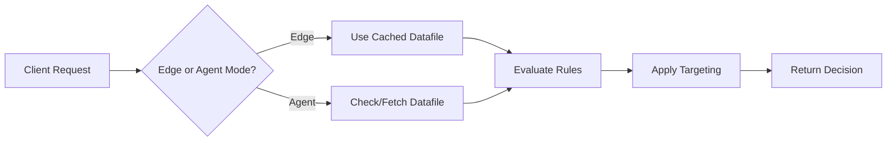

# Decision API Endpoints

Make feature flag and experiment decisions through the Edge Agent.

## Overview

The decision endpoints are the core functionality of the Edge Agent, providing:
- **Feature flag evaluation** with targeting rules
- **Experiment variation assignment** with consistent bucketing
- **Variable delivery** for feature configuration
- **Performance optimization** through edge computing

## Available Endpoints

| Endpoint | Method | Description | Use Case |
|----------|--------|-------------|----------|
| [`/api/decide`](./decide.md) | GET/POST | Single flag decision | Individual feature checks |
| [`/api/decide-all`](./decide-all.md) | GET/POST | All flags decision | Initial page load |
| [`/api/decide-for-keys`](./decide-for-keys.md) | GET/POST | Multiple specific flags | Component-based loading |
| [`/api/decide-options`](./decide-options.md) | GET/POST | Available decision options | Configuration reference |

## Quick Start

### 1. Single Flag Decision
```bash
curl -X POST "https://your-edge-agent/api/decide" \
  -H "Content-Type: application/json" \
  -H "X-Optimizely-Enable-FEX: true" \
  -H "X-Optimizely-SDK-Key: your-sdk-key" \
  -d '{
    "flagKey": "new_feature",
    "userId": "user123"
  }'
```

### 2. Multiple Flags Decision
```bash
curl -X POST "https://your-edge-agent/api/decide-for-keys" \
  -H "Content-Type: application/json" \
  -H "X-Optimizely-Enable-FEX: true" \
  -H "X-Optimizely-SDK-Key: your-sdk-key" \
  -d '{
    "flagKeys": ["feature_a", "feature_b"],
    "userId": "user123"
  }'
```

## Decision Flow



## Common Parameters

### User Context
All decision endpoints accept:
- `userId` (required) - Unique user identifier
- `attributes` (optional) - User properties for targeting

### Decision Options
Control decision behavior:
- `INCLUDE_REASONS` - Get detailed decision explanations
- `EXCLUDE_VARIABLES` - Omit variable values
- `ENABLED_FLAGS_ONLY` - Filter out disabled flags
- `IGNORE_USER_PROFILE_SERVICE` - Skip sticky bucketing
- `DISABLE_DECISION_EVENT` - Skip event tracking

## Response Format

All endpoints return consistent decision objects:

```json
{
  "enabled": true,
  "variationKey": "treatment",
  "flagKey": "feature_name",
  "ruleKey": "targeting_rule_1",
  "variables": {
    "color": "#00FF00",
    "text": "Buy Now"
  },
  "reasons": []
}
```

## Performance Guidelines

### Endpoint Selection
- **Single decision**: Use `/api/decide` for individual checks
- **Component features**: Use `/api/decide-for-keys` for related flags
- **Full state**: Use `/api/decide-all` for initial load only

### Caching Strategy
```javascript
// Cache decisions with appropriate TTL
const CACHE_TTL = 5 * 60 * 1000; // 5 minutes
const decisionCache = new Map();

function getCachedDecision(key) {
  const cached = decisionCache.get(key);
  if (cached && Date.now() - cached.time < CACHE_TTL) {
    return cached.decision;
  }
  return null;
}
```

## Error Handling

All endpoints return standard HTTP status codes:
- `200` - Success
- `400` - Bad request (missing/invalid parameters)
- `500` - Server error
- `501` - Not implemented (service unavailable)

Example error response:
```json
{
  "error": "Missing userId or visitorId"
}
```

## Advanced Features

### Forced Variations
Override decisions for testing:
- Set via [forced variation endpoints](../admin/forced-variations.md)
- Persists across decision requests
- User-specific overrides

### User Profile Service
Enable sticky bucketing:
- Consistent assignments across sessions
- Automatic with KV storage enabled
- Can be disabled with `IGNORE_USER_PROFILE_SERVICE`

## Related Documentation

- [Authentication](../authentication.md) - API authentication setup
- [Datafile Management](../data-management/datafile.md) - Datafile operations
- [Flag Keys](../data-management/flagkeys.md) - Available flags
- [Examples](../examples/) - Implementation examples

---

**Last Updated**: 2025-05-28