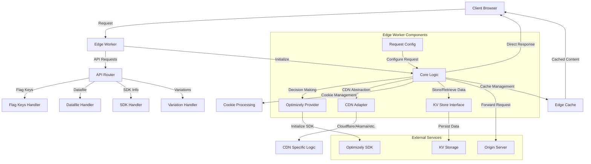

# Implementation Reference Guide: Optimizely Edge Agent

## 1.1 System Overview

The Optimizely Edge Agent is a hybrid edge serverless solution that enables A/B testing directly at the edge of Content Delivery Networks (CDNs). This system allows for immediate decision-making at the edge, minimizing latency and dependency on central servers. The Edge Agent provides a comprehensive solution that incorporates caching, cookie management, visitor ID creation and management with persistence, enabling customers to quickly implement a robust A/B testing framework.

The Edge Agent is designed to be CDN-agnostic, supporting multiple CDN providers (Cloudflare, Akamai, Fastly, CloudFront, Vercel) with a common core logic. It processes both GET and POST HTTP request methods, with GET requests primarily used for content experiments and POST requests activating the serverless functionality.

## 1.2 Architecture

### Mermaid Diagram



### ASCII Diagram

```
+----------------+       +--------------------+       +-------------------+
|                |       |                    |       |                   |
|  Client        +------>+  Edge Worker       +------>+  Core Logic       |
|  Browser       |       |  (CDN Platform)    |       |                   |
|                |       |                    |       +--------+----------+
+----------------+       +--------------------+                |
                                |                             |
                                |                             |
                                v                             v
                         +-----+------+             +---------+---------+
                         |            |             |                   |
                         | API Router |             | Optimizely        |
                         |            |             | Provider          |
                         +-----+------+             |                   |
                               |                    +-------------------+
                               |                              |
                               v                              v
              +----------------+----------------+    +--------+----------+
              |                |                |    |                   |
              | Flag Keys      | Datafile       |    | Optimizely SDK    |
              | Handler        | Handler        |    |                   |
              |                |                |    +-------------------+
              +----------------+----------------+
```

## 1.3 File Structure

| File | Path | Purpose |
|------|------|---------|
| index.js | src/index.js | Main entry point that handles routing requests to appropriate handlers |
| coreLogic.js | src/coreLogic.js | Core application logic for processing requests and decision-making |
| optimizelyProvider.js | src/_optimizely_/optimizelyProvider.js | Provides interface to Optimizely SDK for feature flag evaluation |
| userProfileService.js | src/_optimizely_/userProfileService.js | Service for managing user profiles and persistence |
| requestConfig.js | src/_config_/requestConfig.js | Manages configuration from request headers, query parameters, etc. |
| defaultSettings.js | src/_config_/defaultSettings.js | Default configuration settings for the application |
| cookieOptions.js | src/_config_/cookieOptions.js | Configuration options for cookies |
| optimizelyHelper.js | src/_helpers_/optimizelyHelper.js | Helper functions for Optimizely operations |
| abstractionHelper.js | src/_helpers_/abstractionHelper.js | Helper for abstracting CDN-specific functionality |
| logger.js | src/_helpers_/logger.js | Logging utility for the application |
| apiRouter.js | src/_api_/apiRouter.js | Router for handling API requests |
| datafile.js | src/_api_/handlers/datafile.js | Handler for datafile API endpoints |
| flagKeys.js | src/_api_/handlers/flagKeys.js | Handler for flag keys API endpoints |
| sdk.js | src/_api_/handlers/sdk.js | Handler for SDK API endpoints |
| variationChanges.js | src/_api_/handlers/variationChanges.js | Handler for variation changes API endpoints |
| cloudflareAdapter.js | src/cdn-adapters/cloudflare/cloudflareAdapter.js | Adapter for Cloudflare CDN integration |
| cloudflareKVInterface.js | src/cdn-adapters/cloudflare/cloudflareKVInterface.js | Interface for Cloudflare KV store |
| (Various CDN adapters) | src/cdn-adapters/(provider)/ | Adapter implementations for different CDN providers |

## 1.4 Component Details

### Core Logic
- **Role**: Central processing unit that coordinates all edge worker operations
- **Key Functions**: 
  - `processRequest()`: Main entry point for handling requests
  - `findMatchingConfig()`: Matches request URL to experiment configurations
  - `optimizelyExecute()`: Executes Optimizely decision logic
  - `prepareFinalResponse()`: Prepares response with experiment decisions
- **Interactions**: Coordinates between OptimizelyProvider, CDN Adapter, and Request Config components

### Optimizely Provider
- **Role**: Manages interactions with Optimizely Feature Experimentation SDK
- **Key Functions**:
  - `initializeOptimizely()`: Sets up Optimizely client
  - `decide()`: Makes decisions on feature flags
  - `track()`: Tracks user events
- **Interactions**: Interfaces with Optimizely SDK, manages user contexts and event tracking

### CDN Adapters
- **Role**: Provide CDN-specific implementations
- **Key Functions**:
  - `fetchHandler()`: CDN-specific request handling
  - `dispatchEventToOptimizely()`: Event dispatch to Optimizely
  - `defaultFetch()`: Default fetch behavior
- **Interactions**: Communicates with CDN-specific APIs and Core Logic

### Request Config
- **Role**: Manages settings extracted from various request sources
- **Key Functions**:
  - `initialize()`: Sets up configuration from request
  - `getHeader()`: Gets header values
  - `getCookie()`: Gets cookie values
- **Interactions**: Provides configuration settings to other components

### API Router
- **Role**: Routes API requests to appropriate handlers
- **Key Functions**:
  - Routing for `/api/flagkeys`, `/api/datafile`, `/api/sdk`, `/api/variations`
- **Interactions**: Dispatches to specific API handlers

## 1.5 Data Flow

### GET Request Flow
1. Client sends request to Edge Worker
2. Edge Worker's `index.js` processes request, initializes Core Logic
3. Core Logic validates request and extracts visitor ID
4. Optimizely Provider initializes with datafile from KV store or Optimizely CDN
5. Core Logic determines which flags to decide based on request parameters
6. Optimizely Provider makes decisions on flags
7. Core Logic processes decisions and finds matching experiment configuration
8. If match found, Edge Worker either:
   a. Serves content directly from cache
   b. Fetches content from cdnResponseURL
   c. Forwards request to origin with decision data
9. Response is returned to client with appropriate cookies/headers
10. If configured, decision events are dispatched to Optimizely

### POST Request Flow
1. Client sends POST request to Edge Worker
2. Edge Worker processes request as serverless operation
3. Core Logic determines flags to decide
4. Optimizely Provider makes decisions
5. Response is returned directly to client with decision data
6. Decisions are stored in cookies for subsequent requests

## 1.6 Integration Points

### Optimizely SDK Integration
- The Edge Agent integrates with Optimizely Feature Experimentation SDK
- Integration occurs via OptimizelyProvider which initializes SDK client
- Events are dispatched to Optimizely via custom event dispatcher

### CDN Integration
- The system supports multiple CDN providers through adapter pattern
- Each CDN has specific adapter and KV store interface implementation
- Current implementations include: Cloudflare, Akamai, Fastly, CloudFront, Vercel

### KV Store Integration
- Edge Agent uses CDN's Key-Value storage for persisting:
  - Datafiles
  - Flag Keys
  - User Profiles (when enabled)
- Abstracted through KV store interfaces specific to each CDN

### Origin Server Integration
- Requests can be forwarded to origin server with decision data
- Decision data passed as headers or cookies to origin

## 1.7 Configuration Details

### Environment Variables
- `LOG_LEVEL`: Logging level (debug, info, warn, error)
- `TESTING_FLAG_DEBUG`: Flag key for testing/debugging
- `SDK_KEY`: Default Optimizely SDK key if not provided in request

### Default Settings
- CDN provider configuration
- Cookie options and naming
- KV namespace settings
- Request header/cookie names for configuration
- Optimizely client settings

### Feature Flag Variable: cdnVariationSettings
Essential JSON configuration for GET request experiments:
```javascript
{
  "cdnExperimentURL": "https://example.com/page/1",
  "cdnResponseURL": "https://example.com/page/2",
  "cacheKey": "VARIATION_KEY",
  "forwardRequestToOrigin": "false",
  "cacheRequestToOrigin": "true",
  "isControlVariation": "true"
}
```

## 1.8 Testing

The Optimizely Edge Agent includes support for testing through:

- Environmental detection for testing environments
- Support for special testing headers to override behavior
- Localhost detection and handling

*Note: Detailed test cases and files are not directly visible in the examined codebase.*

## 1.9 Deployment

The Edge Agent can be deployed to various CDN platforms:

### Cloudflare Deployment
- Uses Wrangler for deployment to Cloudflare Workers
- Configuration managed through `wrangler.toml`

### Other CDN Platforms
- Each supported CDN has specific deployment requirements
- Configuration templates provided in `wrangler.toml.template`

## 1.10 Known Issues and Limitations

- Some CDN adapters (Akamai, Fastly, CloudFront, Vercel) appear to be commented out in the main code, suggesting they may be under development
- User Profile Service is optional and affects persistence of user decisions
- Datafile retrieval failures result in fallback to origin content

## 1.11 Next Steps

1. Complete implementation of additional CDN adapters
2. Enhance testing framework with comprehensive test cases
3. Implement additional caching strategies for improved performance
4. Extend API capabilities for more advanced configuration management
5. Improve monitoring and observability features

## 1.12 Extensibility Points

- CDN Adapter System: New CDNs can be supported by adding adapter implementations
- Event Listeners: The system includes an event listener mechanism to hook into various points in the request processing lifecycle
- API Router: Can be extended with additional endpoints

## 1.13 Best Practices and Lessons Learned

- Edge computing introduces unique challenges for state management and caching
- Abstraction layers are essential for supporting multiple CDN providers while maintaining a common core logic
- A/B testing at the edge reduces latency but requires careful management of user identification and persistence
- The use of feature flags to control edge worker behavior allows for rapid iteration without redeployment

## 1.14 Obsolete Files and Modules

Based on the codebase examination, the following files appear to be deprecated or unused:

- Commented-out CDN adapters in `index.js` for Akamai, Fastly, CloudFront, and Vercel
- These adapters are imported but commented out, suggesting they are planned but not currently active

The determination of obsolete files would require a more comprehensive analysis of imports and references throughout the codebase. 