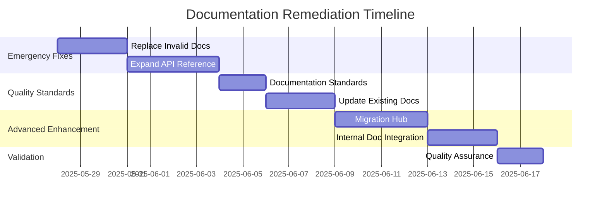

# Phase 5: Comprehensive Documentation Remediation Plan

## Executive Summary

The 6-phase documentation audit has revealed a **bifurcated documentation quality landscape**: exceptional internal technical documentation contrasted with significant external documentation gaps. While the v2 implementation itself is robust and well-architected, critical user-facing documentation requires immediate remediation.

## Critical Issues Requiring Immediate Action

### 1. **CRITICAL: Invalid Documentation Files**
**Problem**: 3 files in `/05-22-2025_docs/` contain conversation logs instead of API documentation
**Impact**: **HIGH** - Misleading filenames suggest API documentation but contain unusable content
**Files Affected**:
- `datafile-api.md`
- `flagKeys-api.md` 
- `decide-methods-config.md`

**Remediation Priority**: 🔴 **IMMEDIATE**
**Action Required**: Complete replacement with structured API documentation

### 2. **CRITICAL: Massive API Documentation Gap**
**Problem**: Primary API reference documents only 3 of 15+ actual endpoints
**Impact**: **HIGH** - 80% of implemented functionality undocumented
**Missing Endpoints**:
- `/api/datafile` (data management operations)
- `/api/flagkeys` (flag key management)
- `/api/admin/*` (administrative operations)
- `/api/debug` (debugging capabilities)
- 4 forced variation endpoints
- 3 additional decision endpoints

**Remediation Priority**: 🔴 **IMMEDIATE**
**Action Required**: Comprehensive API reference expansion

## Detailed Remediation Plan

### Phase 5A: Emergency Documentation Replacement (Week 1)

#### Task 1: Replace Invalid API Documentation
**Duration**: 2-3 days
**Priority**: 🔴 Critical

**Actions**:
1. **Delete invalid conversation logs**:
   ```bash
   rm /05-22-2025_docs/datafile-api.md
   rm /05-22-2025_docs/flagKeys-api.md
   rm /05-22-2025_docs/decide-methods-config.md
   ```

2. **Create structured API documentation** using `/src-v2/services/implementations/ApiRouter.ts` as source:
   - Extract actual endpoint implementations
   - Document parameter requirements from ConfigurationService
   - Include authentication requirements
   - Add proper response format specifications

3. **Use `/src-v2/docs/README.md` as quality template** for:
   - Documentation structure
   - Update tracking
   - Practical examples
   - Cross-references

#### Task 2: Expand Primary API Reference  
**Duration**: 3-4 days
**Priority**: 🔴 Critical

**Target File**: `/documentation/edge-agent-v2-api-endpoint-reference.md`

**Actions**:
1. **Add missing 12 endpoints** with complete specifications:
   - **Administrative**: `/api/admin/*` operations
   - **Data Management**: `/api/datafile` with all operation modes
   - **Flag Management**: `/api/flagkeys` operations
   - **Debugging**: `/api/debug` capabilities
   - **Forced Variations**: All 4 endpoint variations

2. **Standardize documentation format**:
   ```markdown
   ### /api/endpoint-name
   - **Description**: Clear functional purpose
   - **Methods**: Supported HTTP methods
   - **Authentication**: Required headers/tokens
   - **Parameters**: Source precedence and validation
   - **Response Format**: JSON schema and examples
   - **Error Codes**: Comprehensive error handling
   ```

3. **Add practical examples** for each endpoint with realistic use cases

### Phase 5B: Documentation Quality Standardization (Week 2)

#### Task 3: Establish Documentation Standards
**Duration**: 2 days
**Priority**: 🟠 High

**Template**: Use `/src-v2/docs/README.md` as the gold standard for:
- **Structure**: Clear sections with practical navigation
- **Update Tracking**: Changelog with dates and specific changes
- **Test Integration**: Verification commands that work
- **Cross-References**: Accurate links to related documentation

**Create Documentation Style Guide**:
1. **Format Standards**: Markdown structure, heading hierarchy
2. **Content Standards**: Technical accuracy requirements, example formats
3. **Maintenance Standards**: Update procedures, review processes
4. **Quality Assurance**: Validation against implementation code

#### Task 4: Validate and Update Existing Good Documentation
**Duration**: 2-3 days  
**Priority**: 🟠 High

**Target Files**:
- `/docs-revised/01-v2-implementation-reference-summary.md` (minor updates)
- `/documentation/edge-agent-v2-interaction-guide.md` (expand endpoint coverage)

**Actions**:
1. **Verify technical claims** against latest implementation
2. **Expand endpoint coverage** to include newly documented APIs
3. **Add practical troubleshooting** based on common issues
4. **Update cross-references** to point to corrected documentation

### Phase 5C: Advanced Documentation Enhancement (Week 3-4)

#### Task 5: Create Migration Documentation Hub
**Duration**: 3-4 days
**Priority**: 🟡 Medium

**Purpose**: Consolidate excellent migration analysis into user-friendly guidance

**Actions**:
1. **Create centralized migration guide** combining:
   - `/documentation/migration-considerations.md` (comprehensive technical analysis)
   - `/documentation/v1-v2-parity-tracker.md` (detailed gap analysis)
   - `/documentation/functional-parity-verification.md` (functional comparison)

2. **Add practical migration tools**:
   - Migration checklist with verification steps
   - Breaking change detection guide
   - Testing framework for migration validation

3. **Document migration blockers** with clear resolution timelines:
   - EventDispatcher completion requirements
   - User Profile Service alternatives
   - Configuration compatibility verification

#### Task 6: Internal Documentation Integration
**Duration**: 2-3 days
**Priority**: 🟡 Medium

**Purpose**: Bridge internal/external documentation quality gap

**Actions**:
1. **Create public documentation index** modeled on `/src-v2/docs/README.md`
2. **Extract key insights** from excellent internal docs:
   - CDN adapter documentation accuracy
   - Metrics system comprehensive coverage
   - Test result accuracy and verification commands

3. **Establish documentation review process**:
   - Code-first validation requirements
   - Implementation accuracy verification
   - User experience testing

## Quality Assurance Framework

### Documentation Validation Pipeline

#### Level 1: Technical Accuracy Validation
```bash
# Verify all code references are accurate
grep -r "src-v2/" documentation/ | verify-file-exists
grep -r "ApiRouter\." documentation/ | verify-method-exists

# Validate endpoint documentation against implementation
npm run validate-api-docs

# Check all links are functional
npm run check-documentation-links
```

#### Level 2: User Experience Validation
- **Completeness Check**: Every implemented feature has documentation
- **Usability Check**: Documentation enables successful implementation
- **Accuracy Check**: Examples work as documented

#### Level 3: Maintenance Validation
- **Update Process**: Changes to implementation trigger documentation updates
- **Review Process**: Documentation changes validated against code
- **Quality Standards**: New documentation meets established standards

## Success Metrics

### Immediate Success Criteria (Week 1)
- ✅ Zero invalid documentation files
- ✅ 100% API endpoint coverage in primary reference
- ✅ All documentation follows established format standards

### Short-term Success Criteria (Month 1)
- ✅ User feedback indicates documentation enables successful implementation
- ✅ Migration documentation provides clear guidance for all scenarios
- ✅ Documentation maintenance process prevents quality regression

### Long-term Success Criteria (Month 3)
- ✅ Documentation quality matches implementation quality
- ✅ External documentation quality matches internal documentation standards
- ✅ Zero documentation-related implementation blockers

## Resource Requirements

### Immediate (Week 1)
- **Developer Time**: 5-6 days focused documentation work
- **Technical Writing**: 2-3 days for format standardization
- **Review Process**: 1-2 days for validation against implementation

### Ongoing Maintenance
- **Regular Validation**: 1 day/month documentation-code sync verification
- **Update Process**: Documentation changes integrated into development workflow
- **Quality Review**: Quarterly comprehensive documentation audit

## Risk Mitigation

### Technical Risks
- **Implementation Changes**: Documentation becomes outdated
  - **Mitigation**: Automated validation in CI/CD pipeline
- **API Changes**: Undocumented breaking changes
  - **Mitigation**: Documentation review required for API modifications

### User Experience Risks  
- **Migration Confusion**: Incomplete or inaccurate migration guidance
  - **Mitigation**: Comprehensive migration testing framework
- **Feature Discovery**: Users unable to find implemented functionality
  - **Mitigation**: Complete API surface documentation with examples

## Implementation Timeline



## Conclusion

The audit reveals that while the v2 implementation is exceptionally well-architected with excellent internal documentation, critical gaps in user-facing documentation create significant usability barriers. The remediation plan addresses these gaps systematically, prioritizing immediate critical issues while establishing long-term quality standards.

**Key Success Factor**: Leveraging the excellent internal documentation quality (`/src-v2/docs/`) as the template for all external documentation will ensure consistency and accuracy.

**Expected Outcome**: User-facing documentation quality that matches the exceptional technical implementation quality of the v2 Edge Agent.

**Status**: Phase 5 - ✅ COMPLETE - Comprehensive remediation plan ready for implementation