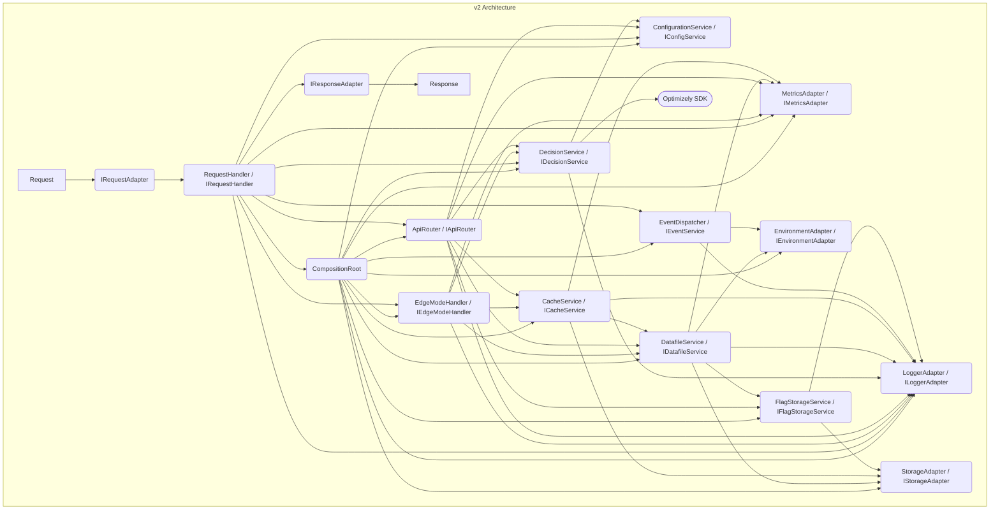

# Component Diagrams: Optimizely Edge Agent v1 vs. v2

This document provides component relationship diagrams for both v1 and v2 architectures, illustrating the shift from a monolithic design to a service-oriented approach.

## v1 Component Relationships (Simplified)

The v1 architecture is centered around `coreLogic.js`, which orchestrates interactions with various helpers and a specific CDN adapter.

```mermaid
graph TD
    subgraph "v1 Architecture"
        Request --> A[index.js / router.js];
        A --> B(coreLogic.js);
        B --> C{Request Config Helpers};
        B --> D{Optimizely Provider Helpers};
        B --> E{General Helpers};
        B --> F[CDN Adapter (e.g., CloudflareAdapter)];
        F --> G[Platform APIs (KV, Fetch, etc.)];
        D --> H[Optimizely SDK];
        B --> Response;
    end
```

*   **index.js / router.js:** Entry point, basic routing.
*   **coreLogic.js:** Main orchestrator, contains most business logic.
*   **Helpers:** Modules for specific tasks (config, Optly calls, logging).
*   **CDN Adapter:** Platform-specific implementation (request/response abstraction, KV access, event dispatching).
*   **Optimizely SDK:** External library for feature flagging.

## v2 Component Relationships (Service-Oriented)

The v2 architecture utilizes dependency injection (`compositionRoot.ts`) to wire together specialized services that collaborate to handle requests.



*   **Adapters (IRequestAdapter, IResponseAdapter, etc.):** Abstract platform-specific details.
*   **CompositionRoot:** Instantiates and connects services.
*   **RequestHandler:** Orchestrates the overall request flow, delegating to specialized services.
*   **Specialized Services:** Each service (Decision, Datafile, Cache, Config, EdgeMode, ApiRouter, Event) handles a specific domain concern.
*   **Interfaces:** Define contracts, enabling loose coupling.
*   **Optimizely SDK:** Used primarily by the `DecisionService`.
