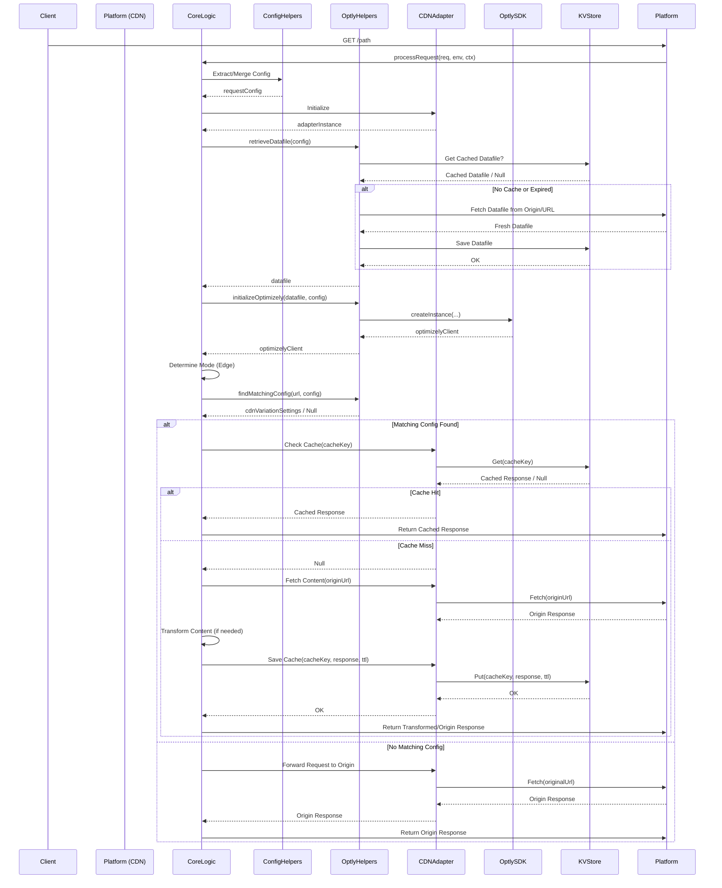
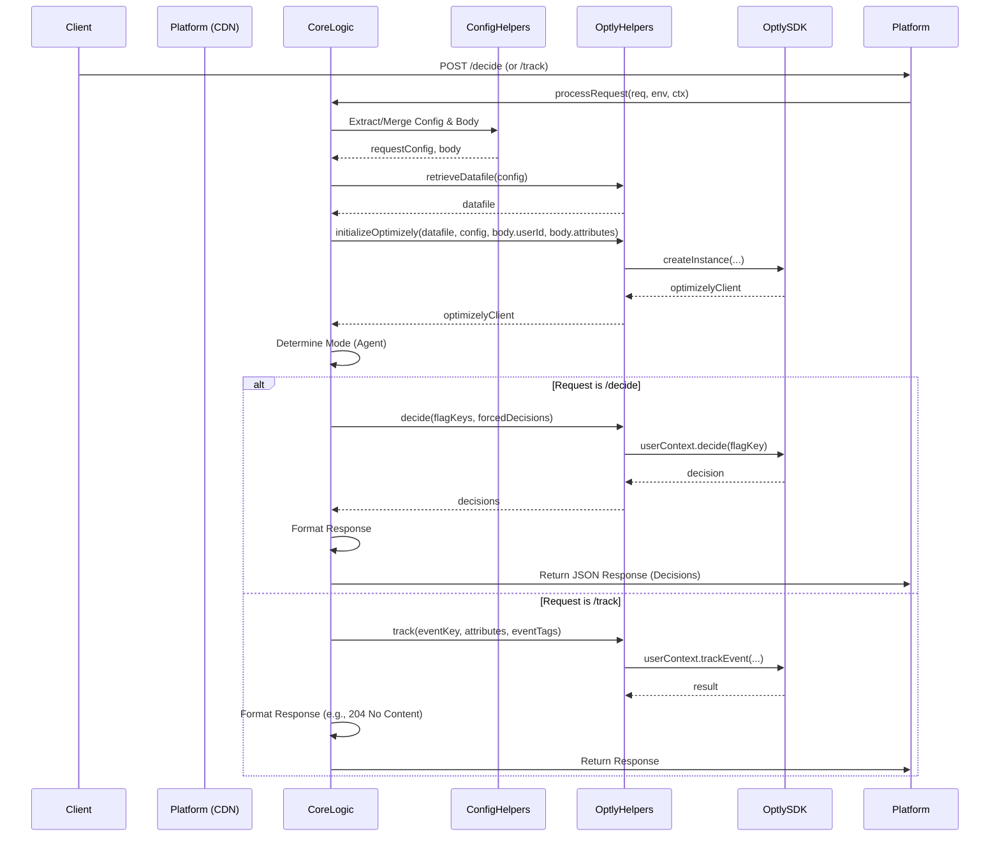
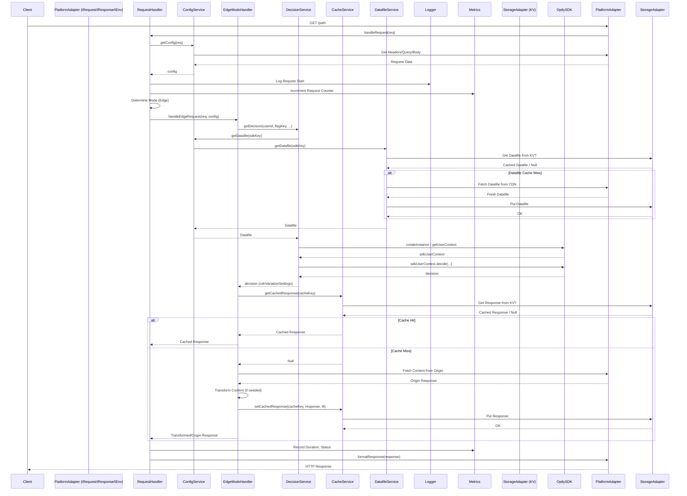
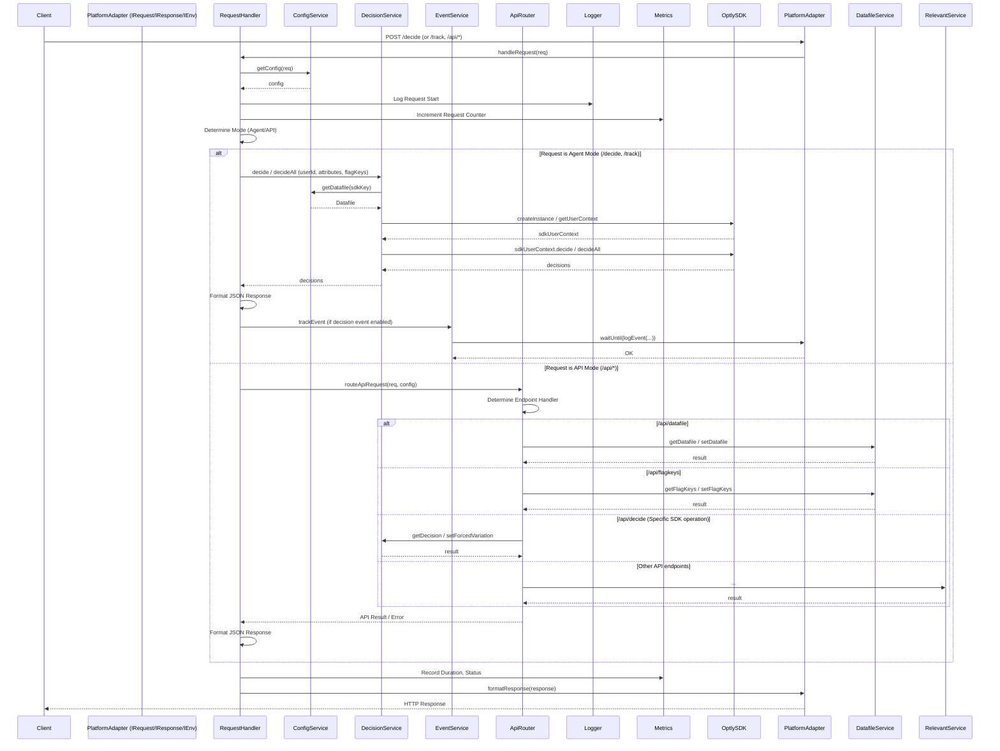

# Request Flow Sequences: Optimizely Edge Agent v1 vs. v2

This document illustrates the typical request handling sequences for both Edge Mode (GET requests) and Agent Mode (POST requests) in v1 and v2 architectures.

## v1 Request Flow

### v1 Edge Mode (GET Request)

### v1 Agent Mode (POST Request)

## v2 Request Flow

### v2 Edge Mode (GET Request)

### v2 Agent Mode (POST Request)

